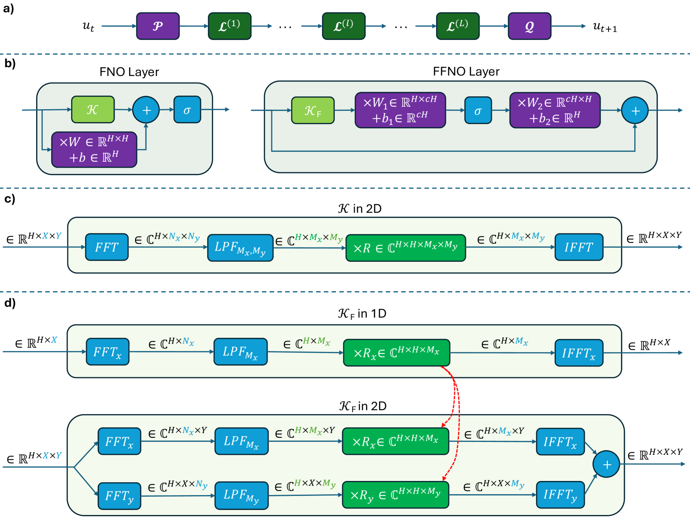

# 低维度下的神经算子预训练

发布时间：2024年07月24日

`LLM应用

解释：这篇论文讨论了在低维偏微分方程（PDE）上预训练神经求解器的方法，并探讨了这种预训练策略在高维PDE中的应用效果。这与大型语言模型（LLM）的应用相关，特别是在处理和优化神经网络求解器方面。因此，它属于LLM应用类别。` `科学计算` `人工智能`

> Pretraining a Neural Operator in Lower Dimensions

# 摘要

> 近期，大规模预训练基础神经偏微分方程（PDE）求解器和神经算子备受瞩目。与视觉和语言模型利用丰富廉价的无标签数据预训练不同，神经求解器常依赖成本高昂的模拟PDE数据，尤其是高维PDE。我们提出在低成本的低维PDE（PreLowD）上预训练神经求解器，并评估其在高维相似PDE中的效果。采用灵活的分解傅里叶神经算子（FFNO），可适应任意空间维度PDE数据并重用低维参数。此外，我们探讨了微调配置对最大化预训练策略效益的影响。

> There has recently been increasing attention towards developing foundational neural Partial Differential Equation (PDE) solvers and neural operators through large-scale pretraining. However, unlike vision and language models that make use of abundant and inexpensive (unlabeled) data for pretraining, these neural solvers usually rely on simulated PDE data, which can be costly to obtain, especially for high-dimensional PDEs. In this work, we aim to Pretrain neural PDE solvers on Lower Dimensional PDEs (PreLowD) where data collection is the least expensive. We evaluated the effectiveness of this pretraining strategy in similar PDEs in higher dimensions. We use the Factorized Fourier Neural Operator (FFNO) due to having the necessary flexibility to be applied to PDE data of arbitrary spatial dimensions and reuse trained parameters in lower dimensions. In addition, our work sheds light on the effect of the fine-tuning configuration to make the most of this pretraining strategy.

[Arxiv](https://arxiv.org/abs/2407.17616)