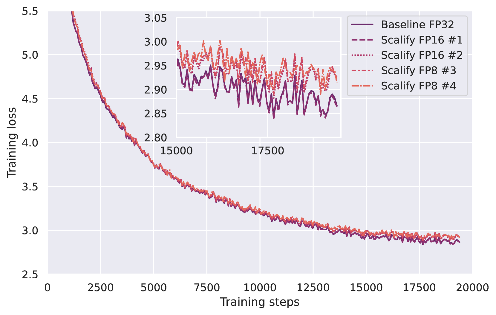

# Scalify：通过尺度传播优化低精度 LLM 训练效率

发布时间：2024年07月24日

`LLM理论` `机器学习` `硬件加速`

> Scalify: scale propagation for efficient low-precision LLM training

# 摘要

> 为了提升大型语言模型训练和推理的效率，低精度格式如 float8 已被引入机器学习加速硬件。但由于匹配高精度训练准确性所需技术的复杂性和脆弱性，ML 社区的采用进展缓慢。为此，我们推出了 Scalify，这是一种创新的端到端尺度传播范式，它不仅概括了现有的张量缩放方法，还对其进行了形式化。实验表明，Scalify 能够无缝支持 float8 矩阵乘法和梯度表示，以及 float16 优化器状态存储。我们的 JAX 实现已开源，详情请访问 https://github.com/graphcore-research/jax-scalify。

> Low-precision formats such as float8 have been introduced in machine learning accelerated hardware to improve computational efficiency for large language models training and inference. Nevertheless, adoption by the ML community has been slowed down by the complex, and sometimes brittle, techniques required to match higher precision training accuracy. In this work, we present Scalify, a end-to-end scale propagation paradigm for computational graphs, generalizing and formalizing existing tensor scaling methods. Experiment results show that Scalify supports out-of-the-box float8 matrix multiplication and gradients representation, as well as float16 optimizer state storage. Our JAX implementation of Scalify is open-sourced at https://github.com/graphcore-research/jax-scalify

[Arxiv](https://arxiv.org/abs/2407.17353)