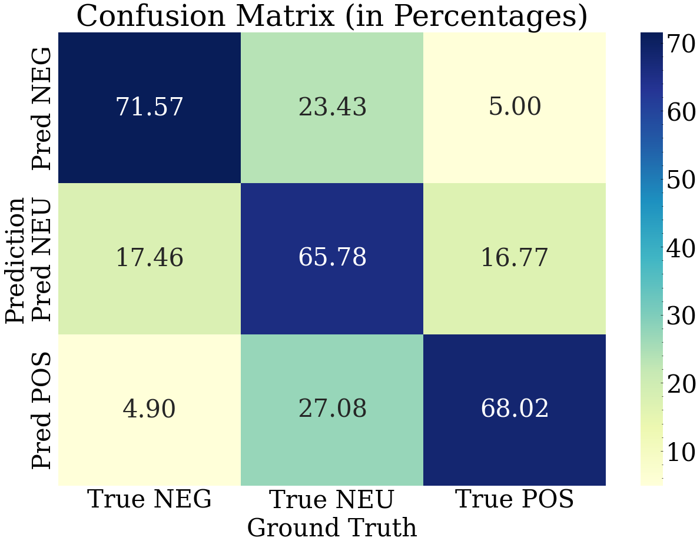
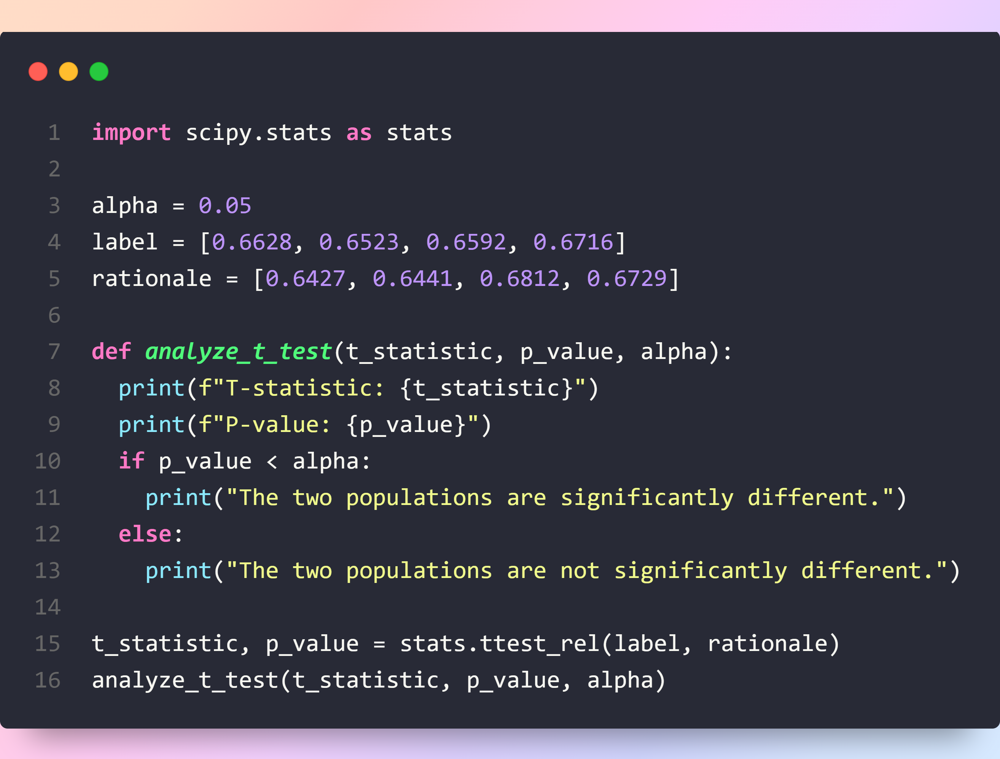

# 医疗保健领域的情感推理

发布时间：2024年07月24日

`LLM应用` `人工智能`

> Sentiment Reasoning for Healthcare

# 摘要

> 在医疗领域，AI决策的透明度至关重要，因为错误可能导致严重后果。这对于在情感分析任务中建立AI与用户之间的信任尤为重要。通过整合推理能力，大型语言模型（LLMs）能更好地理解人类情感，处理复杂语言，并推断隐含情感。我们提出了一项新任务——情感推理，涵盖语音和文本，并构建了一个多模态多任务框架及相应数据集。研究表明，理由增强训练显著提升了情感分类的准确性，无论是在人工转录还是ASR环境下。此外，尽管生成的理由词汇与人类不同，但其语义保持一致。所有资源已公开发布于：https://github.com/leduckhai/MultiMed。

> Transparency in AI decision-making is crucial in healthcare due to the severe consequences of errors, and this is important for building trust among AI and users in sentiment analysis task. Incorporating reasoning capabilities helps Large Language Models (LLMs) understand human emotions within broader contexts, handle nuanced and ambiguous language, and infer underlying sentiments that may not be explicitly stated. In this work, we introduce a new task - Sentiment Reasoning - for both speech and text modalities, along with our proposed multimodal multitask framework and dataset. Our study showed that rationale-augmented training enhances model performance in sentiment classification across both human transcript and ASR settings. Also, we found that the generated rationales typically exhibit different vocabularies compared to human-generated rationales, but maintain similar semantics. All code, data (English-translated and Vietnamese) and models are published online: https://github.com/leduckhai/MultiMed

[Arxiv](https://arxiv.org/abs/2407.21054)