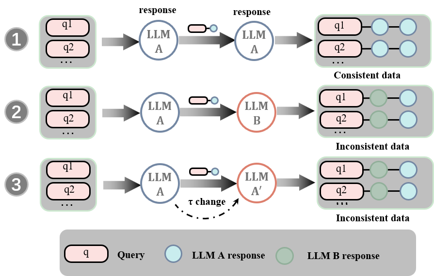

# SimCT：LLMs 开发过程中的一项简洁一致性测试方案

发布时间：2024年07月24日

`LLM应用` `工业界` `软件开发`

> SimCT: A Simple Consistency Test Protocol in LLMs Development Lifecycle

# 摘要

> 本研究致力于在工业界优化大型语言模型（LLM）及其相关系统或服务的开发流程。我们提出了“大型语言模型开发生命周期（LDLC）”概念，并强调了确保交付质量中一致性测试的关键作用。尽管这一原则性测试常被忽视，且在学术界并非紧迫议题，现有解决方案也显得不够严谨和耗时，我们仍创新性地推出了SimCT协议，旨在简化开发各阶段间的协调流程，加速产品交付。SimCT通过不依赖模型细节的主动一致性检查，涵盖了响应和模型两个层面的测试。我们采用LightGBM和Student's t-test分别实施这两部分，并通过广泛实验验证了SimCT及其组件的高效性。

> In this work, we report our efforts to advance the standard operation procedure of developing Large Language Models (LLMs) or LLMs-based systems or services in industry. We introduce the concept of Large Language Model Development Lifecycle (LDLC) and then highlight the importance of consistency test in ensuring the delivery quality. The principled solution of consistency test, however, is usually overlooked by industrial practitioners and not urgent in academia, and current practical solutions are insufficiently rigours and labor-intensive. We thus propose a simple yet effective consistency test protocol, named SimCT. SimCT is mainly to proactively check the consistency across different development stages of "bare metal" LLMs or associated services without accessing the model artifacts, in an attempt to expedite the delivery by reducing the back-and-forth alignment communications among multiple teams involved in different development stages.
  Specifically, SimCT encompasses response-wise and model-wise tests. We implement the protocol with LightGBM and Student's t-test for two components respectively, and perform extensive experiments to substantiate the effectiveness of SimCT and the involved components.

[Arxiv](https://arxiv.org/abs/2407.17150)