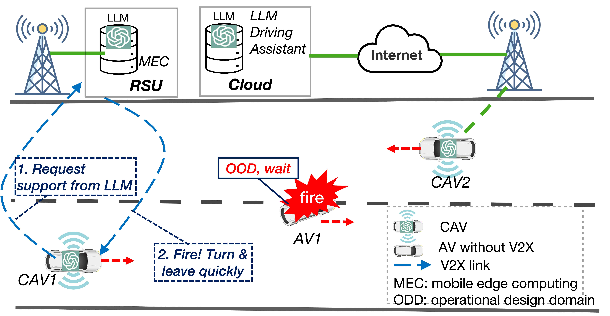

# 探究大型语言模型在连接自动驾驶车辆理论与技能方面的测试表现

发布时间：2024年07月24日

`LLM应用` `自动驾驶` `汽车行业`

> Testing Large Language Models on Driving Theory Knowledge and Skills for Connected Autonomous Vehicles

# 摘要

> 自动驾驶车辆面临的长尾边缘案例处理是一大挑战。尽管大型语言模型（LLMs）在处理这些案例方面潜力巨大，但仍需克服技术障碍，如高模型性能和计算资源需求。本文探讨了利用远程或边缘LLMs支持自动驾驶的新方法。关键在于评估LLMs的驾驶理论和技能理解能力，确保其胜任安全关键的驾驶辅助任务。我们为多个LLM模型设计并实施了超过500道多选理论测试题，测量了模型准确性、成本和处理延迟。结果显示，GPT-4通过测试并提升了领域知识，Ernie准确率为85%，其他模型包括GPT-3.5未通过。对于图像题，GPT4-o准确率高达96%，MiniCPM-Llama3-V2.5为76%。虽然GPT-4在驾驶辅助应用中潜力更大，但其成本远高于GPT3.5。这些结果有助于在CAV应用中选择LLMs，并平衡性能与成本。

> Handling long tail corner cases is a major challenge faced by autonomous vehicles (AVs). While large language models (LLMs) hold great potentials to handle the corner cases with excellent generalization and explanation capabilities and received increasing research interest on application to autonomous driving, there are still technical barriers to be tackled, such as strict model performance and huge computing resource requirements of LLMs. In this paper, we investigate a new approach of applying remote or edge LLMs to support autonomous driving. A key issue for such LLM assisted driving system is the assessment of LLMs on their understanding of driving theory and skills, ensuring they are qualified to undertake safety critical driving assistance tasks for CAVs. We design and run driving theory tests for several proprietary LLM models (OpenAI GPT models, Baidu Ernie and Ali QWen) and open-source LLM models (Tsinghua MiniCPM-2B and MiniCPM-Llama3-V2.5) with more than 500 multiple-choices theory test questions. Model accuracy, cost and processing latency are measured from the experiments. Experiment results show that while model GPT-4 passes the test with improved domain knowledge and Ernie has an accuracy of 85% (just below the 86% passing threshold), other LLM models including GPT-3.5 fail the test. For the test questions with images, the multimodal model GPT4-o has an excellent accuracy result of 96%, and the MiniCPM-Llama3-V2.5 achieves an accuracy of 76%. While GPT-4 holds stronger potential for CAV driving assistance applications, the cost of using model GPT4 is much higher, almost 50 times of that of using GPT3.5. The results can help make decision on the use of the existing LLMs for CAV applications and balancing on the model performance and cost.

[Arxiv](https://arxiv.org/abs/2407.17211)