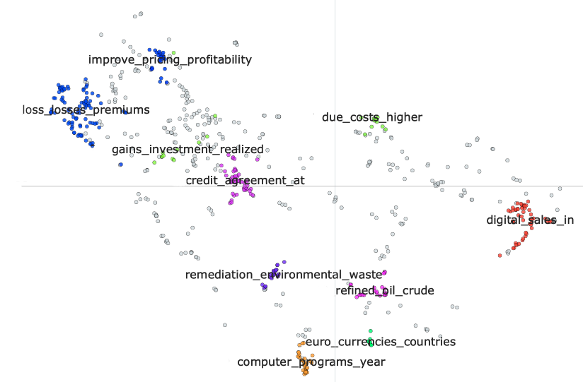
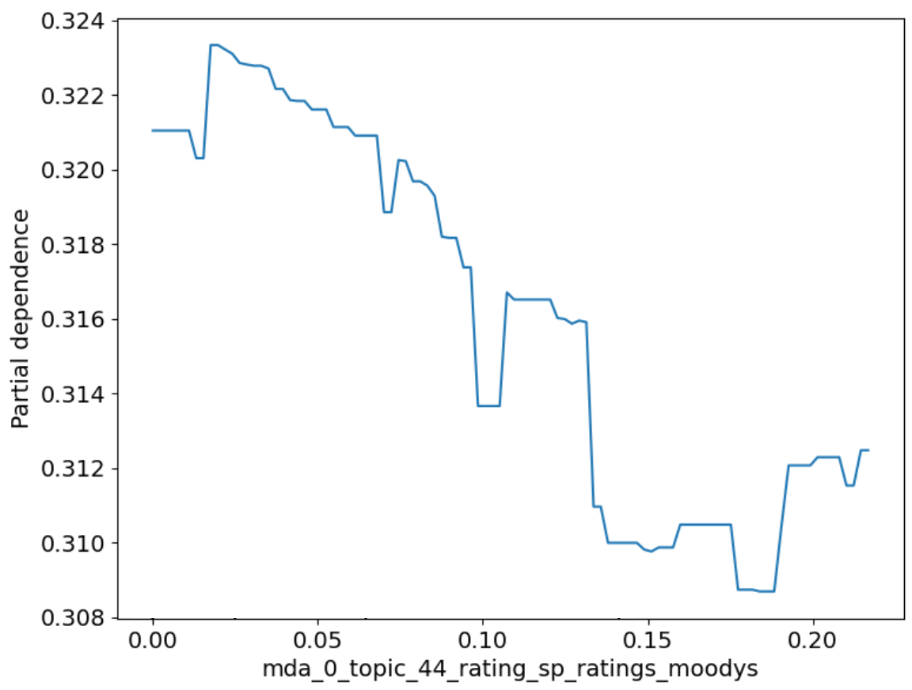
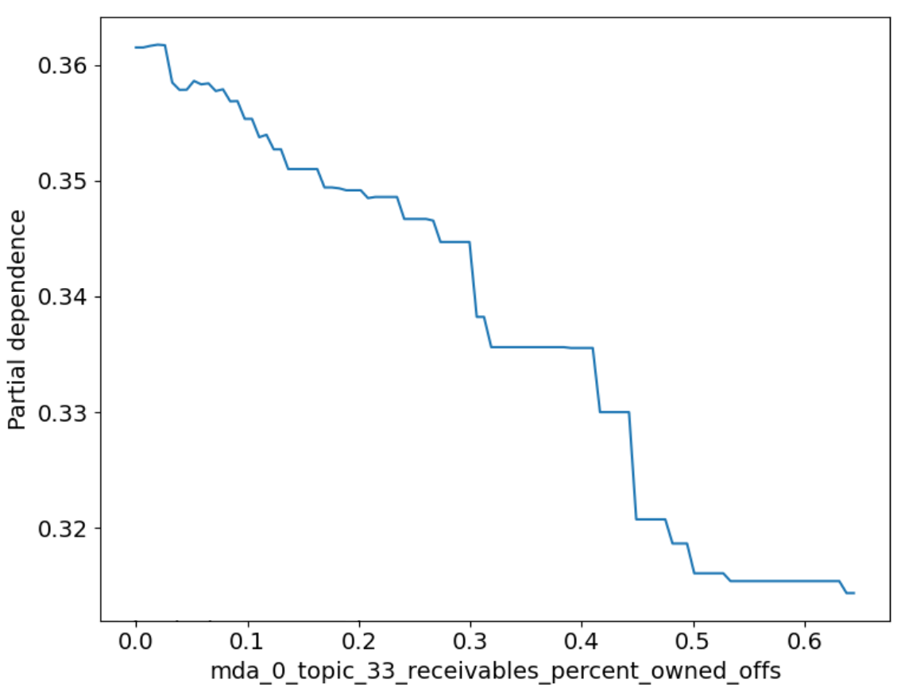

# 在预测信用评级方面，传统方法的表现超越了生成式 LLM。

发布时间：2024年07月24日

`LLM应用` `信用评级`

> Traditional Methods Outperform Generative LLMs at Forecasting Credit Ratings

# 摘要

> LLM 在众多下游任务中表现出色，迁移学习更使其技能大增。在金融领域，LLM 有时甚至能超越传统基准。本文探讨了 LLM 在预测公司信用评级方面的表现。我们发现，尽管 LLM 擅长处理文本信息，但在处理数值和多模态数据时，传统方法依然强劲。就本任务而言，结合基本面和宏观经济数据与高密度文本嵌入特征的 XGBoost 架构，表现优于当前的 LLM。

> Large Language Models (LLMs) have been shown to perform well for many downstream tasks. Transfer learning can enable LLMs to acquire skills that were not targeted during pre-training. In financial contexts, LLMs can sometimes beat well-established benchmarks. This paper investigates how well LLMs perform in the task of forecasting corporate credit ratings. We show that while LLMs are very good at encoding textual information, traditional methods are still very competitive when it comes to encoding numeric and multimodal data. For our task, current LLMs perform worse than a more traditional XGBoost architecture that combines fundamental and macroeconomic data with high-density text-based embedding features.

[Arxiv](https://arxiv.org/abs/2407.17624)