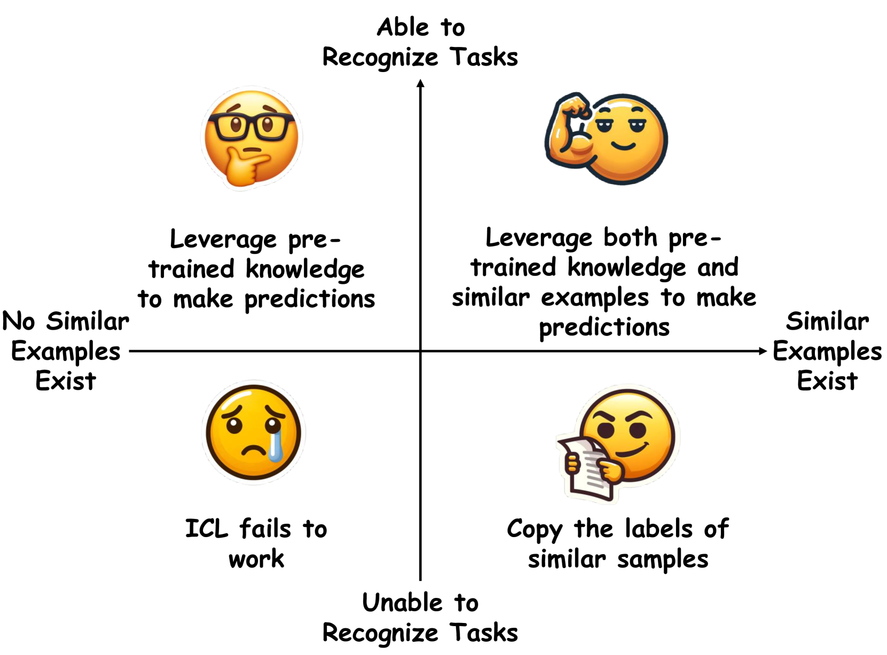
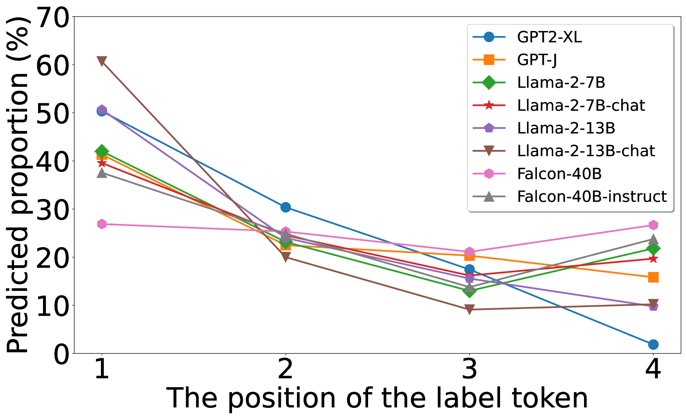
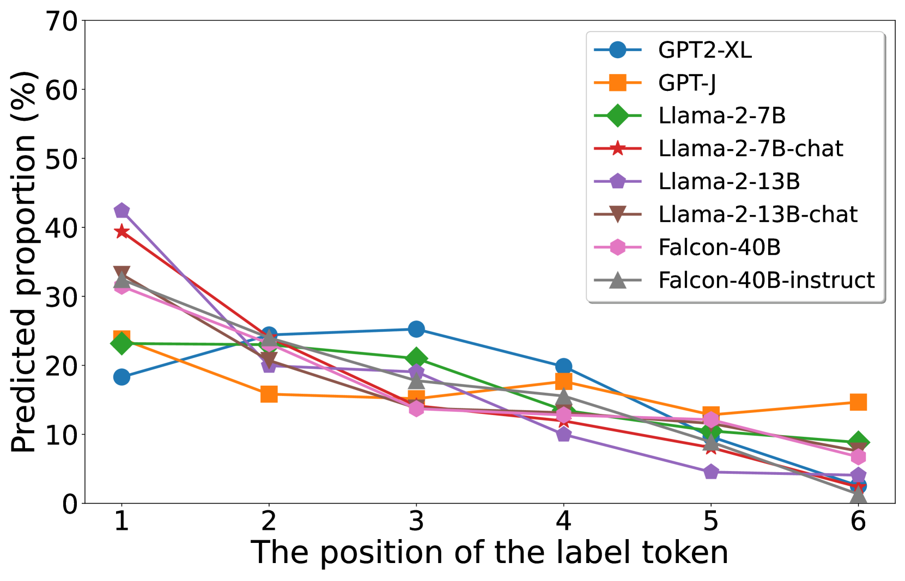

# 揭秘 In-Context Learning：构建坐标系统，深入探究其运作原理

发布时间：2024年07月24日

`LLM理论` `人工智能` `机器学习`

> Unveiling In-Context Learning: A Coordinate System to Understand Its Working Mechanism

# 摘要

> 大型语言模型 (LLM) 的 in-context learning (ICL) 能力引人注目，但其工作原理尚不清晰。研究界对 ICL 存在两种对立看法：一方认为 LLM 能自动识别任务，标签和示例数量无关紧要；另一方则强调演示中相似示例的关键作用，主张标签准确和示例丰富。我们构建了一个二维坐标框架，整合这两种观点，通过两个关键变量解析 ICL 行为：任务识别能力和演示中的相似示例。我们引入峰值逆序排名指标评估 LLM 的任务识别力，并探究其对相似性定义的响应。实验覆盖多个分类任务，深入揭示 ICL 在各象限的运作机制。此外，我们的坐标系统同样适用于生成任务，有效解读 ICL 在生成领域的应用。

> Large language models (LLMs) exhibit remarkable in-context learning (ICL) capabilities. However, the underlying working mechanism of ICL remains poorly understood. Recent research presents two conflicting views on ICL: One attributes it to LLMs' inherent ability of task recognition, deeming label correctness and shot numbers of demonstrations as not crucial; the other emphasizes the impact of similar examples in the demonstrations, stressing the need for label correctness and more shots. In this work, we provide a Two-Dimensional Coordinate System that unifies both views into a systematic framework. The framework explains the behavior of ICL through two orthogonal variables: whether LLMs can recognize the task and whether similar examples are presented in the demonstrations. We propose the peak inverse rank metric to detect the task recognition ability of LLMs and study LLMs' reactions to different definitions of similarity. Based on these, we conduct extensive experiments to elucidate how ICL functions across each quadrant on multiple representative classification tasks. Finally, we extend our analyses to generation tasks, showing that our coordinate system can also be used to interpret ICL for generation tasks effectively.

[Arxiv](https://arxiv.org/abs/2407.17011)