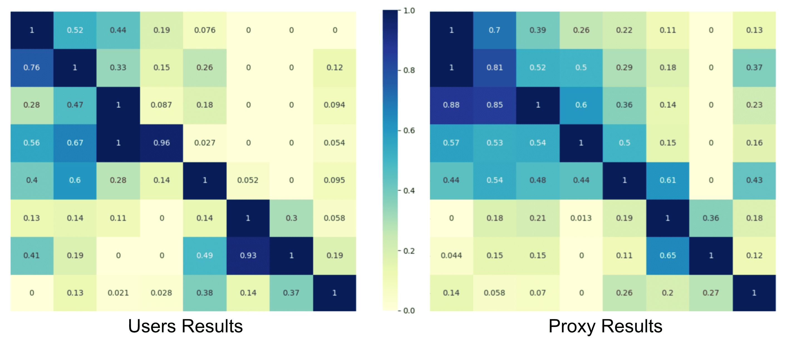
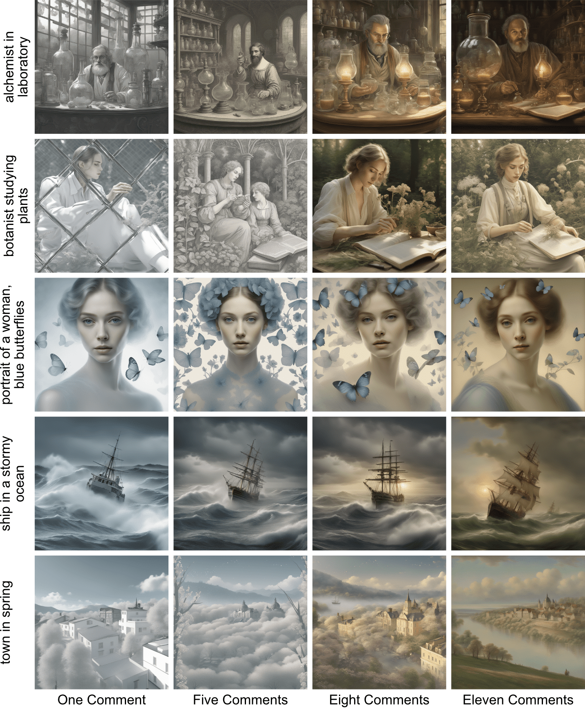
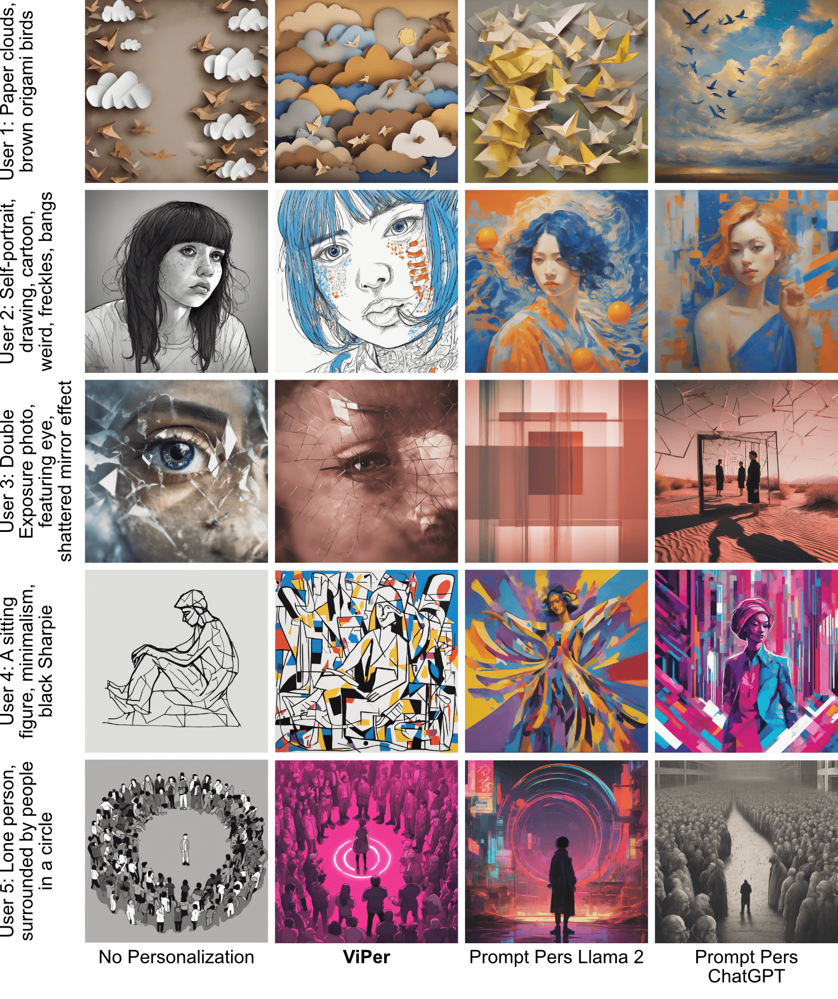
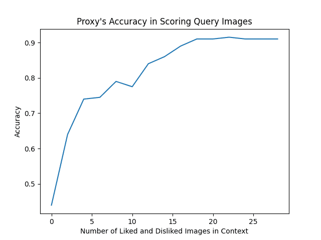

# ViPer：借助个人偏好学习，为生成模型注入视觉个性化魅力

发布时间：2024年07月24日

`LLM应用` `个性化服务` `图像处理`

> ViPer: Visual Personalization of Generative Models via Individual Preference Learning

# 摘要

> 用户对同一提示生成的图像偏好各异，这催生了个性化图像生成的需求。然而，现有生成模型多为通用型，旨在吸引广泛受众。为满足个别用户需求，我们提出一种新方法：通过用户对精选图像的即时反馈，捕捉其视觉偏好，进而利用大型语言模型推断其具体喜好，最终指导文本到图像模型生成定制化图像。实证研究表明，这种方法能有效生成符合用户个性化视觉偏好的图像。

> Different users find different images generated for the same prompt desirable. This gives rise to personalized image generation which involves creating images aligned with an individual's visual preference. Current generative models are, however, unpersonalized, as they are tuned to produce outputs that appeal to a broad audience. Using them to generate images aligned with individual users relies on iterative manual prompt engineering by the user which is inefficient and undesirable. We propose to personalize the image generation process by first capturing the generic preferences of the user in a one-time process by inviting them to comment on a small selection of images, explaining why they like or dislike each. Based on these comments, we infer a user's structured liked and disliked visual attributes, i.e., their visual preference, using a large language model. These attributes are used to guide a text-to-image model toward producing images that are tuned towards the individual user's visual preference. Through a series of user studies and large language model guided evaluations, we demonstrate that the proposed method results in generations that are well aligned with individual users' visual preferences.

[Arxiv](https://arxiv.org/abs/2407.17365)