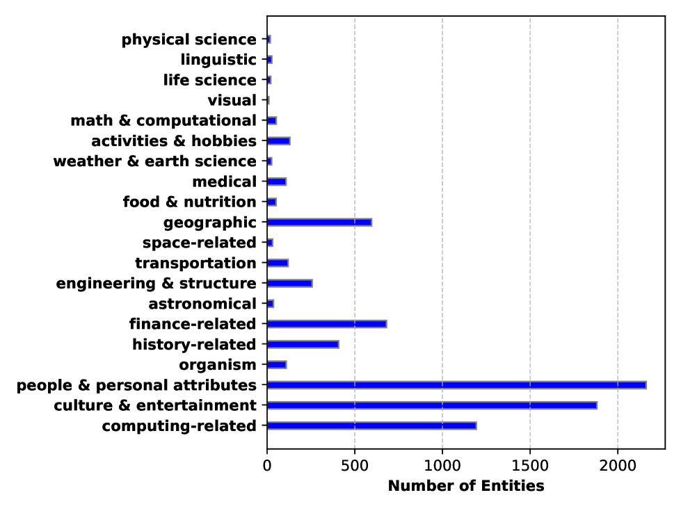
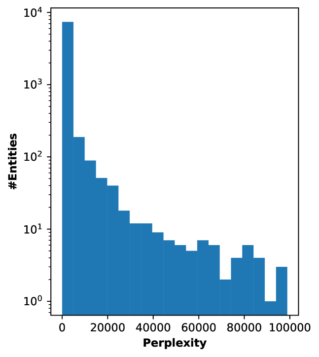
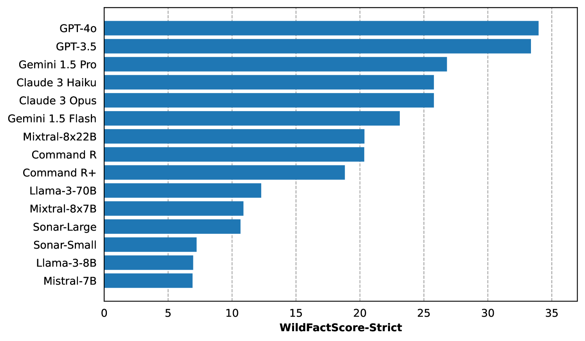
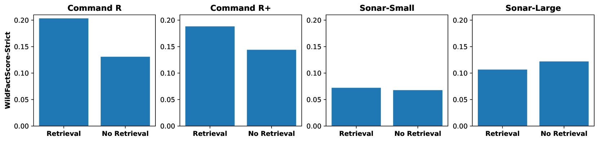
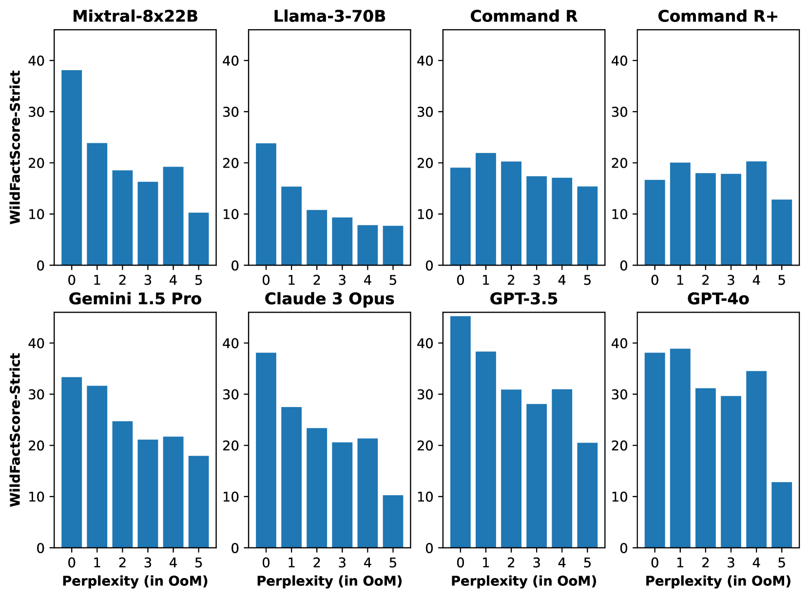
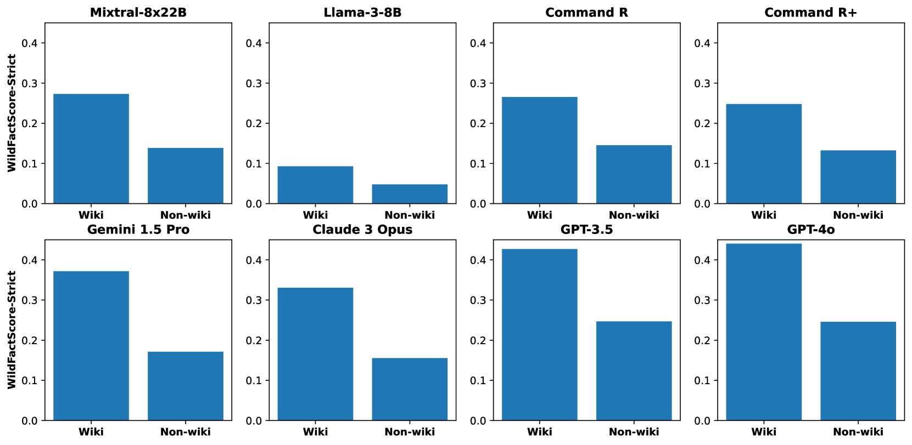

# WildHallucinations：通过真实实体查询，探究 LLMs 长篇内容的事实准确性。

发布时间：2024年07月24日

`LLM应用` `人工智能` `信息检索`

> WildHallucinations: Evaluating Long-form Factuality in LLMs with Real-World Entity Queries

# 摘要

> 大型语言模型（LLM）的幻觉问题普遍存在，但现有的事实性评估基准未能覆盖用户在现实世界中寻求信息的广泛知识领域。为此，我们推出了 WildHallucinations 基准，专门评估事实性。该基准通过让 LLM 生成从用户与聊天机器人的真实对话中提取的实体信息，并自动与精心筛选的网络搜索知识源进行事实核查。值得注意的是，这些实体中有一半没有维基百科页面。我们对 15 个 LLM 生成的 118,785 条信息进行了评估，涉及 7,919 个实体。结果显示，LLM 在无维基百科页面的实体上幻觉更多，且在不同领域幻觉率各异。此外，即使添加检索组件，幻觉问题也仅得到轻微缓解，并未完全消除。

> While hallucinations of large language models (LLMs) prevail as a major challenge, existing evaluation benchmarks on factuality do not cover the diverse domains of knowledge that the real-world users of LLMs seek information about. To bridge this gap, we introduce WildHallucinations, a benchmark that evaluates factuality. It does so by prompting LLMs to generate information about entities mined from user-chatbot conversations in the wild. These generations are then automatically fact-checked against a systematically curated knowledge source collected from web search. Notably, half of these real-world entities do not have associated Wikipedia pages. We evaluate 118,785 generations from 15 LLMs on 7,919 entities. We find that LLMs consistently hallucinate more on entities without Wikipedia pages and exhibit varying hallucination rates across different domains. Finally, given the same base models, adding a retrieval component only slightly reduces hallucinations but does not eliminate hallucinations.

[Arxiv](https://arxiv.org/abs/2407.17468)