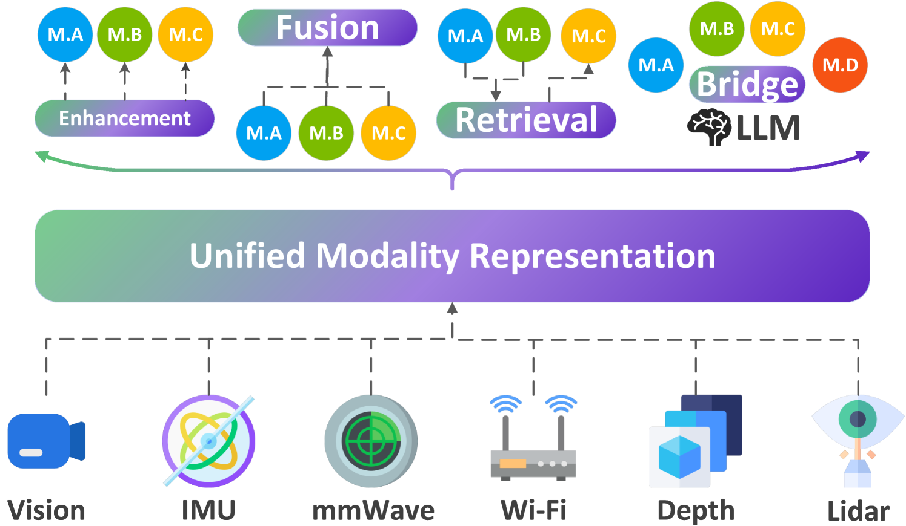

# 借助可扩展的模态对齐技术，我们正推动多模态传感技术的进步。

发布时间：2024年07月25日

`Agent` `人工智能` `物联网`

> Advancing Multi-Modal Sensing Through Expandable Modality Alignment

# 摘要

> 感知技术在理解物理世界方面应用广泛，但如何处理部分成对的多模态数据仍是一大难题。为此，我们推出了Babel框架，涵盖神经网络架构、数据处理及训练策略，旨在构建一个可扩展的预训练多模态感知网络。Babel目前已整合Wi-Fi、mmWave、IMU、LiDAR、视频和深度六种模态。为解决成对数据稀缺问题，Babel通过创新网络架构，将复杂的多模态对齐简化为一系列双模态对齐，并采用预训练模态塔和自适应训练策略等新技术，确保新旧模态的平衡融合。实测表明，Babel在人体活动识别任务中表现卓越，不仅显著提升了多模态融合的准确率（高达22%），还优化了单模态性能（平均提升12%）。此外，Babel还开辟了跨模态检索和增强感知理解等前沿应用场景。

> Sensing technology is widely used for comprehending the physical world, with numerous modalities explored in past decades. While there has been considerable work on multi-modality learning, they all require data of all modalities be paired. How to leverage multi-modality data with partially pairings remains an open problem. To tackle this challenge, we introduce the Babel framework, encompassing the neural network architecture, data preparation and processing, as well as the training strategies. Babel serves as a scalable pre-trained multi-modal sensing neural network, currently aligning six sensing modalities, namely Wi-Fi, mmWave, IMU, LiDAR, video, and depth. To overcome the scarcity of complete paired data, the key idea of Babel involves transforming the N-modality alignment into a series of two-modality alignments by devising the expandable network architecture. This concept is also realized via a series of novel techniques, including the pre-trained modality tower that capitalizes on available single-modal networks, and the adaptive training strategy balancing the contribution of the newly incorporated modality with the previously established modality alignment.
  Evaluation demonstrates Babel's outstanding performance on eight human activity recognition datasets, compared to various baselines e.g., the top multi-modal sensing framework, single-modal sensing networks, and multi-modal large language models. Babel not only effectively fuses multiple available modalities (up to 22% accuracy increase), but also enhance the performance of individual modality (12% averaged accuracy improvement). Case studies also highlight exciting application scenarios empowered by Babel, including cross-modality retrieval (i.e., sensing imaging), and bridging LLM for sensing comprehension.

[Arxiv](https://arxiv.org/abs/2407.17777)