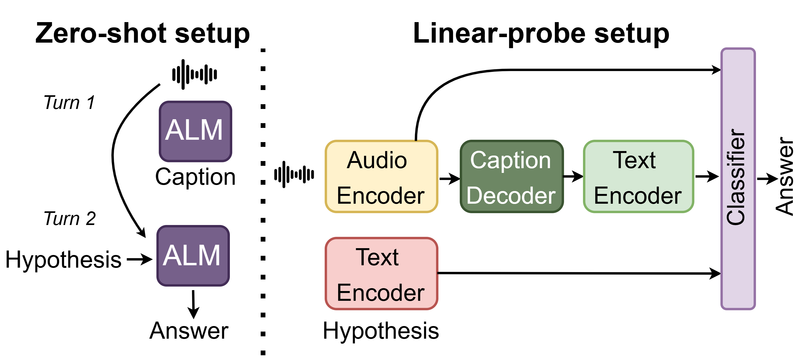

# 音频蕴涵：探索音频理解中的演绎推理能力

发布时间：2024年07月25日

`LLM应用` `音频处理` `人工智能`

> Audio Entailment: Assessing Deductive Reasoning for Audio Understanding

# 摘要

> 近期研究通过语言构建音频基础模型，即音频-语言模型（ALMs），这些模型在海量音频-文本对上训练，表现出色，涵盖文本到音频检索、字幕和问答等任务。但在复杂开放式任务如交互问答中，需逻辑推理能力，此技能尚未基准化。为此，我们创新提出音频蕴含任务，评估ALM演绎推理，即从音频（前提）能否推断出文本描述（假设），结论分蕴含、中性或矛盾，视证据充分性而定。我们基于AudioCaps和Clotho数据集，结合LLMs生成假设，构建两个数据集。基准测试显示，ALMs在逻辑推理上，无论零-shot还是线性探针评估，均显不足。我们提出“先字幕后推理”策略，分别提升零-shot和线性探针性能6%和3%。

> Recent literature uses language to build foundation models for audio. These Audio-Language Models (ALMs) are trained on a vast number of audio-text pairs and show remarkable performance in tasks including Text-to-Audio Retrieval, Captioning, and Question Answering. However, their ability to engage in more complex open-ended tasks, like Interactive Question-Answering, requires proficiency in logical reasoning -- a skill not yet benchmarked. We introduce the novel task of Audio Entailment to evaluate an ALM's deductive reasoning ability. This task assesses whether a text description (hypothesis) of audio content can be deduced from an audio recording (premise), with potential conclusions being entailment, neutral, or contradiction, depending on the sufficiency of the evidence. We create two datasets for this task with audio recordings sourced from two audio captioning datasets -- AudioCaps and Clotho -- and hypotheses generated using Large Language Models (LLMs). We benchmark state-of-the-art ALMs and find deficiencies in logical reasoning with both zero-shot and linear probe evaluations. Finally, we propose "caption-before-reason", an intermediate step of captioning that improves the zero-shot and linear-probe performance of ALMs by an absolute 6% and 3%, respectively.

[Arxiv](https://arxiv.org/abs/2407.18062)