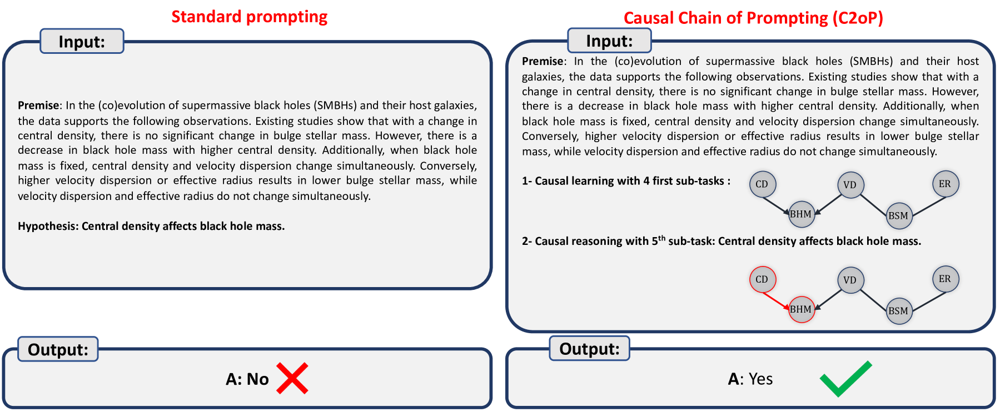
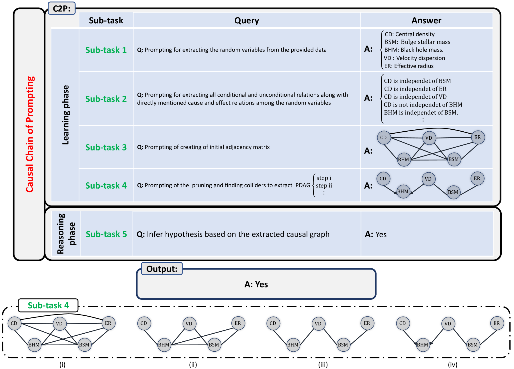

# C2P：以因果推理为特色，展现大型语言模型的能力

发布时间：2024年07月25日

`LLM理论`

> C2P: Featuring Large Language Models with Causal Reasoning

# 摘要

> 因果推理是 LLM 达到人类智能水平的关键障碍。为此，我们推出了因果提示链 (C2P) 框架，这是首个赋予 LLM 因果推理能力的系统。C2P 独立运作，无需外部工具支持，并可在 LLM 训练或微调中直接应用。实验表明，C2P 大幅提升了 LLM 在因果学习和推理上的准确性。该框架还能增强 LLM 在医疗、经济、教育等多个领域解决复杂问题的能力。通过少样本学习，GPT-4 Turbo 结合 C2P，仅用六个示例就实现了超过 33% 的推理准确性提升，远超同类最先进模型。这凸显了 C2P 在 LLM 训练中的革命性作用，为其赋予了强大的因果推理能力。

> Causal reasoning is the primary bottleneck that Large Language Models (LLMs) must overcome to attain human-level intelligence. To address this, we introduce the Causal Chain of Prompting (C2P) as the first reasoning framework that equips current LLMs with causal reasoning capabilities. C2P operates autonomously, avoiding reliance on external tools or modules during both the causal learning and reasoning phases, and can be seamlessly implemented during the training or fine-tuning of LLMs. Experimental results across various benchmark datasets demonstrate a significant improvement in causal learning and subsequent reasoning accuracy of LLMs. We illustrate how C2P enhances LLMs' ability to causally reason in real-world scenarios, addressing complex problems in fields such as healthcare, medicine, economics, education, social sciences, environmental science, and marketing. With few-shot learning, GPT-4 Turbo using C2P with as few as six examples achieves significant performance improvements, boasting over a 33% increase in reasoning accuracy over the most state-of-the-art LLMs, which perform nearly randomly in similar circumstances. This demonstrates the transformative potential of integrating C2P into LLM training or fine-tuning processes, thereby empowering these models with advanced causal reasoning capabilities.

[Arxiv](https://arxiv.org/abs/2407.18069)