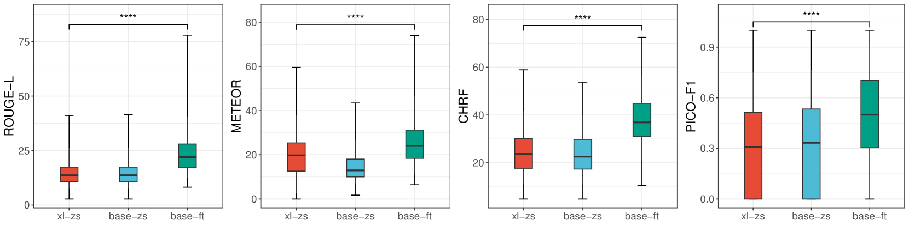
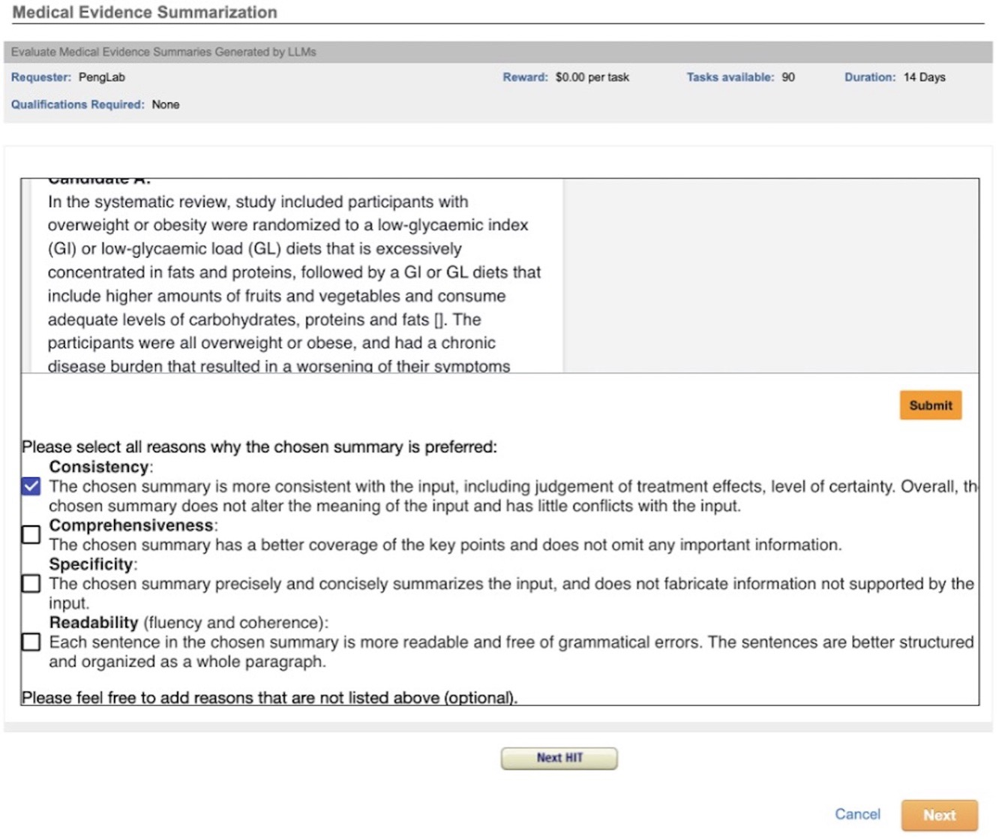

# 弥合开源与商业大型语言模型在医学证据摘要领域的鸿沟

发布时间：2024年07月25日

`LLM应用` `人工智能`

> Closing the gap between open-source and commercial large language models for medical evidence summarization

# 摘要

> 大型语言模型（LLM）在医学证据总结方面展现出巨大潜力。然而，专有 LLM 的使用存在透明度不足和供应商依赖等风险。相比之下，开源 LLM 虽支持更好的透明度和定制，但性能稍逊。本研究探索了通过微调开源 LLM 来提升其在医学证据总结任务中的表现。我们使用包含 8,161 对系统评价和总结的 MedReview 数据集，对 PRIMERA、LongT5 和 Llama-2 进行了微调。结果显示，微调后的 LLM 在 ROUGE-L、METEOR 和 CHRF 评分上均有显著提升，微调后的 LongT5 甚至接近 GPT-3.5 的零-shot 性能。此外，小型微调模型有时表现优于大型零-shot 模型。这些改进在人类和 GPT4 模拟评估中均得到验证。本研究成果可为需要特定领域知识的任务（如医学证据总结）提供模型选择的指导。

> Large language models (LLMs) hold great promise in summarizing medical evidence. Most recent studies focus on the application of proprietary LLMs. Using proprietary LLMs introduces multiple risk factors, including a lack of transparency and vendor dependency. While open-source LLMs allow better transparency and customization, their performance falls short compared to proprietary ones. In this study, we investigated to what extent fine-tuning open-source LLMs can further improve their performance in summarizing medical evidence. Utilizing a benchmark dataset, MedReview, consisting of 8,161 pairs of systematic reviews and summaries, we fine-tuned three broadly-used, open-sourced LLMs, namely PRIMERA, LongT5, and Llama-2. Overall, the fine-tuned LLMs obtained an increase of 9.89 in ROUGE-L (95% confidence interval: 8.94-10.81), 13.21 in METEOR score (95% confidence interval: 12.05-14.37), and 15.82 in CHRF score (95% confidence interval: 13.89-16.44). The performance of fine-tuned LongT5 is close to GPT-3.5 with zero-shot settings. Furthermore, smaller fine-tuned models sometimes even demonstrated superior performance compared to larger zero-shot models. The above trends of improvement were also manifested in both human and GPT4-simulated evaluations. Our results can be applied to guide model selection for tasks demanding particular domain knowledge, such as medical evidence summarization.

[Arxiv](https://arxiv.org/abs/2408.00588)