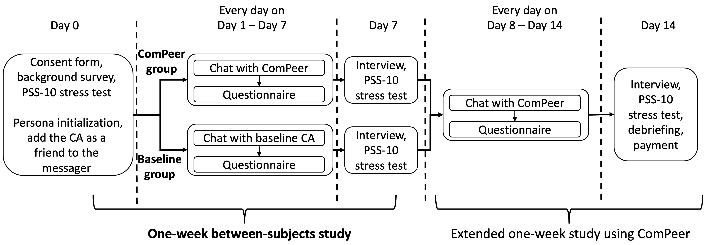

# ComPeer：一款主动提供同伴支持的生成式对话代理

发布时间：2024年07月25日

`Agent` `心理健康` `人工智能`

> ComPeer: A Generative Conversational Agent for Proactive Peer Support

# 摘要

> 对话代理（CAs）作为同伴支持者，已被证实对心理健康有益。然而，以往的CAs要么被动等待用户发起对话，要么按预设规则行动，这可能阻碍用户与CAs建立长期关系。本文介绍的ComPeer，是一款主动型生成CA，能根据对话内容灵活提供支持。它运用大型语言模型，精准捕捉对话要点，并据此规划关怀策略。ComPeer还整合了支持技巧、对话历程及自身角色特征，生成个性化信息。一项为期一周的研究（N=24）表明，ComPeer在持续提供同伴支持和增强用户互动方面，优于传统被动型CA。

> Conversational Agents (CAs) acting as peer supporters have been widely studied and demonstrated beneficial for people's mental health. However, previous peer support CAs either are user-initiated or follow predefined rules to initiate the conversations, which may discourage users to engage and build relationships with the CAs for long-term benefits. In this paper, we develop ComPeer, a generative CA that can proactively offer adaptive peer support to users. ComPeer leverages large language models to detect and reflect significant events in the dialogue, enabling it to strategically plan the timing and content of proactive care. In addition, ComPeer incorporates peer support strategies, conversation history, and its persona into the generative messages. Our one-week between-subjects study (N=24) demonstrates ComPeer's strength in providing peer support over time and boosting users' engagement compared to a baseline user-initiated CA.

[Arxiv](https://arxiv.org/abs/2407.18064)