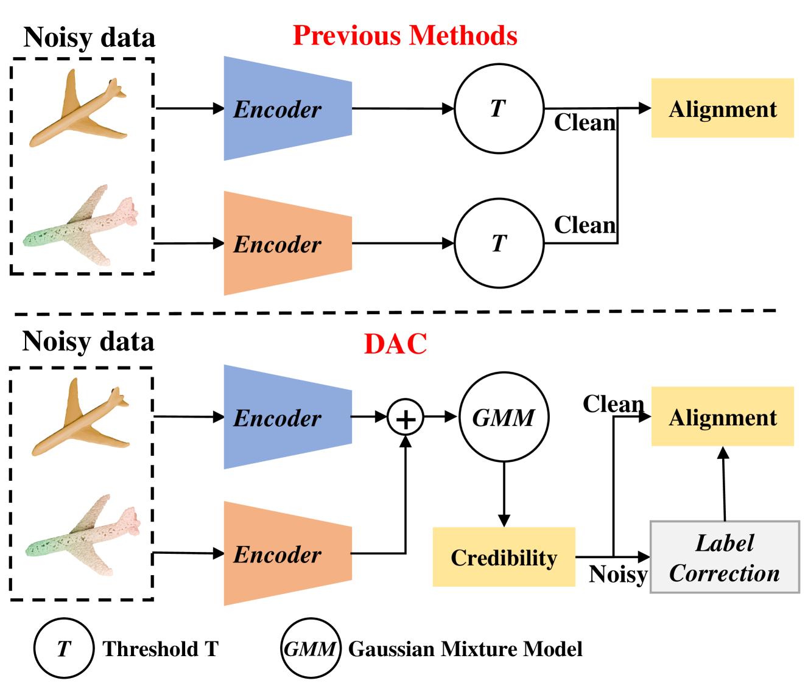
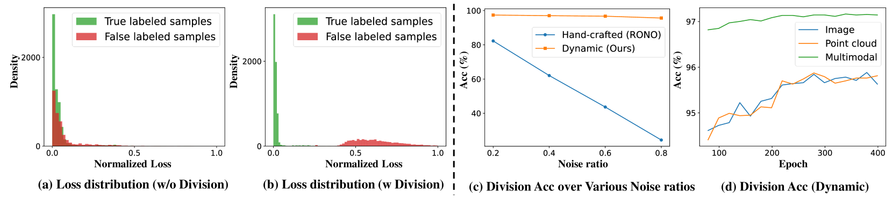
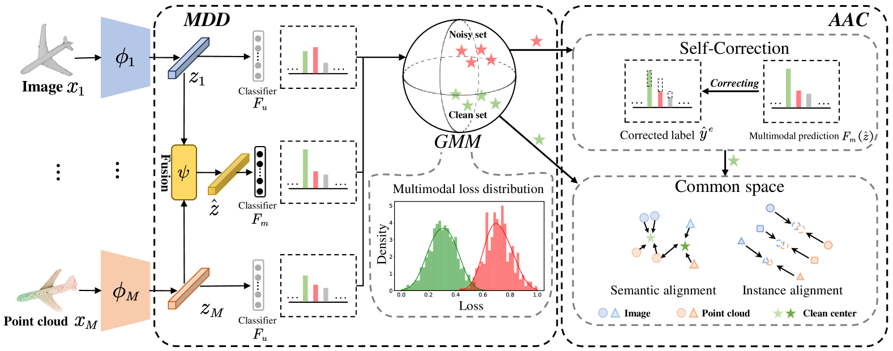
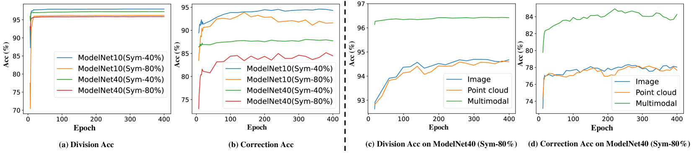
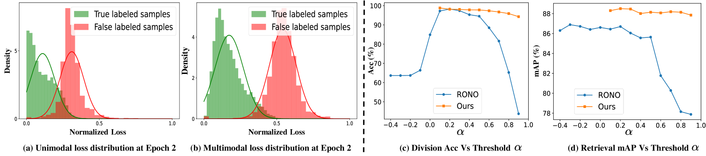
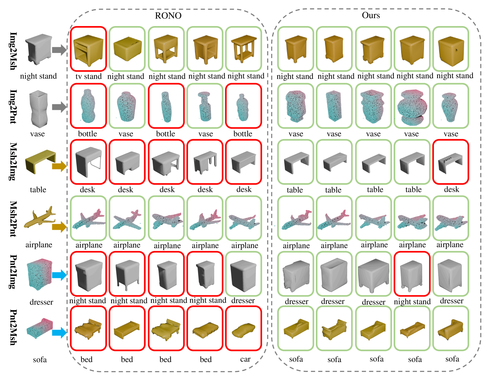

# DAC：采用分治对齐与校正技术，解决带有噪声标签的2D-3D检索问题

发布时间：2024年07月25日

`LLM应用` `计算机视觉` `数据管理`

> DAC: 2D-3D Retrieval with Noisy Labels via Divide-and-Conquer Alignment and Correction

# 摘要

> 随着二维和三维数据的激增，跨模态检索备受瞩目。然而，非专家的手动标注常因内容模糊而产生错误标签。以往方法虽通过手工阈值划分策略应对，但性能对阈值极为敏感，且未能充分利用各子集的监督信号。为此，我们提出DAC框架，包含MDD和AAC，前者通过多模态损失分布中的补偿信息进行自适应样本划分，后者则采用不同对齐策略增强语义紧密度，并引入自校正策略提升表示质量。此外，我们创建了Objaverse-N200基准，包含20万样本和1156个噪声标签，以评估实际效果。实验表明，DAC在多个基准上显著优于现有模型，展现了其广泛适用性和卓越性能。

> With the recent burst of 2D and 3D data, cross-modal retrieval has attracted increasing attention recently. However, manual labeling by non-experts will inevitably introduce corrupted annotations given ambiguous 2D/3D content. Though previous works have addressed this issue by designing a naive division strategy with hand-crafted thresholds, their performance generally exhibits great sensitivity to the threshold value. Besides, they fail to fully utilize the valuable supervisory signals within each divided subset. To tackle this problem, we propose a Divide-and-conquer 2D-3D cross-modal Alignment and Correction framework (DAC), which comprises Multimodal Dynamic Division (MDD) and Adaptive Alignment and Correction (AAC). Specifically, the former performs accurate sample division by adaptive credibility modeling for each sample based on the compensation information within multimodal loss distribution. Then in AAC, samples in distinct subsets are exploited with different alignment strategies to fully enhance the semantic compactness and meanwhile alleviate over-fitting to noisy labels, where a self-correction strategy is introduced to improve the quality of representation. Moreover. To evaluate the effectiveness in real-world scenarios, we introduce a challenging noisy benchmark, namely Objaverse-N200, which comprises 200k-level samples annotated with 1156 realistic noisy labels. Extensive experiments on both traditional and the newly proposed benchmarks demonstrate the generality and superiority of our DAC, where DAC outperforms state-of-the-art models by a large margin. (i.e., with +5.9% gain on ModelNet40 and +5.8% on Objaverse-N200).

[Arxiv](https://arxiv.org/abs/2407.17779)