# Dallah：一款专为阿拉伯语设计的方言感知多模态大型语言模型

发布时间：2024年07月25日

`LLM应用` `语言技术` `多模态交互`

> Dallah: A Dialect-Aware Multimodal Large Language Model for Arabic

# 摘要

> 近期，多模态大型语言模型 (MLLMs) 在图像到文本的生成与理解方面取得了显著进步，但这些成就主要集中在英语领域，因其他语言高质量多模态资源的匮乏，限制了如阿拉伯语等语言模型的竞争力。为此，我们推出了高效的阿拉伯语多模态助手 Dallah，它基于先进的 LLaMA-2 模型，旨在优化多模态交互。Dallah 在阿拉伯语 MLLMs 中表现卓越，通过微调六种方言，展现了处理复杂文本与视觉交互的能力。在现代标准阿拉伯语 (MSA) 和方言响应的专项测试中，Dallah 均表现优异，不仅在多模态任务中表现强劲，更预示着方言感知型阿拉伯语 MLLMs 的未来发展。

> Recent advancements have significantly enhanced the capabilities of Multimodal Large Language Models (MLLMs) in generating and understanding image-to-text content. Despite these successes, progress is predominantly limited to English due to the scarcity of high quality multimodal resources in other languages. This limitation impedes the development of competitive models in languages such as Arabic. To alleviate this situation, we introduce an efficient Arabic multimodal assistant, dubbed Dallah, that utilizes an advanced language model based on LLaMA-2 to facilitate multimodal interactions. Dallah demonstrates state-of-the-art performance in Arabic MLLMs. Through fine-tuning six Arabic dialects, Dallah showcases its capability to handle complex dialectal interactions incorporating both textual and visual elements. The model excels in two benchmark tests: one evaluating its performance on Modern Standard Arabic (MSA) and another specifically designed to assess dialectal responses. Beyond its robust performance in multimodal interaction tasks, Dallah has the potential to pave the way for further development of dialect-aware Arabic MLLMs.

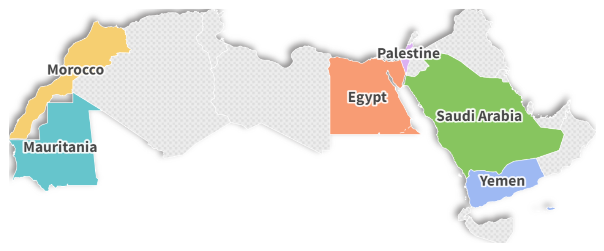

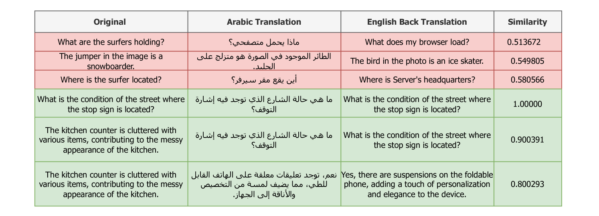

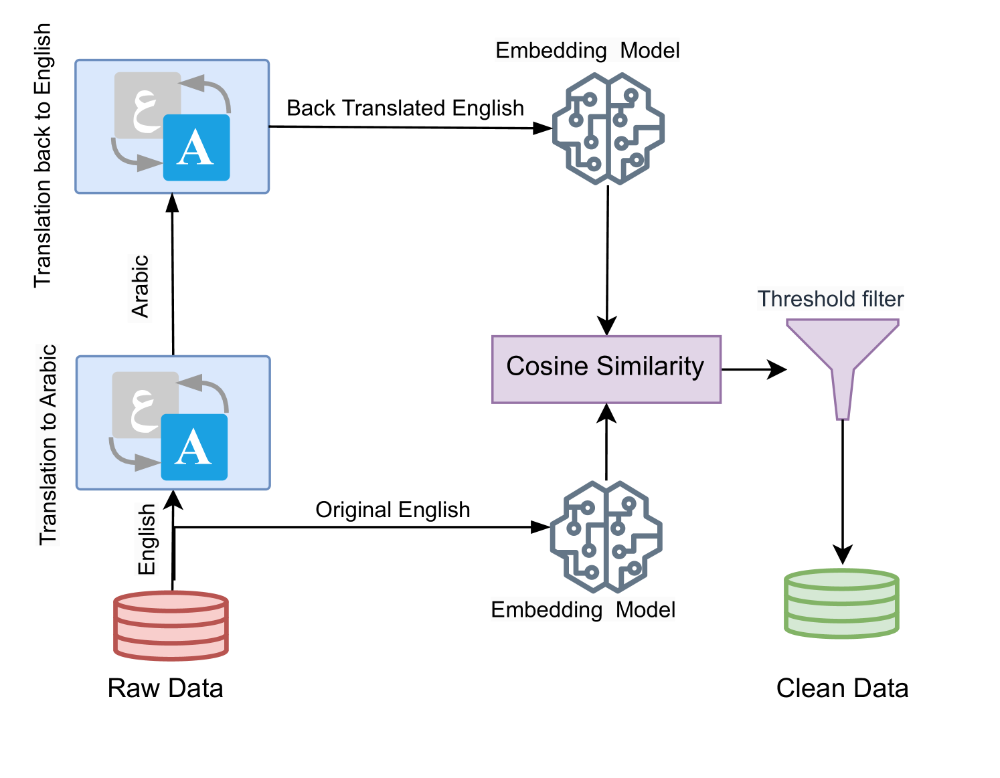

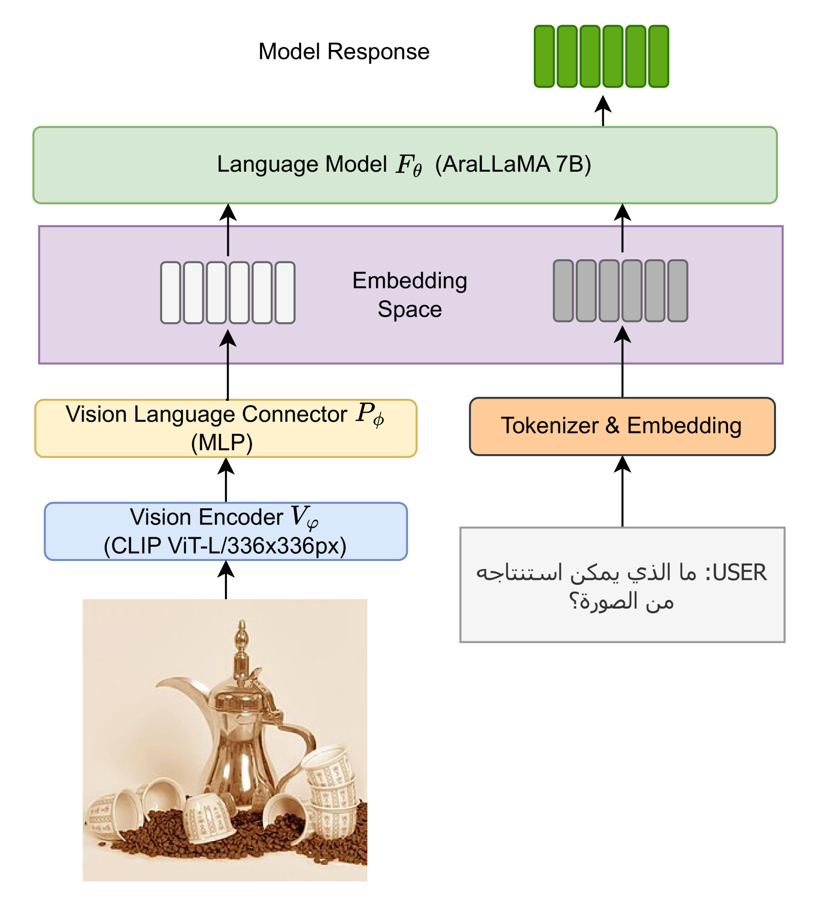

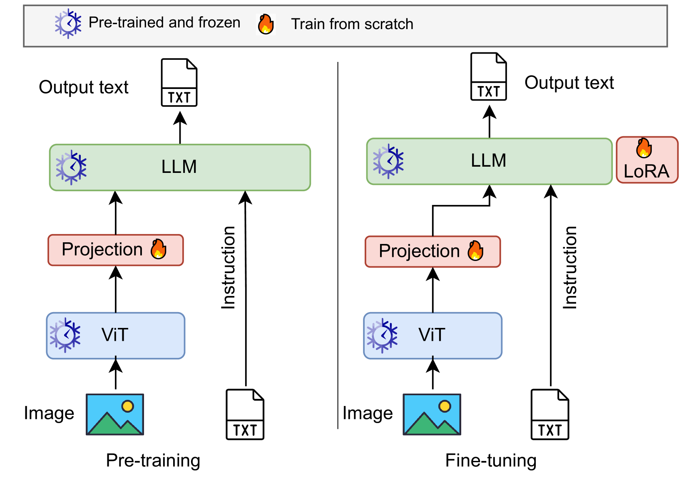

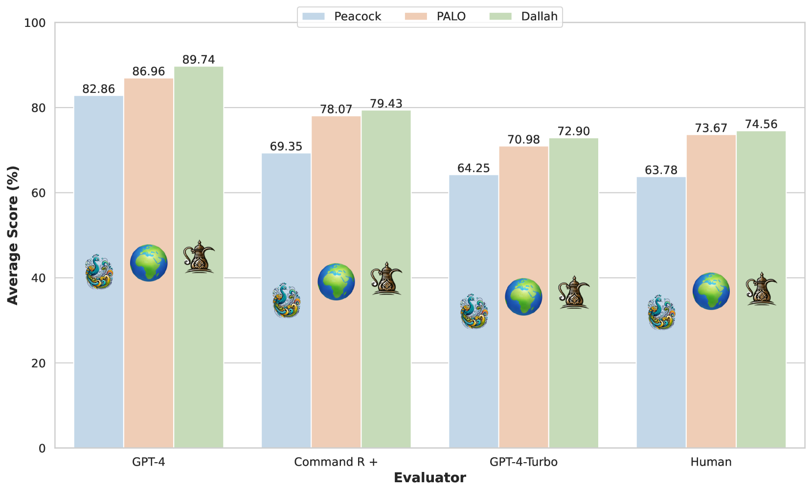

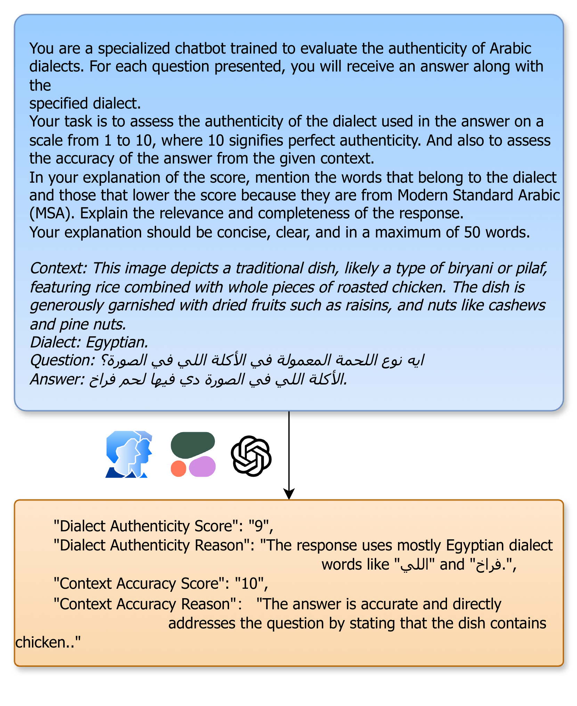

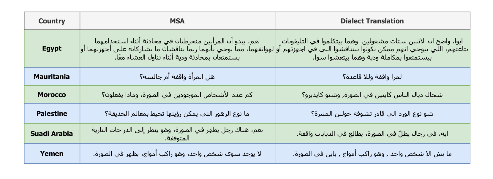

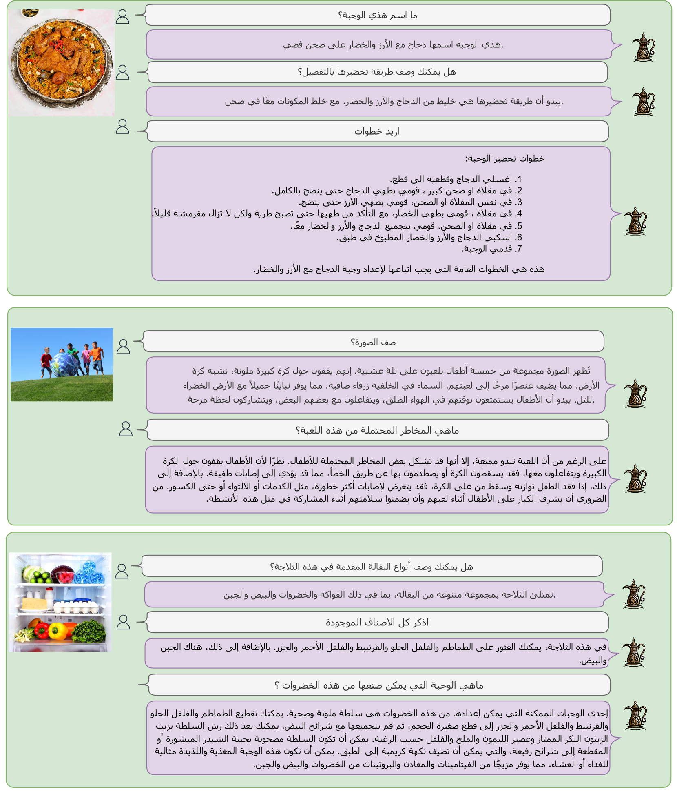

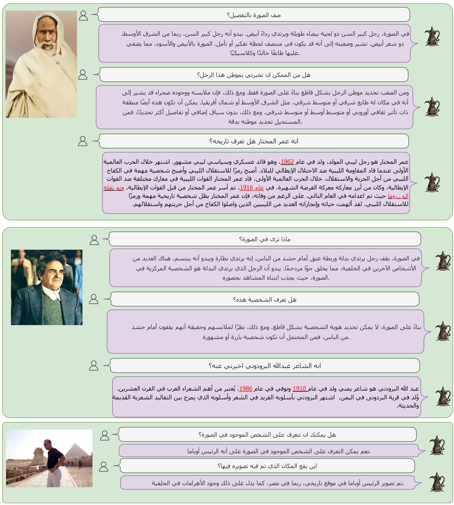

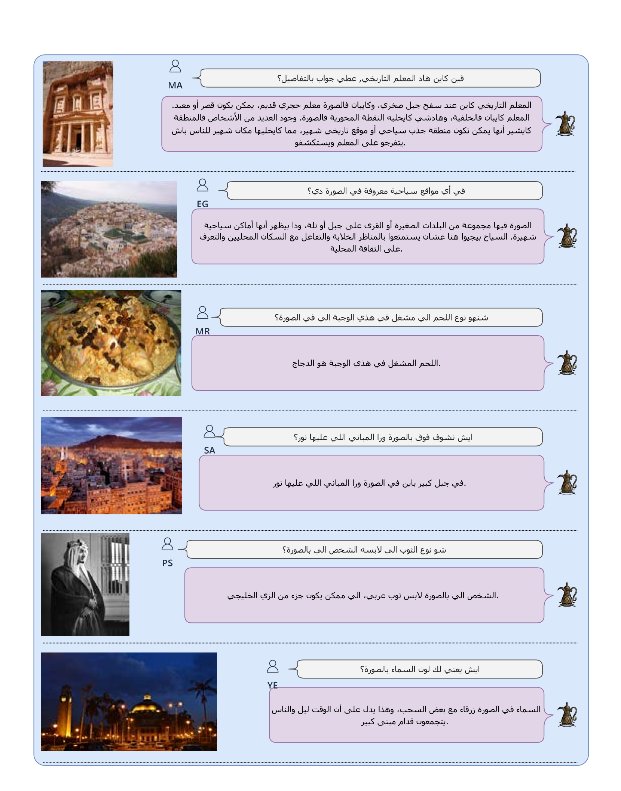

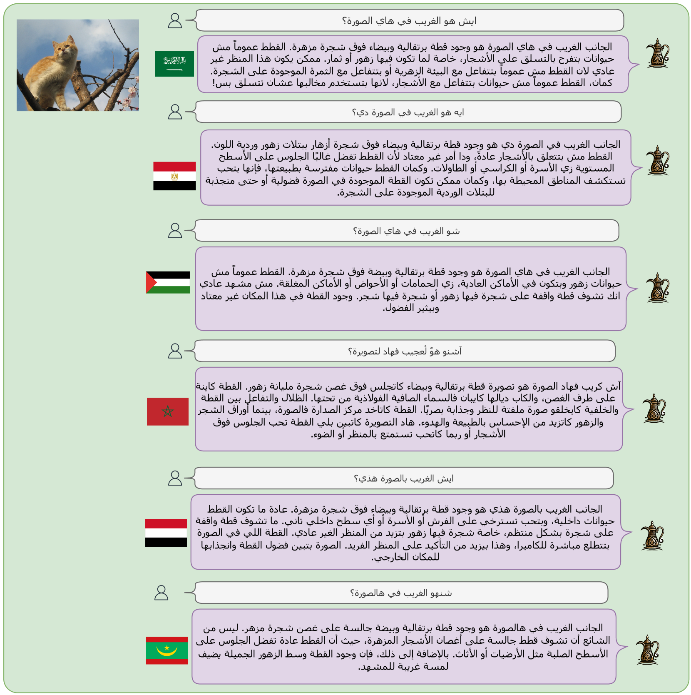

[Arxiv](https://arxiv.org/abs/2407.18129)