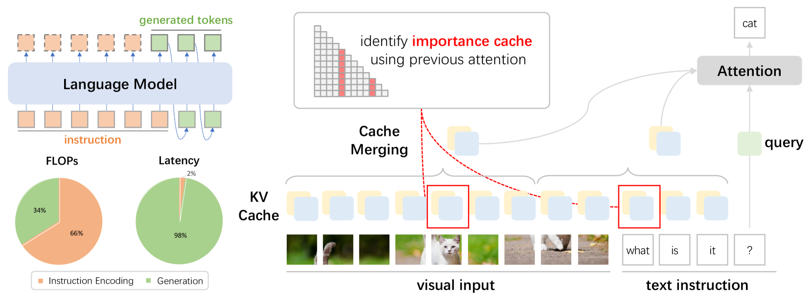
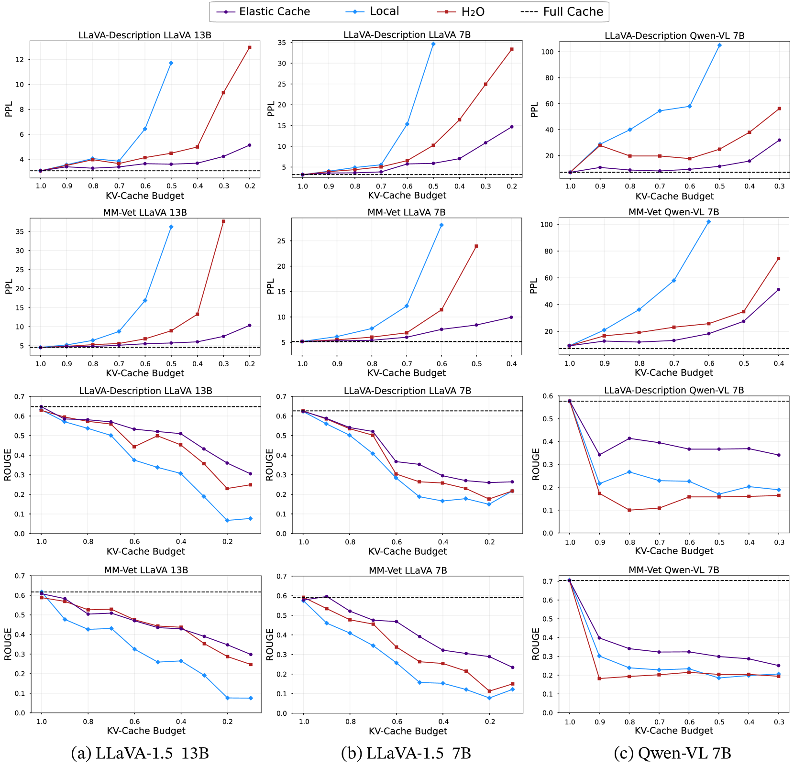
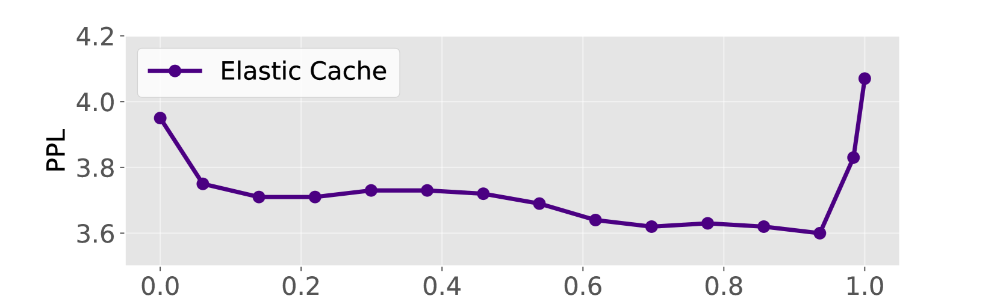

# 弹性缓存助力视觉指令模型高效推理

发布时间：2024年07月25日

`LLM应用` `计算机视觉` `人工智能`

> Efficient Inference of Vision Instruction-Following Models with Elastic Cache

# 摘要

> 在大型视觉-语言模型 (LVLMs) 中，高效部署这些模型因关键-值 (KV) 缓存的高内存需求而面临挑战。传统的缓存管理策略未能满足多模态指令遵循模型的特定需求。为此，本文提出了 Elastic Cache，通过为指令编码和输出生成阶段采用不同加速方法，优化缓存管理。我们提出了一种重要性驱动的缓存合并策略，识别重要关键/值向量作为锚点，合并周边缓存，既保留了上下文信息，又实现了加速。在指令编码阶段，我们依据频率评估缓存重要性；在输出生成阶段，则根据令牌与偏移量的距离进行优先排序。实验结果显示，Elastic Cache 在提升效率的同时，显著超越了现有修剪方法在语言生成任务中的表现。代码已公开在 https://github.com/liuzuyan/ElasticCache。

> In the field of instruction-following large vision-language models (LVLMs), the efficient deployment of these models faces challenges, notably due to the high memory demands of their key-value (KV) caches. Conventional cache management strategies for LLMs focus on cache eviction, which often fails to address the specific needs of multimodal instruction-following models. Recognizing this gap, in this paper, we introduce Elastic Cache, a novel approach that benefits from applying distinct acceleration methods for instruction encoding and output generation stages. We investigate the metrics of importance in different stages and propose an importance-driven cache merging strategy to prune redundancy caches. Instead of discarding less important caches, our strategy identifies important key/value vectors as anchor points. Surrounding less important caches are then merged with these anchors, enhancing the preservation of contextual information in the KV caches while yielding an arbitrary acceleration ratio. For instruction encoding, we utilize the frequency to evaluate the importance of caches. Regarding output generation, we prioritize tokens based on their distance with an offset, by which both the initial and most recent tokens are retained. Results on a range of LVLMs demonstrate that Elastic Cache not only boosts efficiency but also notably outperforms existing pruning methods in language generation across various tasks. Code is available at https://github.com/liuzuyan/ElasticCache

[Arxiv](https://arxiv.org/abs/2407.18121)