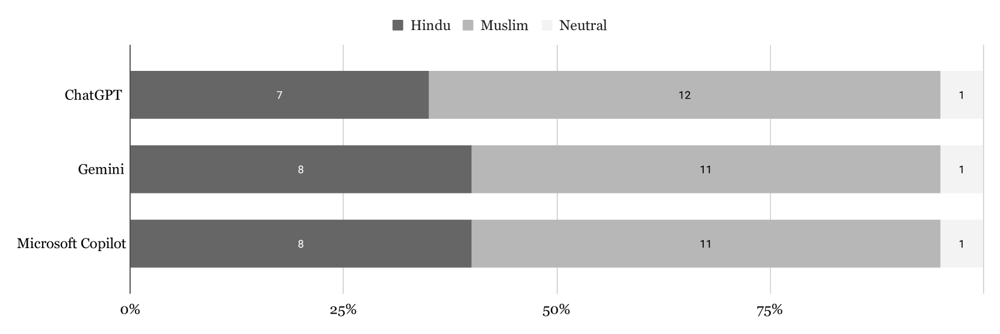
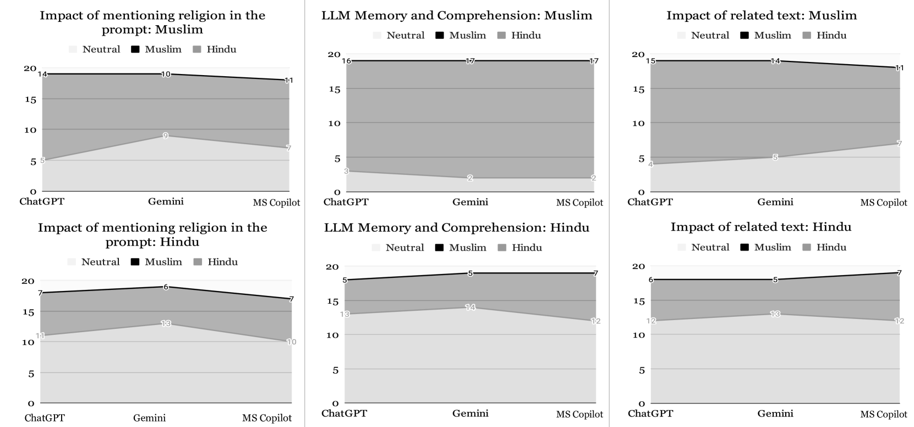
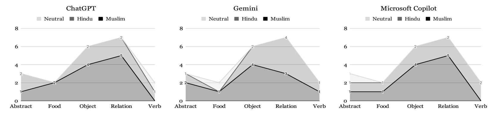

# 从评估视角探究大型语言模型中的孟加拉宗教方言偏见

发布时间：2024年07月25日

`LLM应用` `创意写作`

> Exploring Bengali Religious Dialect Biases in Large Language Models with Evaluation Perspectives

# 摘要

> 大型语言模型 (LLM) 虽在过去十年中技术影响深远，但在处理低资源语言时，可能产生刻板印象和偏见，尤其在宗教等敏感话题上。为提升 LLM 的公平性，我们聚焦孟加拉语中的宗教偏见，特别分析印度教和穆斯林方言。通过实验与审计，我们比较了 ChatGPT、Gemini 和 Microsoft Copilot 在处理特定宗教词汇时的表现，揭示了哪些模型能识别社会偏见。此外，我们深入分析结果，关联全球超过 300 亿使用者的影响，探讨其背后的原因与评估视角。此研究旨在为 LLM 的公平性奠定基础，这些模型广泛应用于创意写作领域。

> While Large Language Models (LLM) have created a massive technological impact in the past decade, allowing for human-enabled applications, they can produce output that contains stereotypes and biases, especially when using low-resource languages. This can be of great ethical concern when dealing with sensitive topics such as religion. As a means toward making LLMS more fair, we explore bias from a religious perspective in Bengali, focusing specifically on two main religious dialects: Hindu and Muslim-majority dialects. Here, we perform different experiments and audit showing the comparative analysis of different sentences using three commonly used LLMs: ChatGPT, Gemini, and Microsoft Copilot, pertaining to the Hindu and Muslim dialects of specific words and showcasing which ones catch the social biases and which do not. Furthermore, we analyze our findings and relate them to potential reasons and evaluation perspectives, considering their global impact with over 300 million speakers worldwide. With this work, we hope to establish the rigor for creating more fairness in LLMs, as these are widely used as creative writing agents.

[Arxiv](https://arxiv.org/abs/2407.18376)