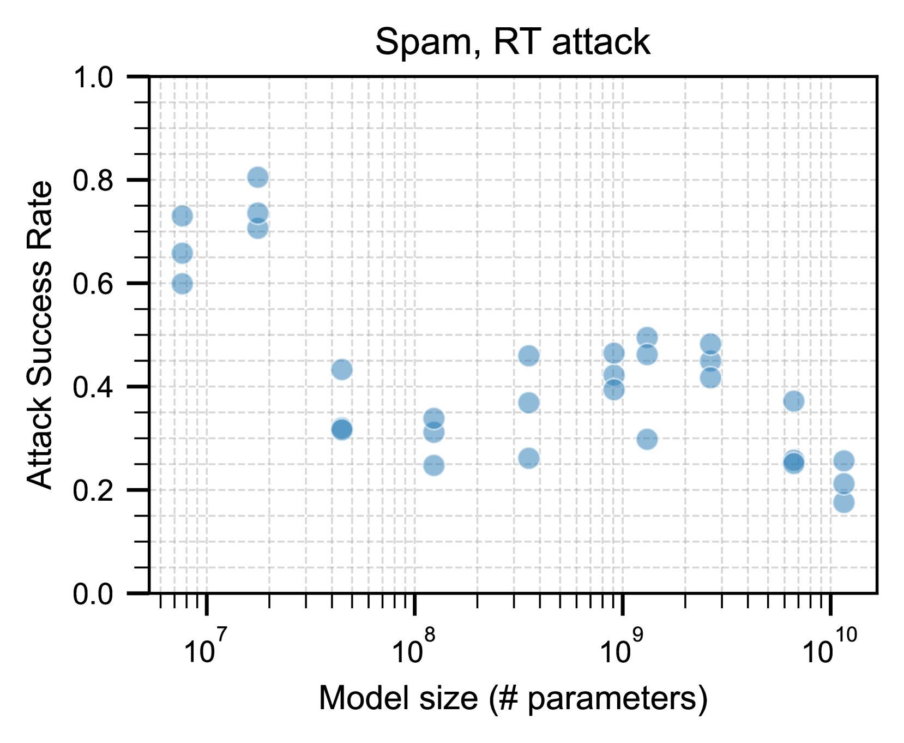
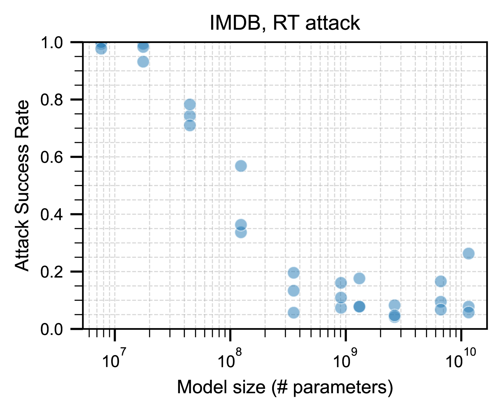
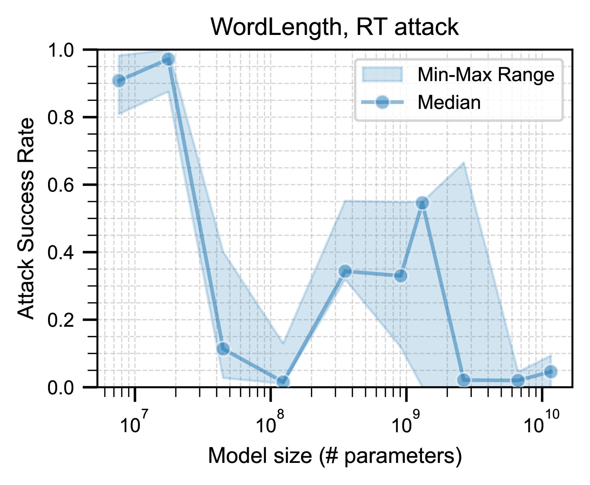
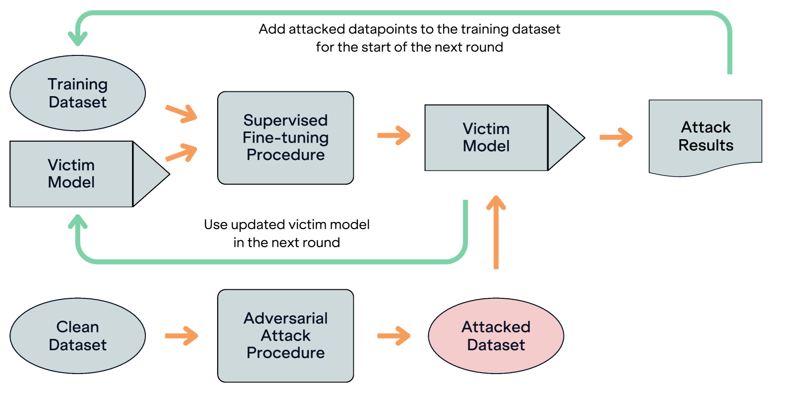
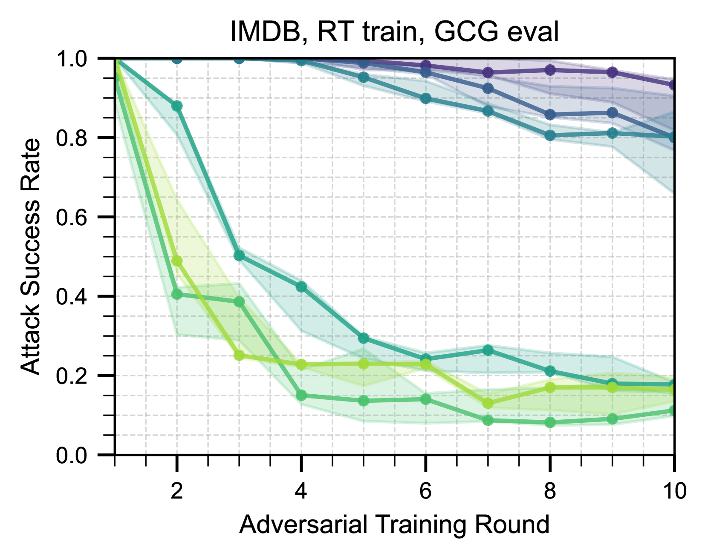

# 探究LLM鲁棒性中的规模效应

发布时间：2024年07月25日

`LLM理论` `计算机科学` `人工智能`

> Exploring Scaling Trends in LLM Robustness

# 摘要

> 随着模型大小和训练数据的扩展，语言模型的能力不断提升。这一发现促使我们训练了越来越多的庞大语言模型，它们展现出了令人瞩目的能力。然而，这些模型对对抗性提示，如“越狱”行为，显得脆弱，这种行为可能导致模型执行不希望的行为，带来滥用风险。过去的研究表明，计算机视觉模型在规模扩大时变得更加健壮，这让我们思考：语言模型的健壮性是否也会随规模提升？我们的实证研究发现，尽管更大模型在对抗性训练中表现更佳，但在缺乏明确防御措施时，规模的扩大并未带来显著益处。

> Language model capabilities predictably improve from scaling a model's size and training data. Motivated by this, increasingly large language models have been trained, yielding an array of impressive capabilities. Yet these models are vulnerable to adversarial prompts, such as "jailbreaks" that hijack models to perform undesired behaviors, posing a significant risk of misuse. Prior work indicates that computer vision models become more robust with model and data scaling, raising the question: does language model robustness also improve with scale? We study this question empirically, finding that larger models respond substantially better to adversarial training, but there is little to no benefit from model scale in the absence of explicit defenses.

[Arxiv](https://arxiv.org/abs/2407.18213)