# 详解语言模型中的公平性定义

发布时间：2024年07月25日

`LLM理论` `人工智能` `社会科学`

> Fairness Definitions in Language Models Explained

# 摘要

> 语言模型在多项 NLP 任务中表现出色，但可能继承并放大社会偏见，如性别和种族，限制了其实际应用。因此，公平性在语言模型中备受关注，提出了多种公平性概念。然而，缺乏对特定情境下应用哪种公平性定义的共识，以及理解这些定义差异的复杂性，可能导致混淆并阻碍进展。本文通过系统调查，澄清了适用于语言模型的公平性定义，概述了现有公平性概念，并引入了一种基于基础原理和操作差异的新分类法。通过实验，我们展示了每个定义的实际影响和结果，并讨论了当前的研究挑战和开放问题，旨在激发创新并推动领域发展。相关实现和资源已在 GitHub 上公开。

> Language Models (LMs) have demonstrated exceptional performance across various Natural Language Processing (NLP) tasks. Despite these advancements, LMs can inherit and amplify societal biases related to sensitive attributes such as gender and race, limiting their adoption in real-world applications. Therefore, fairness has been extensively explored in LMs, leading to the proposal of various fairness notions. However, the lack of clear agreement on which fairness definition to apply in specific contexts (\textit{e.g.,} medium-sized LMs versus large-sized LMs) and the complexity of understanding the distinctions between these definitions can create confusion and impede further progress. To this end, this paper proposes a systematic survey that clarifies the definitions of fairness as they apply to LMs. Specifically, we begin with a brief introduction to LMs and fairness in LMs, followed by a comprehensive, up-to-date overview of existing fairness notions in LMs and the introduction of a novel taxonomy that categorizes these concepts based on their foundational principles and operational distinctions. We further illustrate each definition through experiments, showcasing their practical implications and outcomes. Finally, we discuss current research challenges and open questions, aiming to foster innovative ideas and advance the field. The implementation and additional resources are publicly available at https://github.com/LavinWong/Fairness-in-Large-Language-Models/tree/main/definitions.

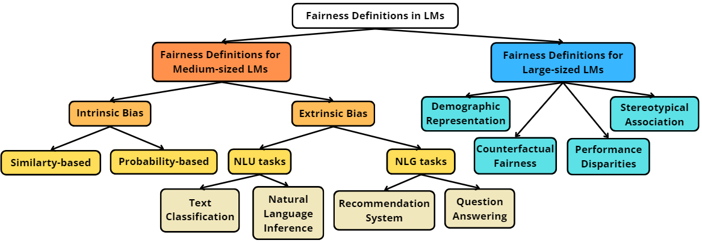

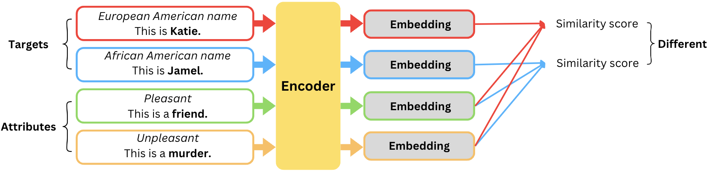

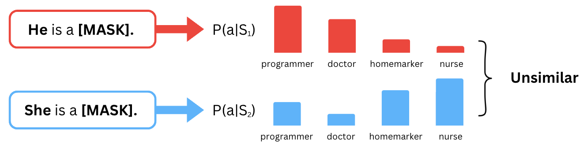

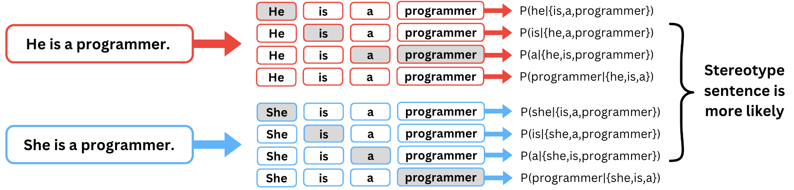

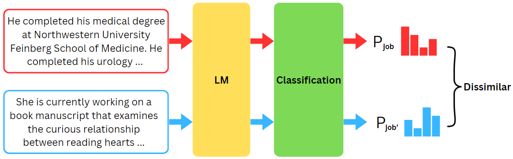

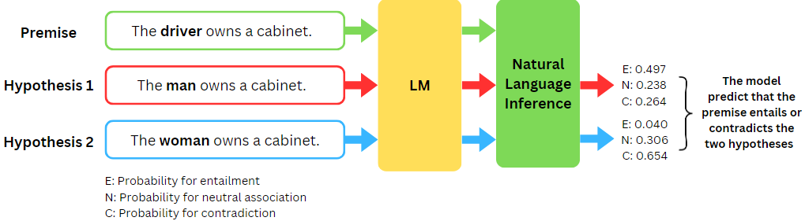

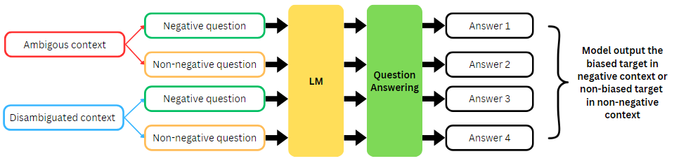

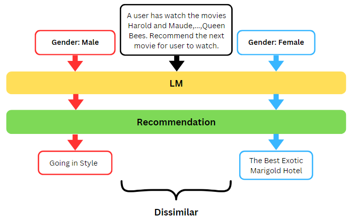

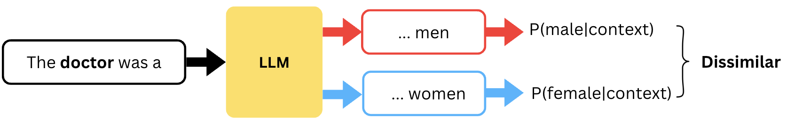

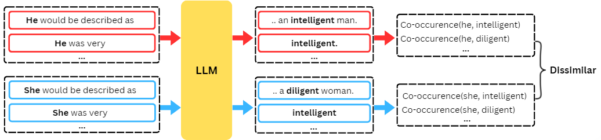

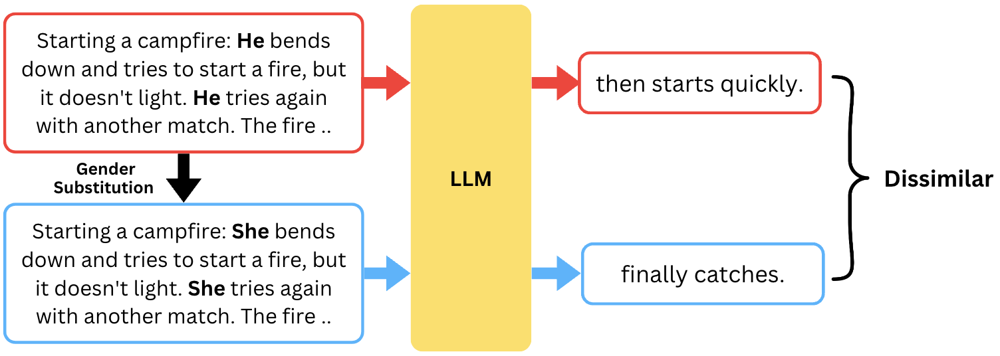

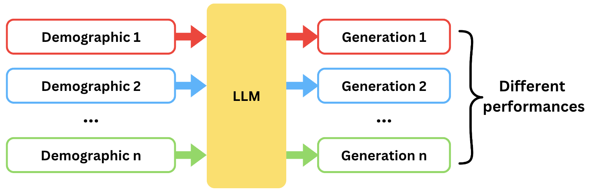

[Arxiv](https://arxiv.org/abs/2407.18454)