# 利用大型语言模型解析财务报表

发布时间：2024年07月25日

`LLM应用` `人工智能`

> Financial Statement Analysis with Large Language Models

# 摘要

> 我们探讨了 LLM 能否像专业分析师一样进行财务报表分析，发现 GPT4 在缺乏特定信息的情况下，预测收益变化的能力超越了人类分析师。特别是在分析师难以应对的场景中，LLM 展现出显著优势。其预测准确性甚至与顶尖的机器学习模型不相上下，且预测并非依赖训练记忆，而是基于对公司未来表现的深刻洞察。基于 GPT 预测的交易策略在夏普比率和阿尔法值上均优于其他模型，这表明 LLM 在决策过程中可能占据核心地位。

> We investigate whether an LLM can successfully perform financial statement analysis in a way similar to a professional human analyst. We provide standardized and anonymous financial statements to GPT4 and instruct the model to analyze them to determine the direction of future earnings. Even without any narrative or industry-specific information, the LLM outperforms financial analysts in its ability to predict earnings changes. The LLM exhibits a relative advantage over human analysts in situations when the analysts tend to struggle. Furthermore, we find that the prediction accuracy of the LLM is on par with the performance of a narrowly trained state-of-the-art ML model. LLM prediction does not stem from its training memory. Instead, we find that the LLM generates useful narrative insights about a company's future performance. Lastly, our trading strategies based on GPT's predictions yield a higher Sharpe ratio and alphas than strategies based on other models. Taken together, our results suggest that LLMs may take a central role in decision-making.

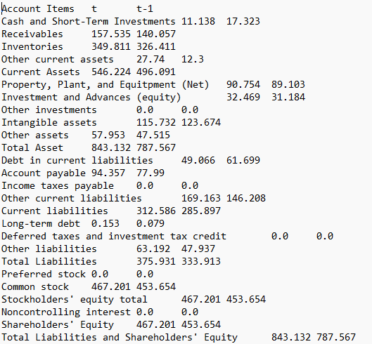

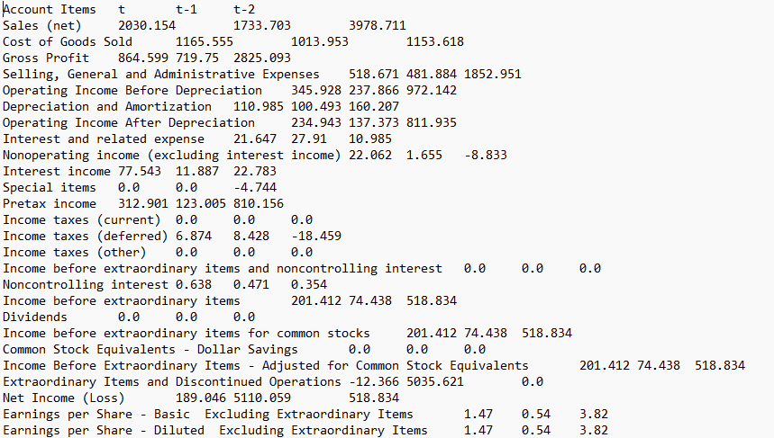

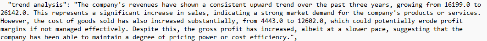

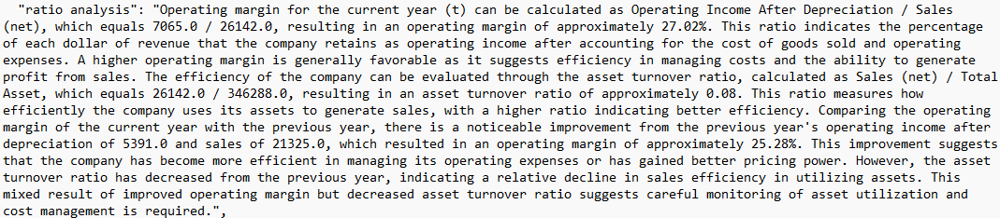

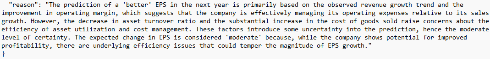

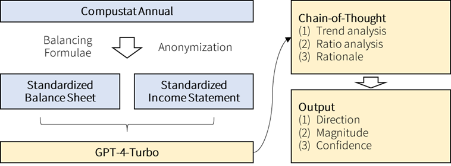

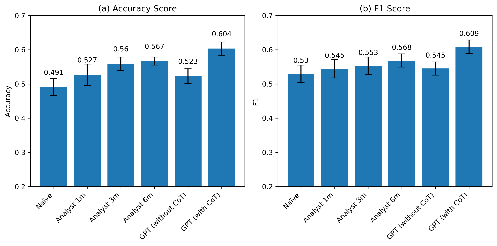

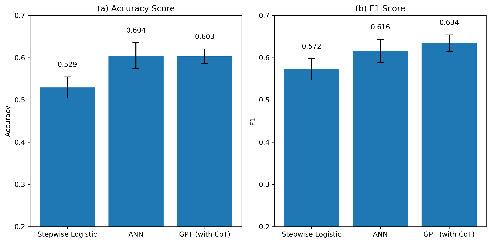

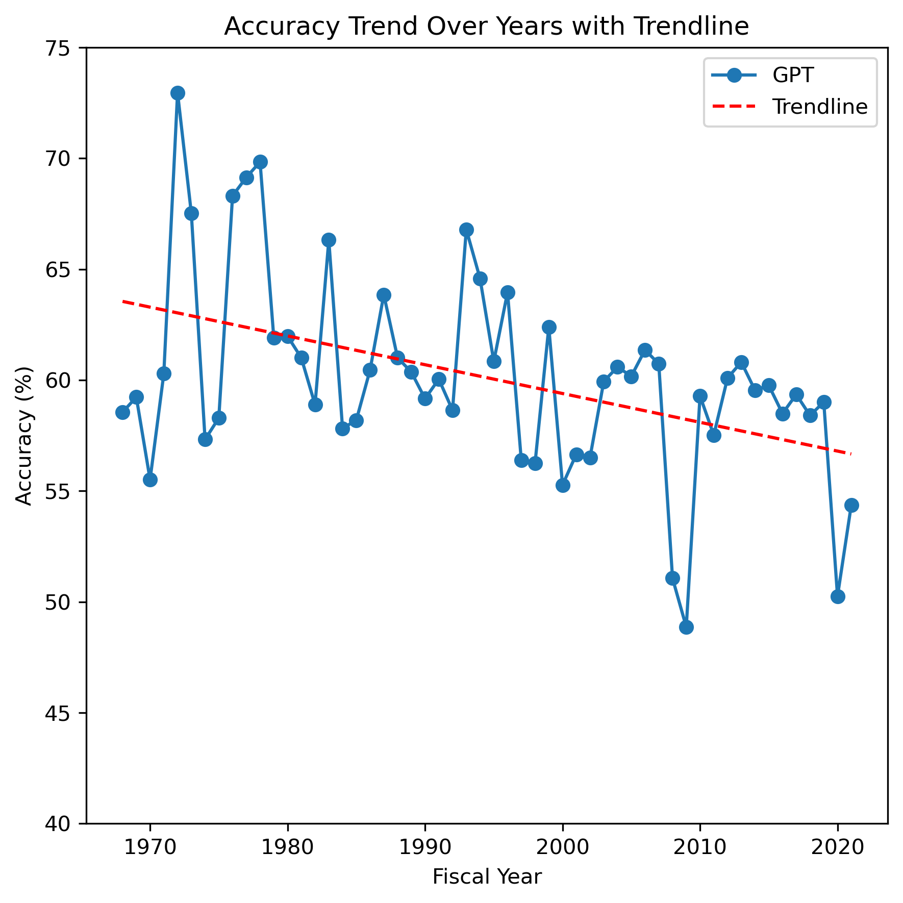

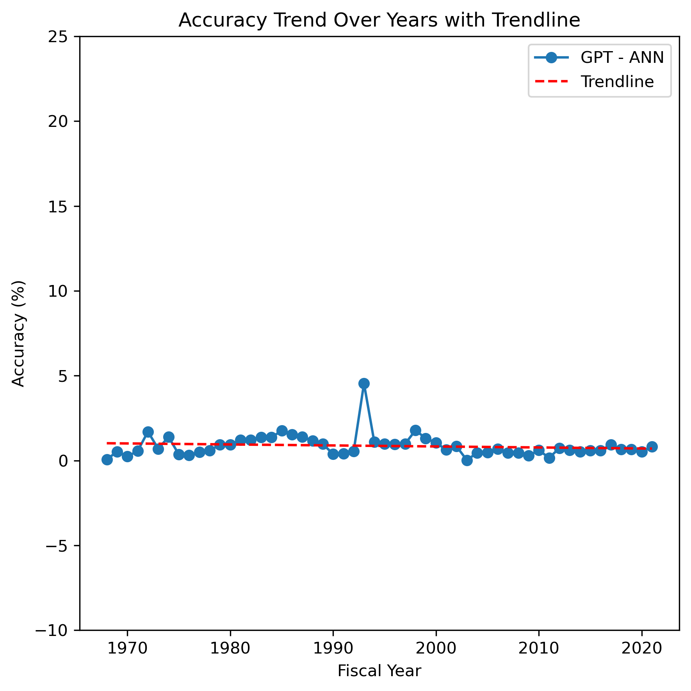

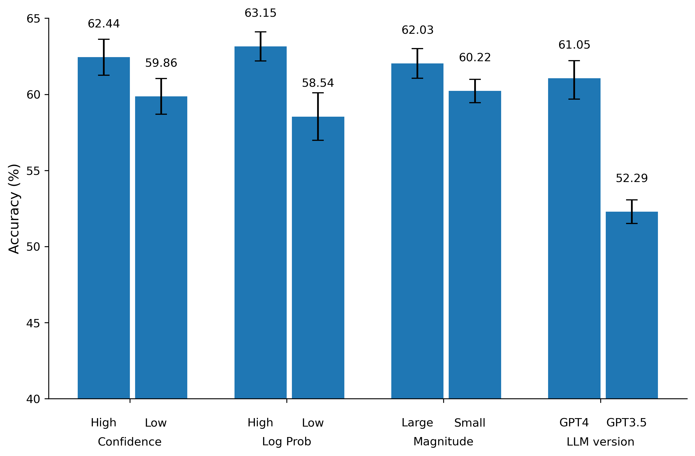

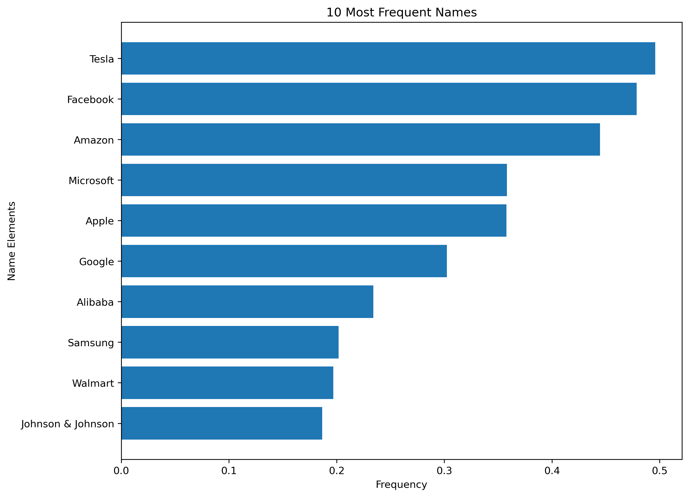

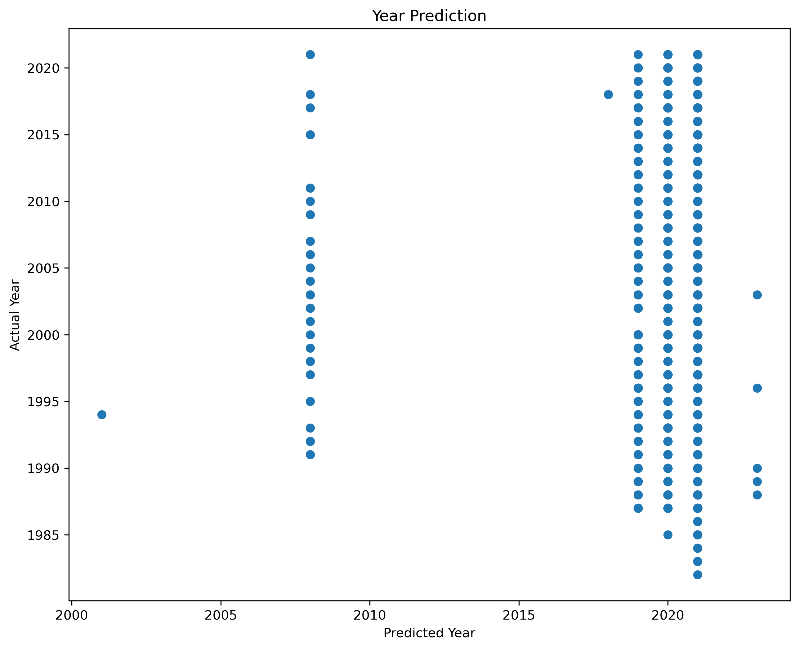

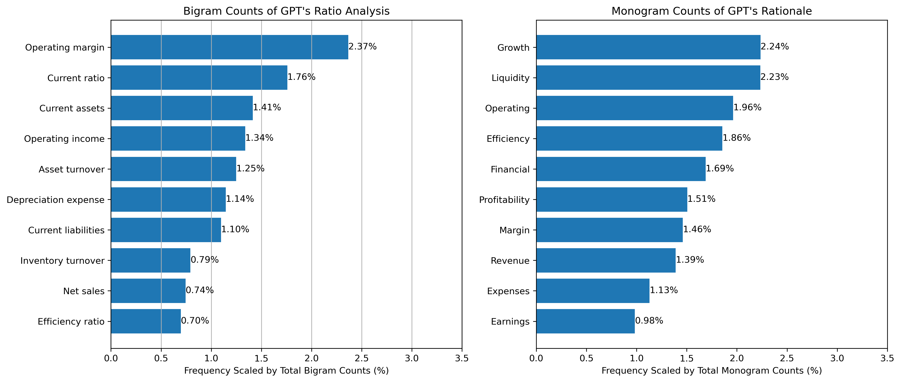

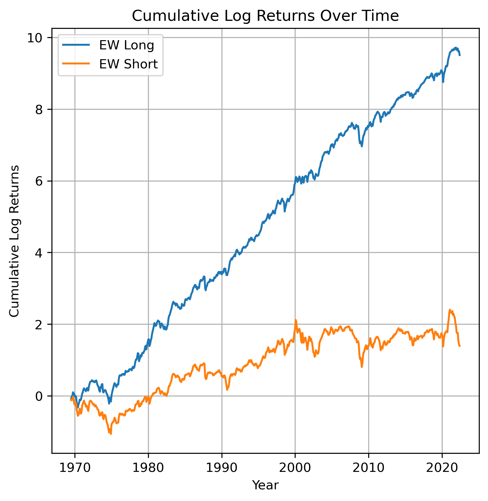

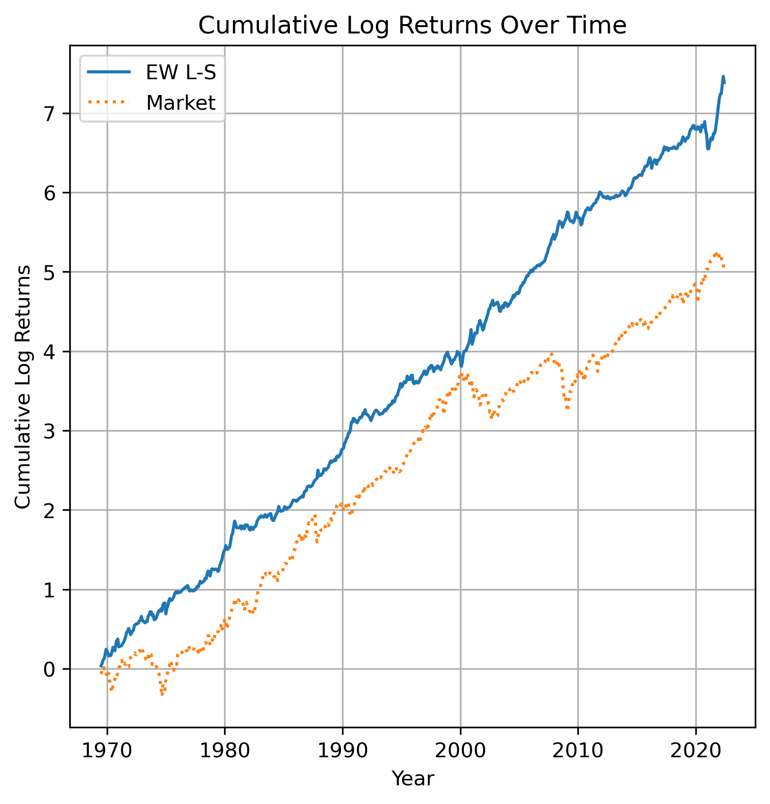

[Arxiv](https://arxiv.org/abs/2407.17866)