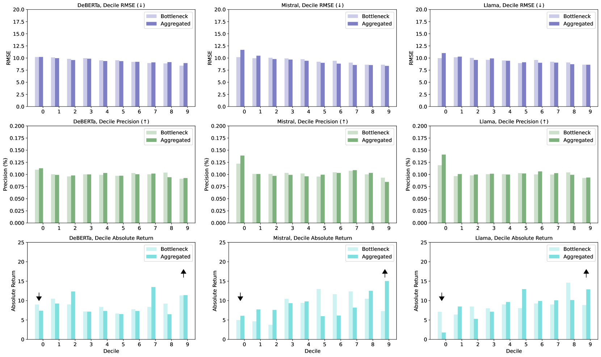
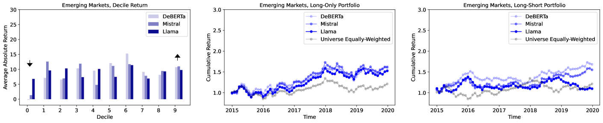

# 通过新闻流微调大型语言模型以预测股票回报

发布时间：2024年07月25日

`LLM应用` `量化投资`

> Fine-Tuning Large Language Models for Stock Return Prediction Using Newsflow

# 摘要

> 大型语言模型（LLM）通过微调技术在语言理解和生成任务中表现卓越。本文聚焦于利用财经新闻流预测股票回报的 LLM 微调。在量化投资领域，准确的回报预测是选股和优化投资组合的关键。我们设计的模型包含文本表示和预测两个模块，并探讨了仅编码器和仅解码器 LLM 的不同文本生成方式对预测性能的影响。实验结果显示：(1) 从 LLM 词级别嵌入中聚合的表示能有效提升纯多头和多空组合的性能；(2) 在大型投资组合中，基于解码器 LLM 的模型表现更优，而在小型组合中则无明显优势。在研究的三种 LLM 中，Mistral 在不同组合中表现稳健；(3) LLM 文本表示得出的回报预测在投资组合构建中优于传统情绪分析。

> Large language models (LLMs) and their fine-tuning techniques have demonstrated superior performance in various language understanding and generation tasks. This paper explores fine-tuning LLMs for stock return forecasting with financial newsflow. In quantitative investing, return forecasting is fundamental for subsequent tasks like stock picking, portfolio optimization, etc. We formulate the model to include text representation and forecasting modules. We propose to compare the encoder-only and decoder-only LLMs, considering they generate text representations in distinct ways. The impact of these different representations on forecasting performance remains an open question. Meanwhile, we compare two simple methods of integrating LLMs' token-level representations into the forecasting module. The experiments on real news and investment universes reveal that: (1) aggregated representations from LLMs' token-level embeddings generally produce return predictions that enhance the performance of long-only and long-short portfolios; (2) in the relatively large investment universe, the decoder LLMs-based prediction model leads to stronger portfolios, whereas in the small universes, there are no consistent winners. Among the three LLMs studied (DeBERTa, Mistral, Llama), Mistral performs more robustly across different universes; (3) return predictions derived from LLMs' text representations are a strong signal for portfolio construction, outperforming conventional sentiment scores.

[Arxiv](https://arxiv.org/abs/2407.18103)