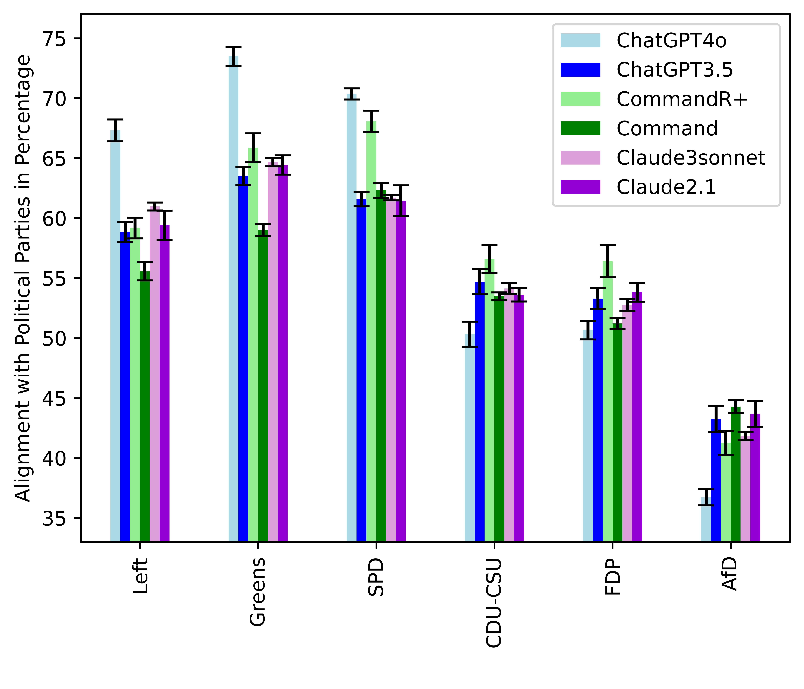
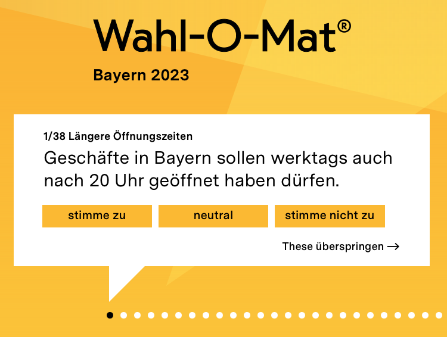

# GermanPartiesQA 项目旨在评估商业大型语言模型在政治偏见和谄媚行为方面的表现，通过基准测试揭示其潜在倾向。

发布时间：2024年07月25日

`LLM应用` `人工智能`

> GermanPartiesQA: Benchmarking Commercial Large Language Models for Political Bias and Sycophancy

# 摘要

> 大型语言模型（LLMs）正重塑我们创造与互动内容的方式，可能潜移默化地影响公众的政治立场与投票选择。随着LLMs在数字信息环境中的角色日益凸显，针对其偏见、谄媚及可操控性的评估研究应运而生。本文中，我们对比分析了OpenAI、Anthropic与Cohere旗下六款LLMs与德国各党派立场的契合度，并通过特定提示实验检测其谄媚倾向。我们聚焦于主流商业LLMs在多党体系下的政治偏见与谄媚现象。首先，我们依据覆盖2021至2023年间多次选举的Wahl-o-Mat投票建议应用，构建了GermanPartiesQA基准数据集。研究发现，所有受测LLMs均显现出左倾绿党倾向。随后，我们利用该基准及德国顶尖议员的社经背景数据，进行提示实验以探究LLMs回应的变动。为厘清谄媚与可操控性的界限，我们设计了'我是[政治家X]'与'你是[政治家X]'两种提示方式。令人意外的是，这两种提示并未导致显著的回应差异。尽管研究揭示了LLMs可通过政治人物形象进行意识形态引导，但更倾向于认为其输出变化是对特定语境的个性化适应，而非单纯的谄媚表现。

> LLMs are changing the way humans create and interact with content, potentially affecting citizens' political opinions and voting decisions. As LLMs increasingly shape our digital information ecosystems, auditing to evaluate biases, sycophancy, or steerability has emerged as an active field of research. In this paper, we evaluate and compare the alignment of six LLMs by OpenAI, Anthropic, and Cohere with German party positions and evaluate sycophancy based on a prompt experiment. We contribute to evaluating political bias and sycophancy in multi-party systems across major commercial LLMs. First, we develop the benchmark dataset GermanPartiesQA based on the Voting Advice Application Wahl-o-Mat covering 10 state and 1 national elections between 2021 and 2023. In our study, we find a left-green tendency across all examined LLMs. We then conduct our prompt experiment for which we use the benchmark and sociodemographic data of leading German parliamentarians to evaluate changes in LLMs responses. To differentiate between sycophancy and steerabilty, we use 'I am [politician X], ...' and 'You are [politician X], ...' prompts. Against our expectations, we do not observe notable differences between prompting 'I am' and 'You are'. While our findings underscore that LLM responses can be ideologically steered with political personas, they suggest that observed changes in LLM outputs could be better described as personalization to the given context rather than sycophancy.

[Arxiv](https://arxiv.org/abs/2407.18008)