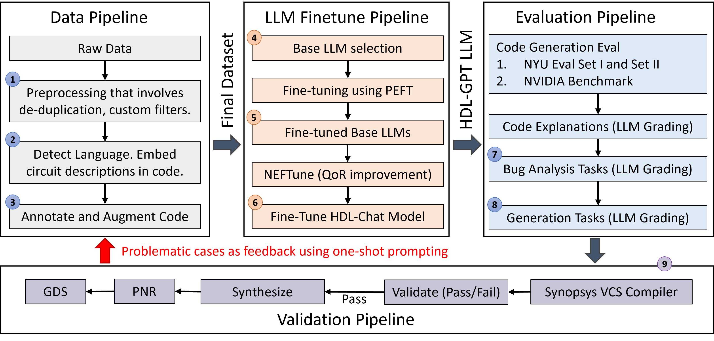
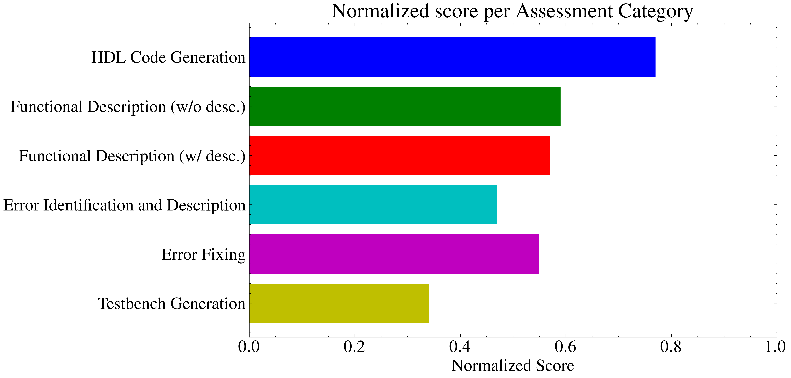

# HDL-GPT：只需高质量HDL，一切尽在掌握

发布时间：2024年07月25日

`LLM应用` `电子工程` `软件开发`

> HDL-GPT: High-Quality HDL is All You Need

# 摘要

> 本文提出了一种名为HDL-GPT的新方法，该方法利用开源HDL代码库来训练高质量的大型代码模型。我们假设，只要拥有高质量的HDL，就能构建出性能卓越且具有广泛零-shot泛化能力的模型。通过精心策划和增强开源HDL代码，我们将质量参差不齐的数据转化为高质量数据。实验证明，经过精心筛选和增强的HDL数据能够训练出超越现有最先进模型的强大模型。此外，我们还研究了不同微调方法对模型性能的影响。实验结果显示，HDL-GPT在多项任务中，如电路解释、代码生成等，性能较现有最先进模型提升了50%至200%。这一突破为电路设计领域的高级模型训练技术开辟了新方向。

> This paper presents Hardware Description Language Generative Pre-trained Transformers (HDL-GPT), a novel approach that leverages the vast repository of open-source High Definition Language (HDL) codes to train superior quality large code models. The core premise of this paper is the hypothesis that high-quality HDL is all you need to create models with exceptional performance and broad zero-shot generalization abilities. The paper elucidates the methods employed for the curation and augmentation of large corpora from open-source HDL code, transforming highly variable quality data into high-quality data through careful prompting and context maintenance. We demonstrate that the careful selection, filtering, and augmentation of data across HDLs can yield powerful models that surpass current state-of-the-art models. We also explore the impact of different fine-tuning methods on the quality of results. We describe experimental results across a range of fine-tuned SOTA LLMs, substantiating our claims. We demonstrate improvements of 50% to 200% over SOTA HDL models on current benchmarks in tasks ranging from HDL circuit explanations, code generation, formal and simulation testbench creation, triaging bugs, and fixing them. HDL-GPT opens new avenues for the development of advanced model training techniques for circuit design tasks.

[Arxiv](https://arxiv.org/abs/2407.18423)