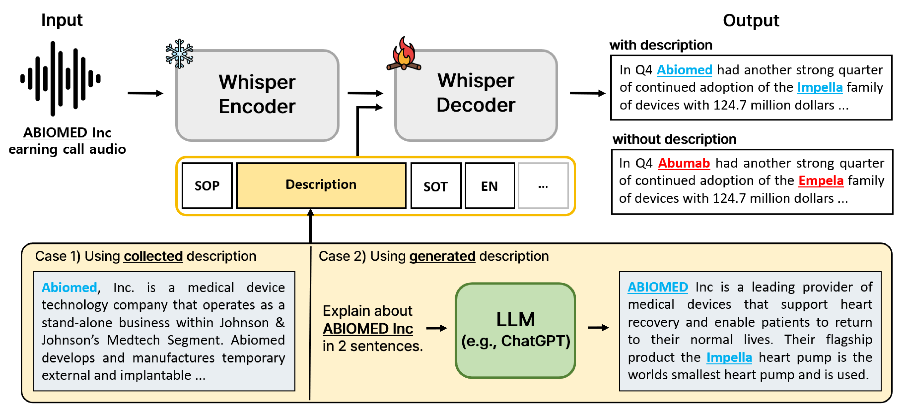

# 借助 LLM 生成的上下文描述，我们致力于提升特定领域的自动语音识别（ASR）性能。

发布时间：2024年07月25日

`LLM应用` `语音识别` `人工智能`

> Improving Domain-Specific ASR with LLM-Generated Contextual Descriptions

# 摘要

> E2E ASR系统虽在大数据集训练下进步显著，但仍难精准识别专有名词等特定领域词汇。为此，我们提出不改架构利用Whisper，同时保持泛化性能并有效利用描述信息。此外，通过解码器微调和上下文扰动两项技术，进一步提升特定领域ASR性能。当描述缺失时，我们更利用LLM生成简单元数据描述。实验显示，这些方法大幅提升实际数据集上特定领域ASR的准确性，且LLM生成的描述效果超越人工制作。

> End-to-end automatic speech recognition (E2E ASR) systems have significantly improved speech recognition through training on extensive datasets. Despite these advancements, they still struggle to accurately recognize domain specific words, such as proper nouns and technical terminologies. To address this problem, we propose a method to utilize the state-of-the-art Whisper without modifying its architecture, preserving its generalization performance while enabling it to leverage descriptions effectively. Moreover, we propose two additional training techniques to improve the domain specific ASR: decoder fine-tuning, and context perturbation. We also propose a method to use a Large Language Model (LLM) to generate descriptions with simple metadata, when descriptions are unavailable. Our experiments demonstrate that proposed methods notably enhance domain-specific ASR accuracy on real-life datasets, with LLM-generated descriptions outperforming human-crafted ones in effectiveness.

[Arxiv](https://arxiv.org/abs/2407.17874)