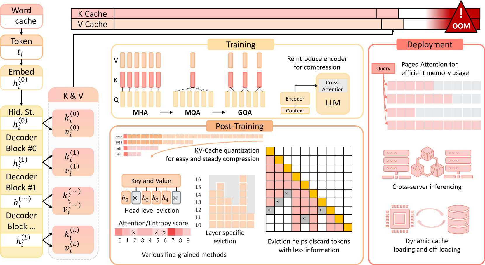
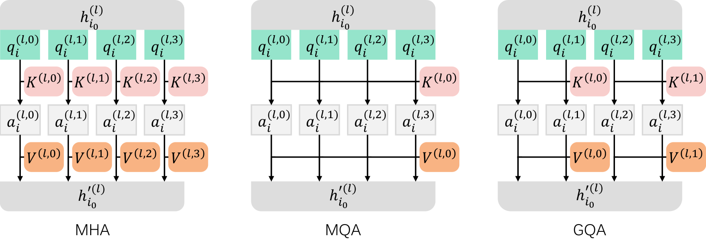
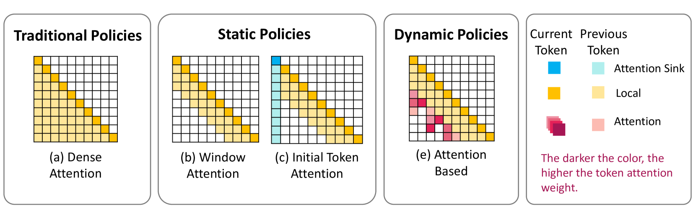
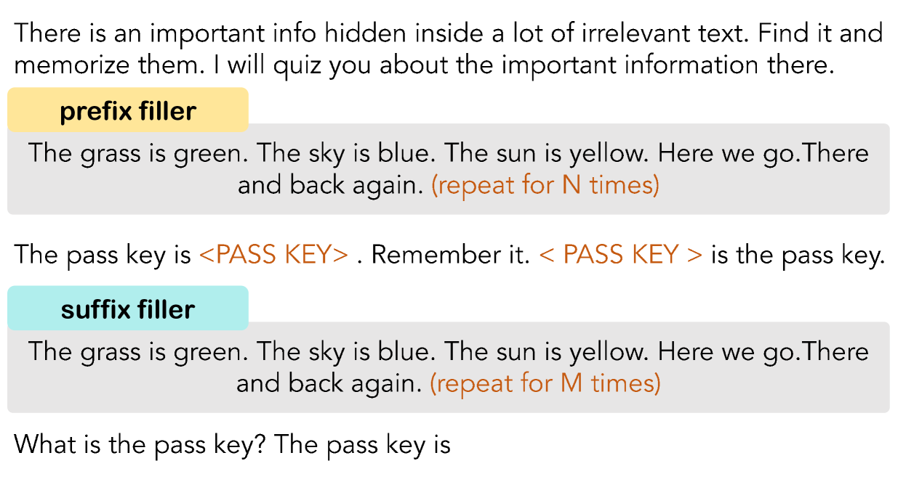
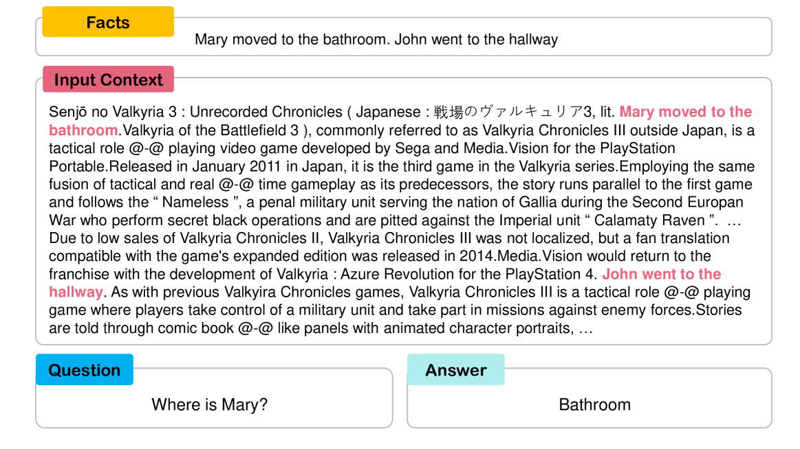

# 降低成本：探索优化 LLM KV-Cache 消耗之道

发布时间：2024年07月25日

`LLM理论` `人工智能` `计算机科学`

> Keep the Cost Down: A Review on Methods to Optimize LLM' s KV-Cache Consumption

# 摘要

> ChatGPT 等大型语言模型（LLM）凭借其卓越的语言理解能力，在多个行业掀起革命。然而，Transformer 架构在处理长文本时的局限性挑战了其效率。KV-Cache 应运而生，成为关键解决方案，将令牌生成的时间复杂度从二次方降至线性，尽管这伴随着对话长度增加而增加的 GPU 内存开销。随着 LLM 社区和学术界的进步，多种 KV-Cache 压缩方法相继提出。本综述深入剖析 KV-Cache 特性，并详述当前优化 LLM KV-Cache 空间使用的策略，涵盖预训练、部署及推理阶段，并总结这些方法的异同。同时，我们列出评估 LLM 长文本能力的指标，兼顾效率与能力视角。这篇综述不仅揭示了 LLM 优化领域的演变，更为该动态领域的未来发展提供了洞见。

> Large Language Models (LLMs), epitomized by ChatGPT' s release in late 2022, have revolutionized various industries with their advanced language comprehension. However, their efficiency is challenged by the Transformer architecture' s struggle with handling long texts. KV-Cache has emerged as a pivotal solution to this issue, converting the time complexity of token generation from quadratic to linear, albeit with increased GPU memory overhead proportional to conversation length. With the development of the LLM community and academia, various KV-Cache compression methods have been proposed. In this review, we dissect the various properties of KV-Cache and elaborate on various methods currently used to optimize the KV-Cache space usage of LLMs. These methods span the pre-training phase, deployment phase, and inference phase, and we summarize the commonalities and differences among these methods. Additionally, we list some metrics for evaluating the long-text capabilities of large language models, from both efficiency and capability perspectives. Our review thus sheds light on the evolving landscape of LLM optimization, offering insights into future advancements in this dynamic field.

[Arxiv](https://arxiv.org/abs/2407.18003)