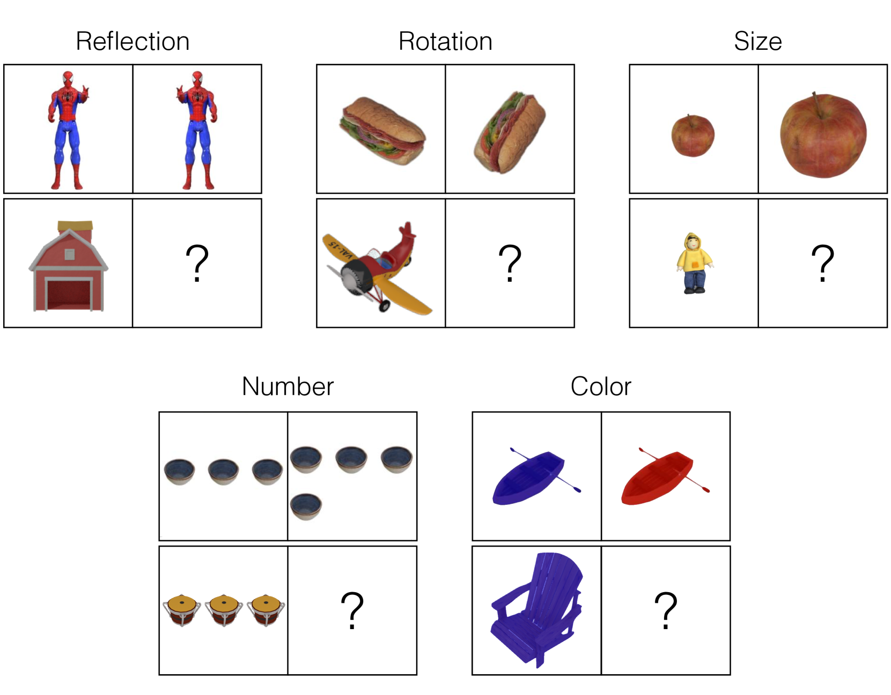

# KiVA：以儿童思维为灵感的视觉类比，专为评估大型多模态模型而设计。

发布时间：2024年07月25日

`LLM应用` `人工智能`

> KiVA: Kid-inspired Visual Analogies for Testing Large Multimodal Models

# 摘要

> 本文探讨了大型多模态模型（LMMs）在视觉类比推理方面的表现，并与成人和儿童进行了对比。我们提出了一项包含1,400个日常物体视觉变换的新基准，旨在测试LMMs的视觉类比推理能力，并比较其与人类的表现。评估分为三个阶段：识别变化、理解变化方式及应用规则至新场景。研究发现，尽管某些模型能有效识别变化，但在理解和应用变化规则方面仍显不足。相比之下，人类在各阶段均展现出更强的类比推理能力。此外，模型在处理简单视觉属性任务时表现较好，但在涉及复杂认知需求的任务中则面临更大挑战。这些结果凸显了当前模型训练数据主要依赖2D图像和文本的局限性。

> This paper investigates visual analogical reasoning in large multimodal models (LMMs) compared to human adults and children. A "visual analogy" is an abstract rule inferred from one image and applied to another. While benchmarks exist for testing visual reasoning in LMMs, they require advanced skills and omit basic visual analogies that even young children can make. Inspired by developmental psychology, we propose a new benchmark of 1,400 visual transformations of everyday objects to test LMMs on visual analogical reasoning and compare them to children and adults. We structure the evaluation into three stages: identifying what changed (e.g., color, number, etc.), how it changed (e.g., added one object), and applying the rule to new scenarios. Our findings show that while models like GPT-4V, LLaVA-1.5, and MANTIS identify the "what" effectively, they struggle with quantifying the "how" and extrapolating this rule to new objects. In contrast, children and adults exhibit much stronger analogical reasoning at all three stages. Additionally, the strongest tested model, GPT-4V, performs better in tasks involving simple visual attributes like color and size, correlating with quicker human adult response times. Conversely, more complex tasks such as number, rotation, and reflection, which necessitate extensive cognitive processing and understanding of the 3D physical world, present more significant challenges. Altogether, these findings highlight the limitations of training models on data that primarily consists of 2D images and text.

[Arxiv](https://arxiv.org/abs/2407.17773)