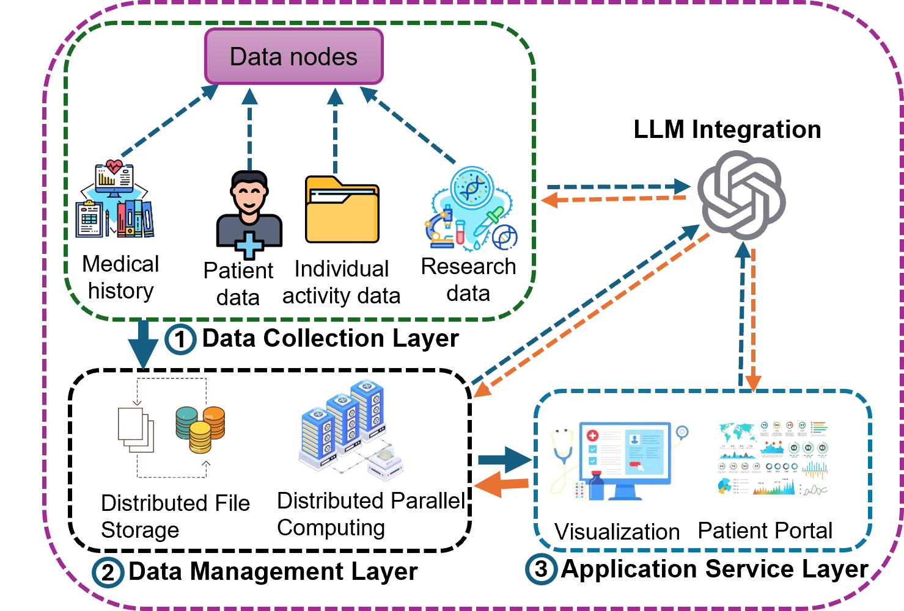

# 集成大型语言模型的医疗保健网络物理系统架构

发布时间：2024年07月25日

`LLM应用` `人工智能`

> Large Language Model Integrated Healthcare Cyber-Physical Systems Architecture

# 摘要

> 网络物理系统在现代医疗保健行业中扮演着关键角色。HCPS通过融合物理与网络元素，致力于提升医疗保健质量。然而，HCPS也面临挑战，如繁琐的数据录入、缺乏实时处理能力及有限的患者实时可视化。为解决这些问题，本文创新性地提出将大型语言模型（LLM）融入医疗系统，以提升整体效率。通过在多层次整合LLM，HCPS能借助尖端AI技术，优化患者护理、加速数据处理并强化决策过程。

> Cyber-physical systems have become an essential part of the modern healthcare industry. The healthcare cyber-physical systems (HCPS) combine physical and cyber components to improve the healthcare industry. While HCPS has many advantages, it also has some drawbacks, such as a lengthy data entry process, a lack of real-time processing, and limited real-time patient visualization. To overcome these issues, this paper represents an innovative approach to integrating large language model (LLM) to enhance the efficiency of the healthcare system. By incorporating LLM at various layers, HCPS can leverage advanced AI capabilities to improve patient outcomes, advance data processing, and enhance decision-making.

[Arxiv](https://arxiv.org/abs/2407.18407)