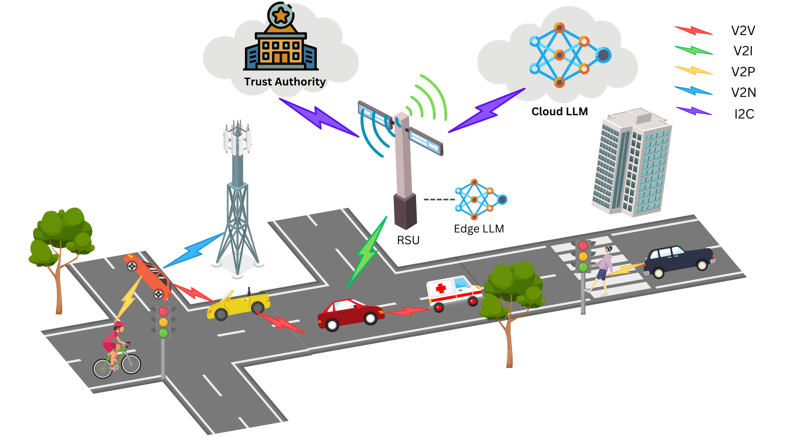
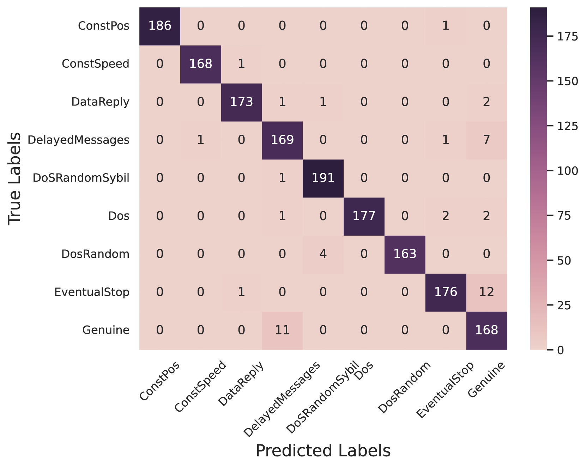

# MistralBSM：借助 Mistral-7B 技术，提升车辆网络中不当行为的检测能力。

发布时间：2024年07月25日

`LLM应用` `网络安全`

> MistralBSM: Leveraging Mistral-7B for Vehicular Networks Misbehavior Detection

# 摘要

> 车辆网络因恶意攻击而面临多重威胁，这些威胁不仅危及通信安全，还可能影响交通安全。其中，行为异常的车辆是这些攻击的主要来源。为此，我们提出在边缘-云架构中部署一个由预训练大型语言模型（LLM）驱动的异常行为检测系统（MDS）。我们特别微调了先进的LLM Mistral-7B作为边缘节点，实现实时检测，同时利用云端的更大LLM进行深入分析。实验结果显示，Mistral-7B在VeReMi数据集上的准确率高达98%，优于其他模型。此外，我们还探讨了窗口大小对计算成本的影响，以提升部署效率。通过在MDS中应用LLM，我们有效提升了车辆异常行为的检测能力，进而增强了车辆网络的安全性，保障了道路用户的安全。

> Vehicular networks are exposed to various threats resulting from malicious attacks. These threats compromise the security and reliability of communications among road users, thereby jeopardizing road and traffic safety. One of the main vectors of these attacks within vehicular networks is misbehaving vehicles. To address this challenge, we propose deploying a pretrained Large Language Model (LLM)-empowered Misbehavior Detection System (MDS) within an edge-cloud detection framework. Specifically, we fine-tune Mistral-7B, a state-of-the-art LLM, as the edge component to enable real-time detection, whereas a larger LLM deployed in the cloud can conduct a more comprehensive analysis. Our experiments conducted on the extended VeReMi dataset demonstrate Mistral-7B's superior performance, achieving 98\% accuracy compared to other LLMs such as LLAMA2-7B and RoBERTa. Additionally, we investigate the impact of window size on computational costs to optimize deployment efficiency. Leveraging LLMs in MDS shows interesting results in improving the detection of vehicle misbehavior, consequently strengthening vehicular network security to ensure the safety of road users.

[Arxiv](https://arxiv.org/abs/2407.18462)