# 模块化RAG：打造如同乐高般的可重构RAG系统框架

发布时间：2024年07月25日

`RAG` `人工智能` `信息技术`

> Modular RAG: Transforming RAG Systems into LEGO-like Reconfigurable Frameworks

# 摘要

> RAG 技术通过增强检索能力，显著提升了 LLM 在知识密集型任务中的表现。随着应用需求的增加，RAG 不断进化，整合了尖端检索技术、LLM 及其他互补技术，使其系统愈发复杂。然而，技术快速进步使得基础 RAG 范式面临挑战，特别是在“检索-生成”流程的统一性上。本文深入分析了现有 RAG 的局限，并提出了模块化 RAG 框架，通过分解系统为独立模块和专业操作，构建了一个高度灵活的框架。模块化 RAG 不仅超越了传统线性结构，还引入了先进的路由、调度和融合设计。本文还详细分析了四种常见 RAG 模式——线性、条件、分支和循环——的实现细节。模块化 RAG 为 RAG 系统的创新和部署开辟了新路径。最后，本文探讨了未来可能出现的新操作符和范式，为 RAG 技术的持续发展提供了理论支撑和实践指南。

> Retrieval-augmented Generation (RAG) has markedly enhanced the capabilities of Large Language Models (LLMs) in tackling knowledge-intensive tasks. The increasing demands of application scenarios have driven the evolution of RAG, leading to the integration of advanced retrievers, LLMs and other complementary technologies, which in turn has amplified the intricacy of RAG systems. However, the rapid advancements are outpacing the foundational RAG paradigm, with many methods struggling to be unified under the process of "retrieve-then-generate". In this context, this paper examines the limitations of the existing RAG paradigm and introduces the modular RAG framework. By decomposing complex RAG systems into independent modules and specialized operators, it facilitates a highly reconfigurable framework. Modular RAG transcends the traditional linear architecture, embracing a more advanced design that integrates routing, scheduling, and fusion mechanisms. Drawing on extensive research, this paper further identifies prevalent RAG patterns-linear, conditional, branching, and looping-and offers a comprehensive analysis of their respective implementation nuances. Modular RAG presents innovative opportunities for the conceptualization and deployment of RAG systems. Finally, the paper explores the potential emergence of new operators and paradigms, establishing a solid theoretical foundation and a practical roadmap for the continued evolution and practical deployment of RAG technologies.

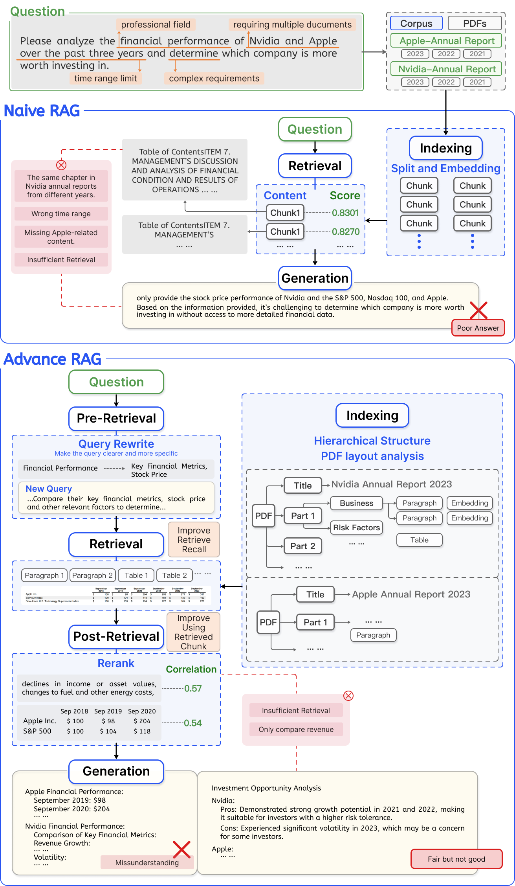

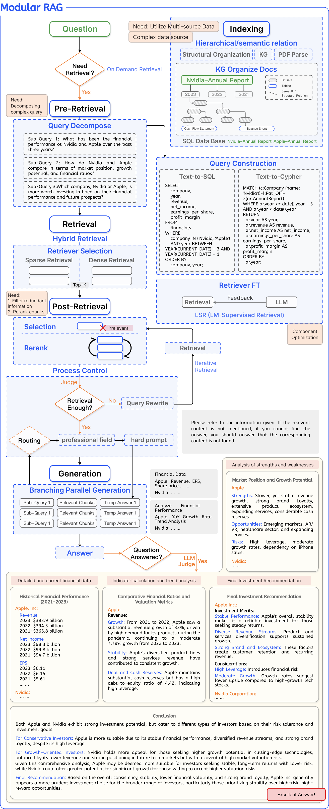

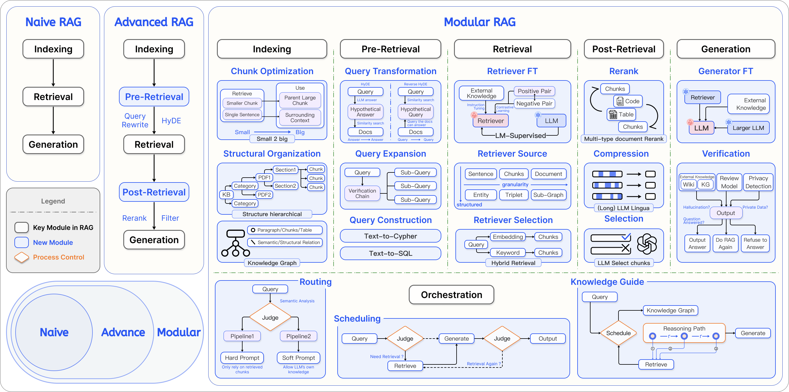

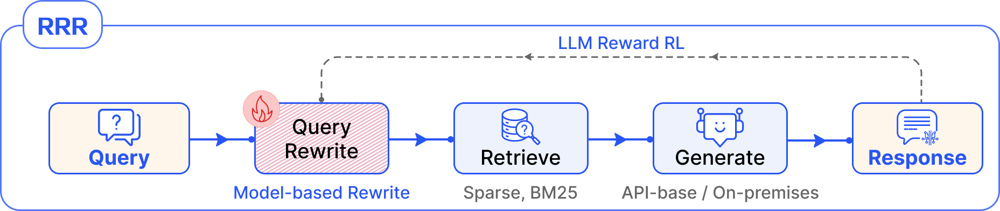

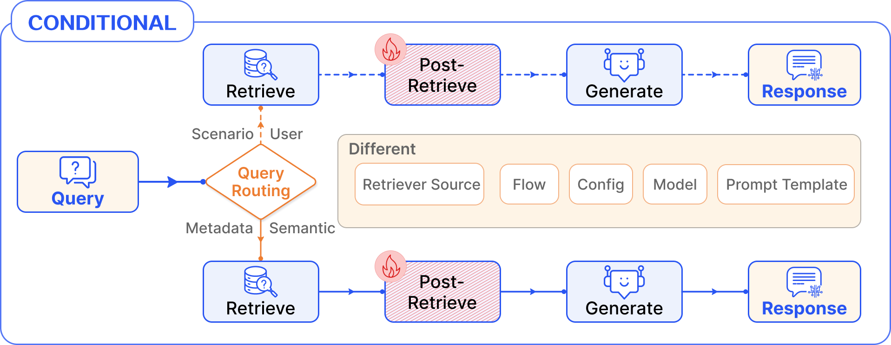

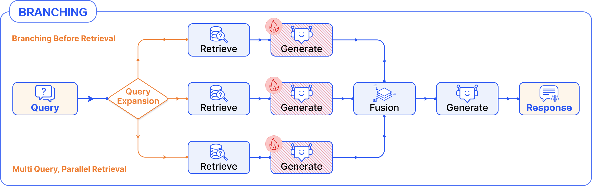

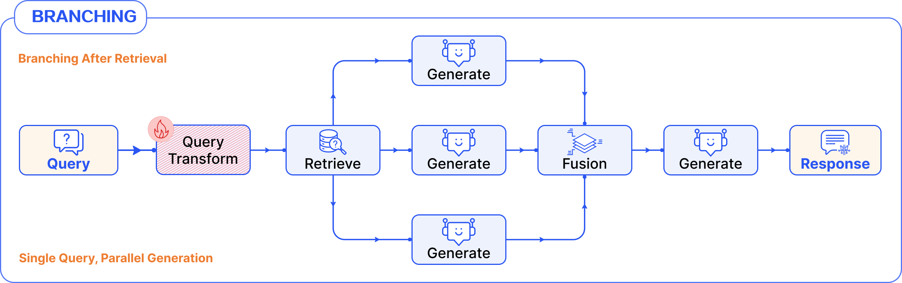

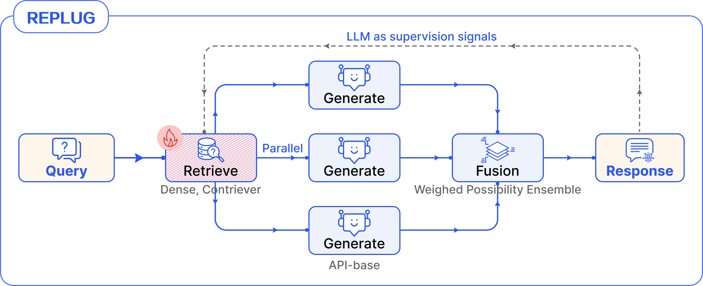

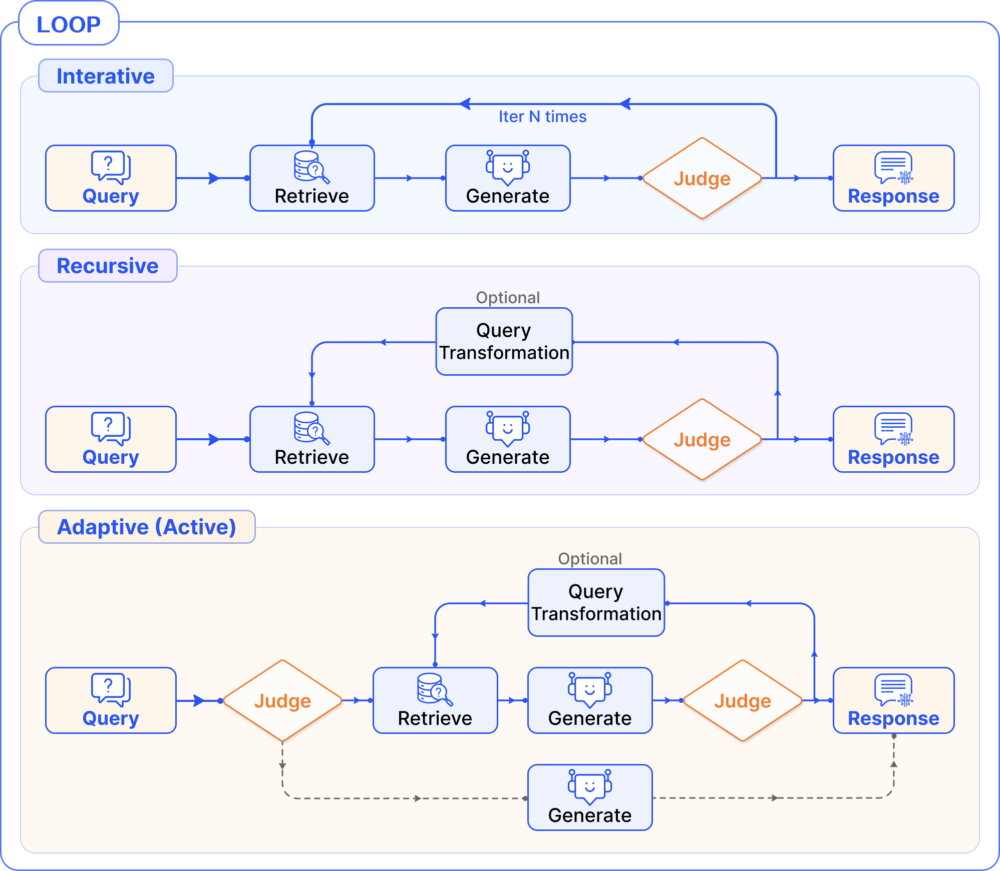

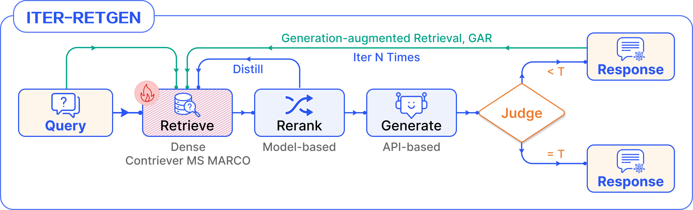

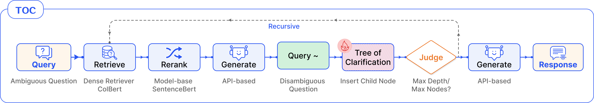

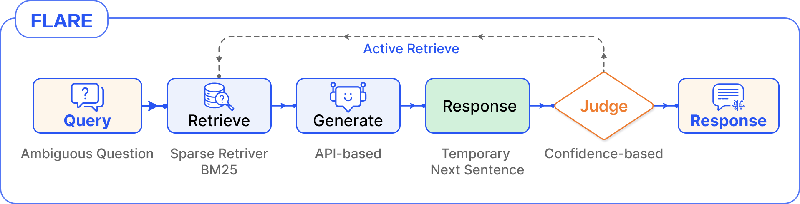

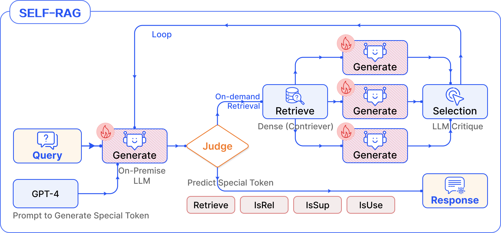

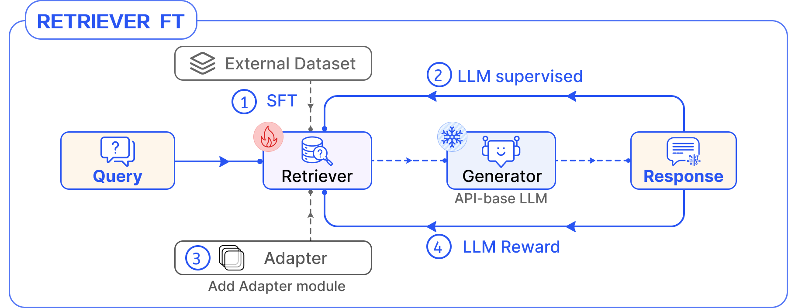

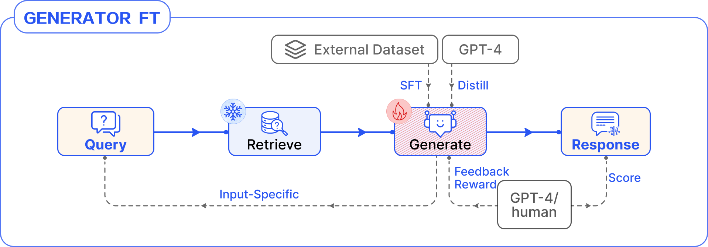

[Arxiv](https://arxiv.org/abs/2407.21059)