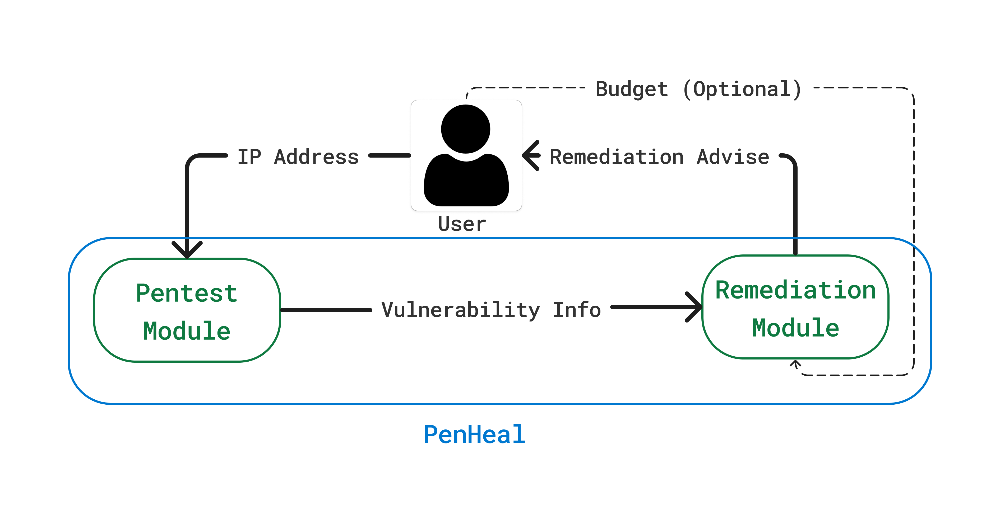
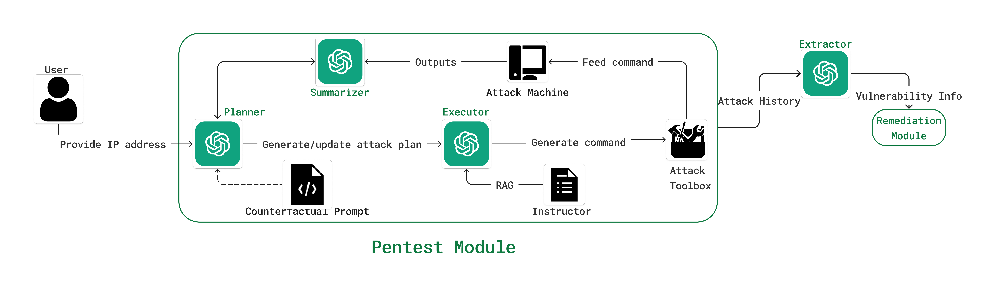
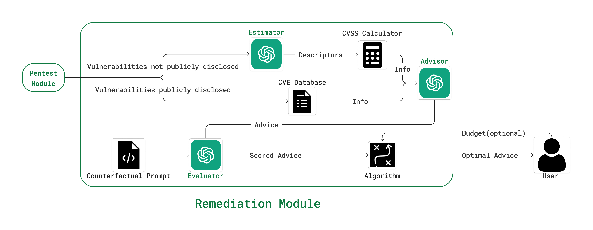
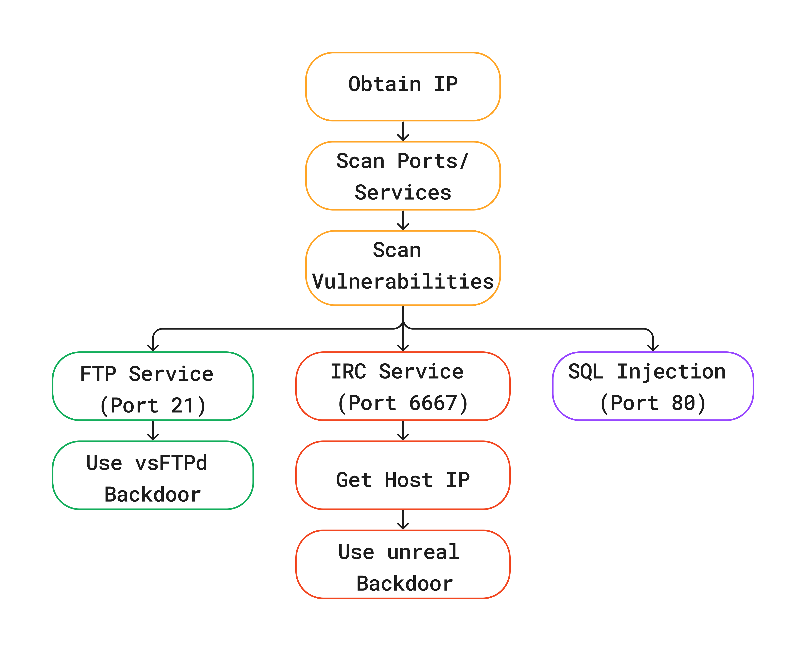
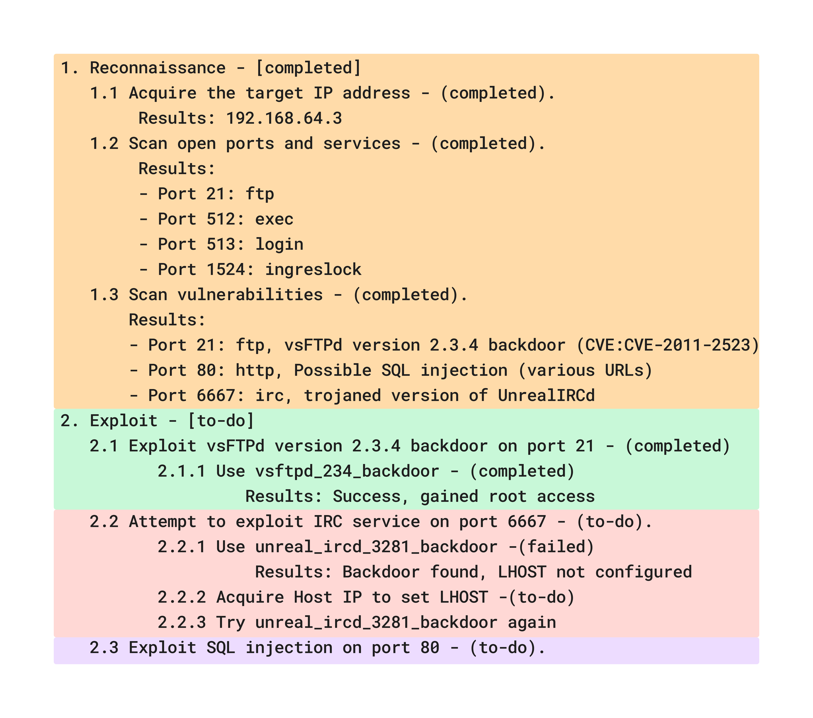

# PenHeal：一款双阶段 LLM 框架，专为自动化渗透测试与优化修复设计。

发布时间：2024年07月25日

`LLM应用` `网络安全` `自动化系统`

> PenHeal: A Two-Stage LLM Framework for Automated Pentesting and Optimal Remediation

# 摘要

> 大型语言模型（LLM）的进步在提升网络安全防御方面展现出显著潜力。基于LLM的渗透测试通过识别漏洞，成为自动化系统安全评估的关键环节。紧随其后的修复步骤，则针对这些漏洞进行处理。鉴于漏洞详情、利用手段及软件版本对系统弱点的揭示至关重要，将渗透测试与修复整合为一体化系统，既显而易见又势在必行。本文推出的PenHeal框架，通过两阶段LLM驱动，自主识别并缓解安全漏洞。它融合了Pentest模块（检测多重漏洞）与Remediation模块（推荐最佳修复方案）。借助反事实提示与指导模块，利用外部知识引导LLM探索多条潜在攻击路径。实验显示，PenHeal不仅自动化了漏洞识别与修复，更将漏洞覆盖率提升31%，修复策略有效性增强32%，成本降低46%，远超基准模型。这凸显了LLM在革新网络安全实践中的巨大潜力，为抵御网络威胁提供了创新路径。

> Recent advances in Large Language Models (LLMs) have shown significant potential in enhancing cybersecurity defenses against sophisticated threats. LLM-based penetration testing is an essential step in automating system security evaluations by identifying vulnerabilities. Remediation, the subsequent crucial step, addresses these discovered vulnerabilities. Since details about vulnerabilities, exploitation methods, and software versions offer crucial insights into system weaknesses, integrating penetration testing with vulnerability remediation into a cohesive system has become both intuitive and necessary.
  This paper introduces PenHeal, a two-stage LLM-based framework designed to autonomously identify and mitigate security vulnerabilities. The framework integrates two LLM-enabled components: the Pentest Module, which detects multiple vulnerabilities within a system, and the Remediation Module, which recommends optimal remediation strategies. The integration is facilitated through Counterfactual Prompting and an Instructor module that guides the LLMs using external knowledge to explore multiple potential attack paths effectively. Our experimental results demonstrate that PenHeal not only automates the identification and remediation of vulnerabilities but also significantly improves vulnerability coverage by 31%, increases the effectiveness of remediation strategies by 32%, and reduces the associated costs by 46% compared to baseline models. These outcomes highlight the transformative potential of LLMs in reshaping cybersecurity practices, offering an innovative solution to defend against cyber threats.

[Arxiv](https://arxiv.org/abs/2407.17788)