# 递归内省法：引导语言模型自我提升之道

发布时间：2024年07月25日

`LLM理论` `人工智能`

> Recursive Introspection: Teaching Language Model Agents How to Self-Improve

# 摘要

> 在基础模型中实现智能代理行为的关键在于，使模型能够在获得更多计算资源或交互机会时，进行自我反省、推理并纠正错误。尽管最强大的专有大型语言模型（LLM）在明确被告知犯错时，也未能持续改进其响应。为此，我们提出了RISE方法：递归内省，通过微调LLM来实现这一能力，尽管先前研究认为这可能无法实现。RISE采用迭代微调策略，在模型尝试解决难题失败后，教会其如何调整响应，并可结合环境反馈。我们将单轮提示的微调视为多轮马尔可夫决策过程（MDP），初始状态即为提示。借鉴在线模仿学习和强化学习理念，我们设计了多轮数据收集与训练策略，使LLM能在后续迭代中递归地发现并修正错误。实验表明，RISE让Llama2、Llama3和Mistral模型在数学推理任务上通过更多轮次自我提升，超越了同等计算条件下的单轮策略。此外，RISE展现出良好的扩展性，在更强大的模型上带来更大收益。分析显示，RISE在不损害单轮能力的前提下，通过实质性改进使模型响应更趋近正确答案，有效应对了复杂提示的挑战。

> A central piece in enabling intelligent agentic behavior in foundation models is to make them capable of introspecting upon their behavior, reasoning, and correcting their mistakes as more computation or interaction is available. Even the strongest proprietary large language models (LLMs) do not quite exhibit the ability of continually improving their responses sequentially, even in scenarios where they are explicitly told that they are making a mistake. In this paper, we develop RISE: Recursive IntroSpEction, an approach for fine-tuning LLMs to introduce this capability, despite prior work hypothesizing that this capability may not be possible to attain. Our approach prescribes an iterative fine-tuning procedure, which attempts to teach the model how to alter its response after having executed previously unsuccessful attempts to solve a hard test-time problem, with optionally additional environment feedback. RISE poses fine-tuning for a single-turn prompt as solving a multi-turn Markov decision process (MDP), where the initial state is the prompt. Inspired by principles in online imitation learning and reinforcement learning, we propose strategies for multi-turn data collection and training so as to imbue an LLM with the capability to recursively detect and correct its previous mistakes in subsequent iterations. Our experiments show that RISE enables Llama2, Llama3, and Mistral models to improve themselves with more turns on math reasoning tasks, outperforming several single-turn strategies given an equal amount of inference-time computation. We also find that RISE scales well, often attaining larger benefits with more capable models. Our analysis shows that RISE makes meaningful improvements to responses to arrive at the correct solution for challenging prompts, without disrupting one-turn abilities as a result of expressing more complex distributions.

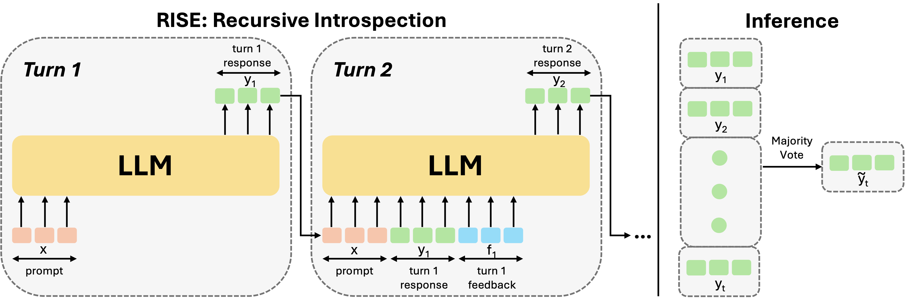

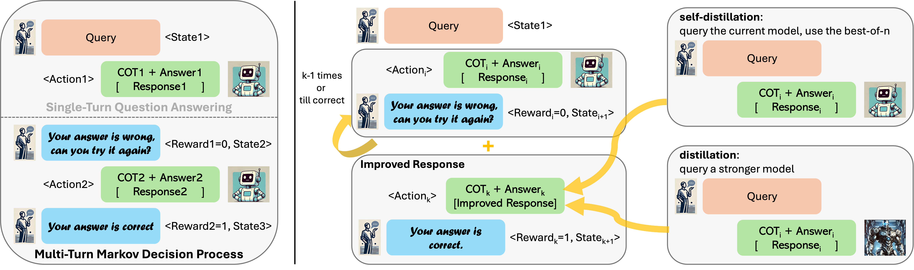

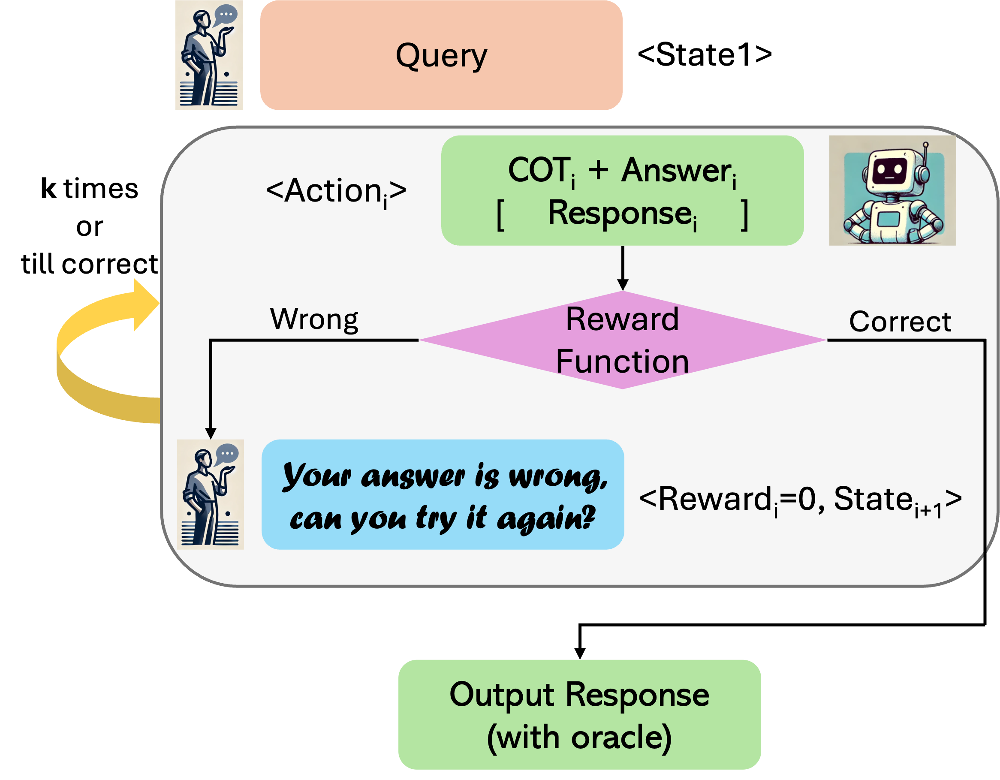

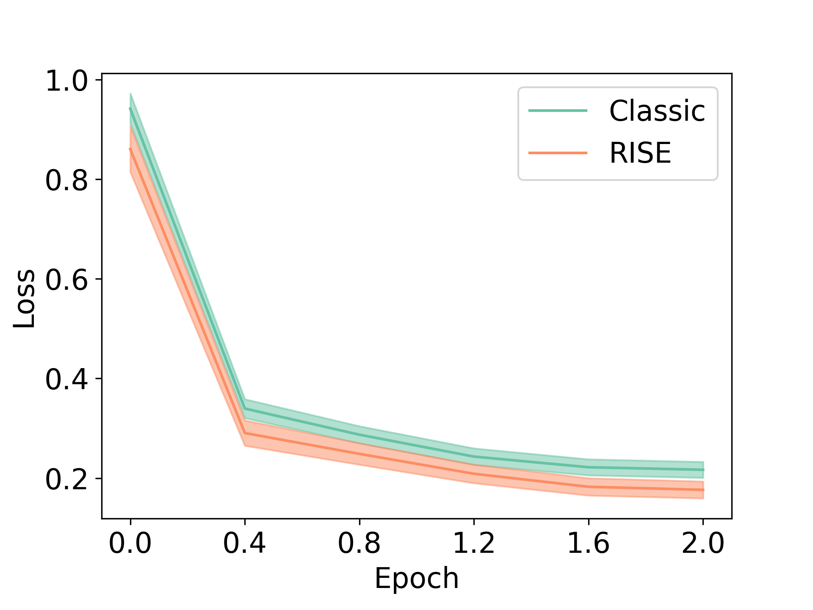

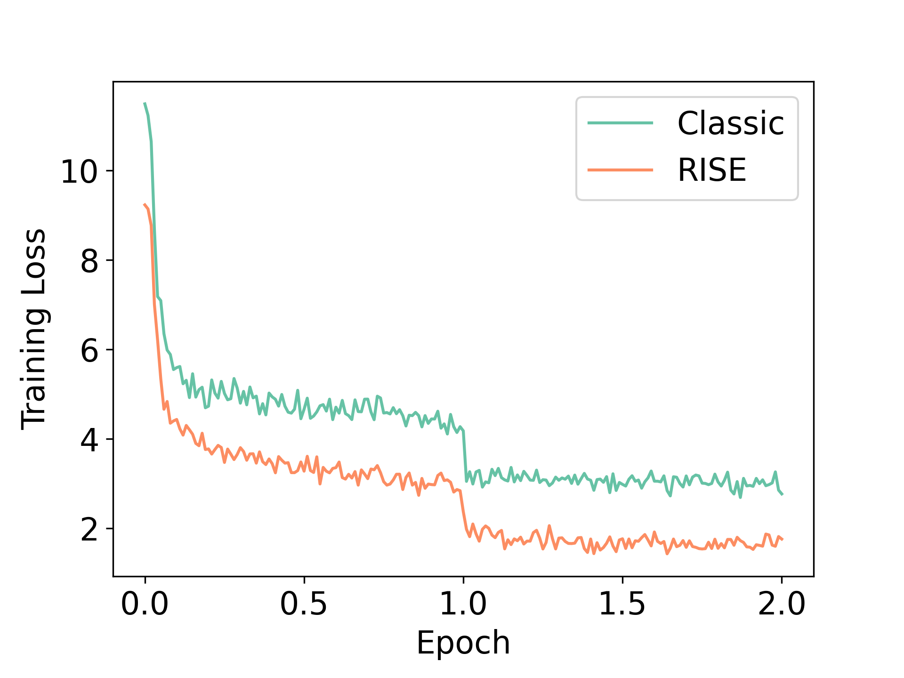

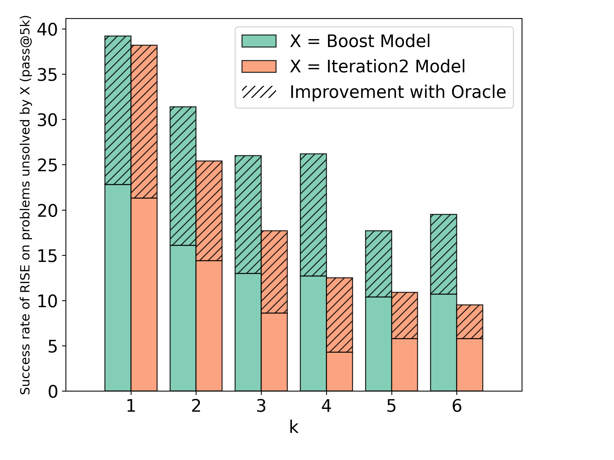

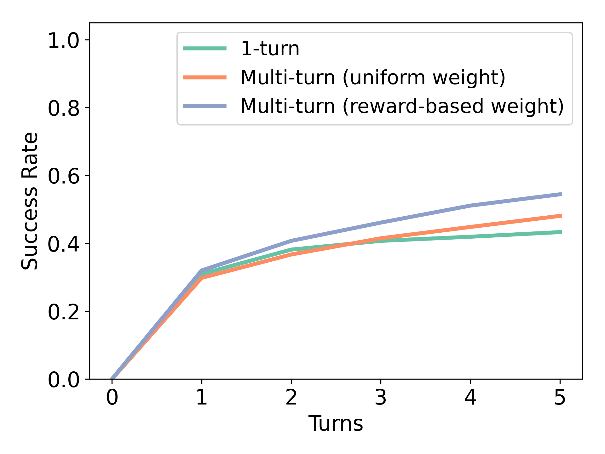

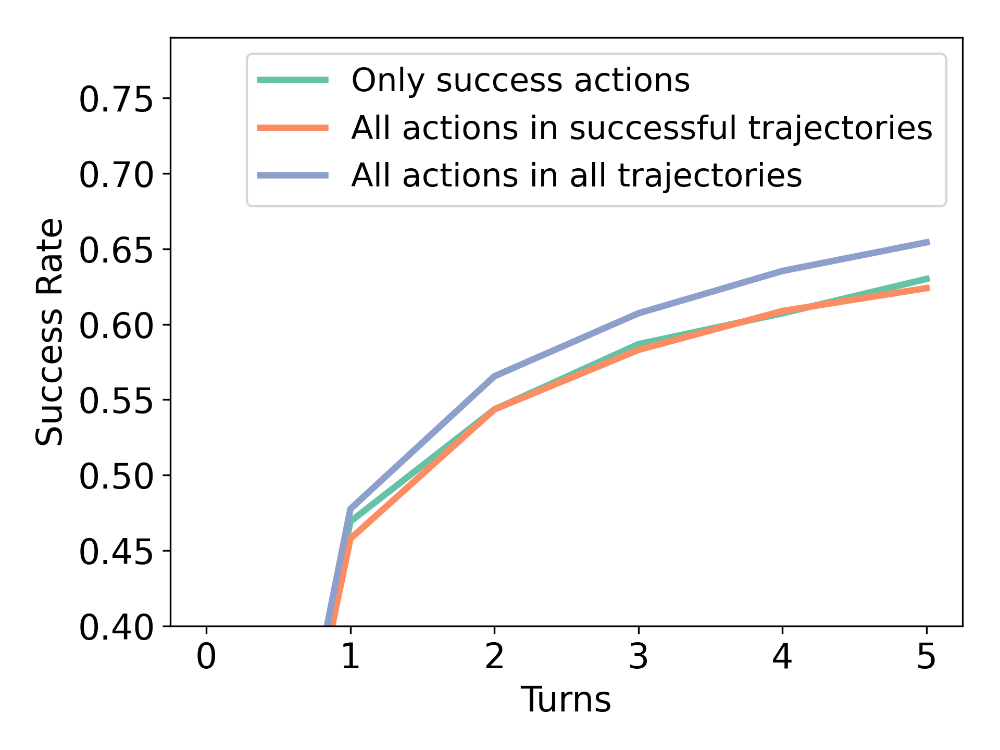

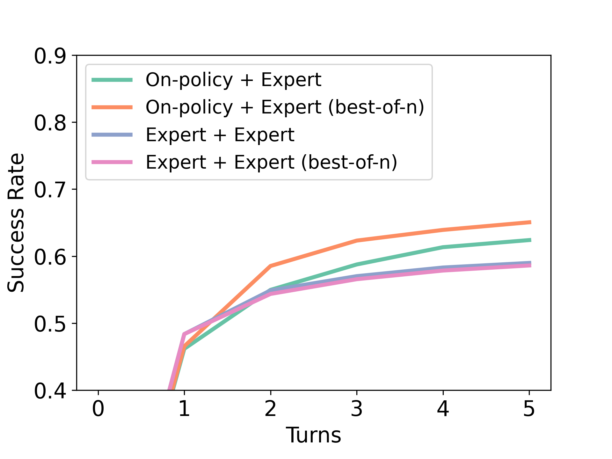

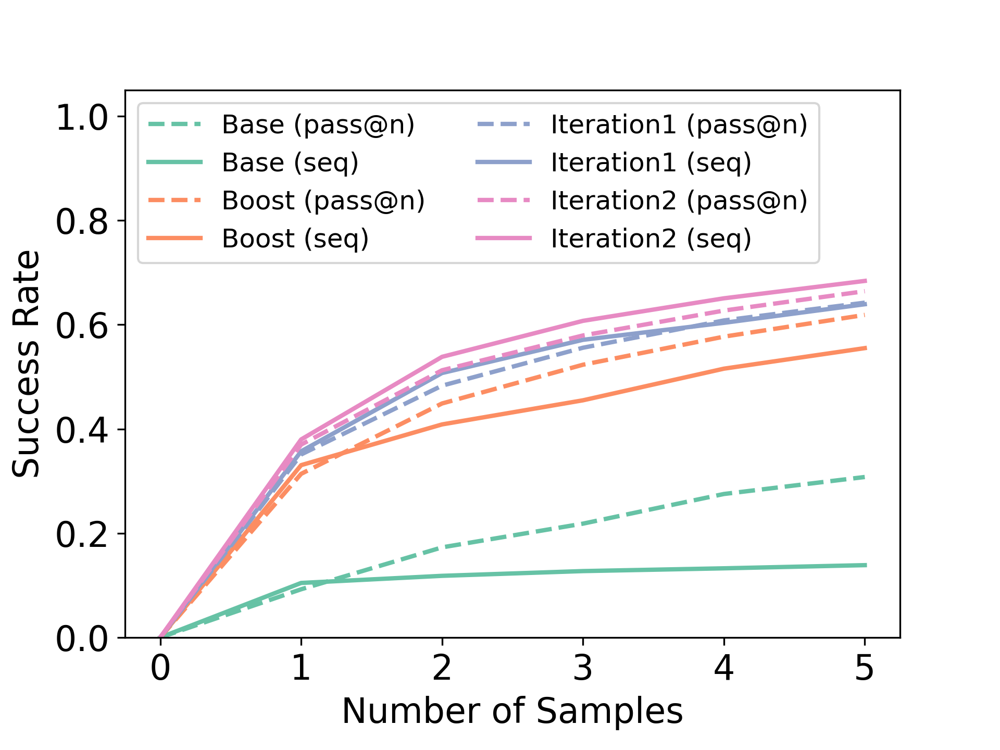

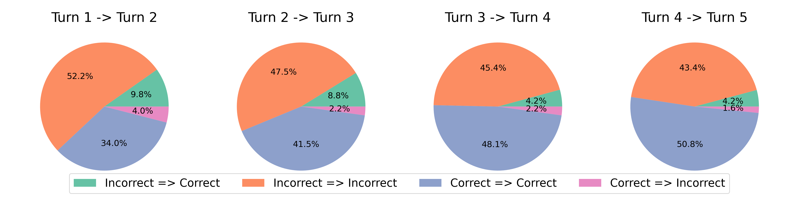

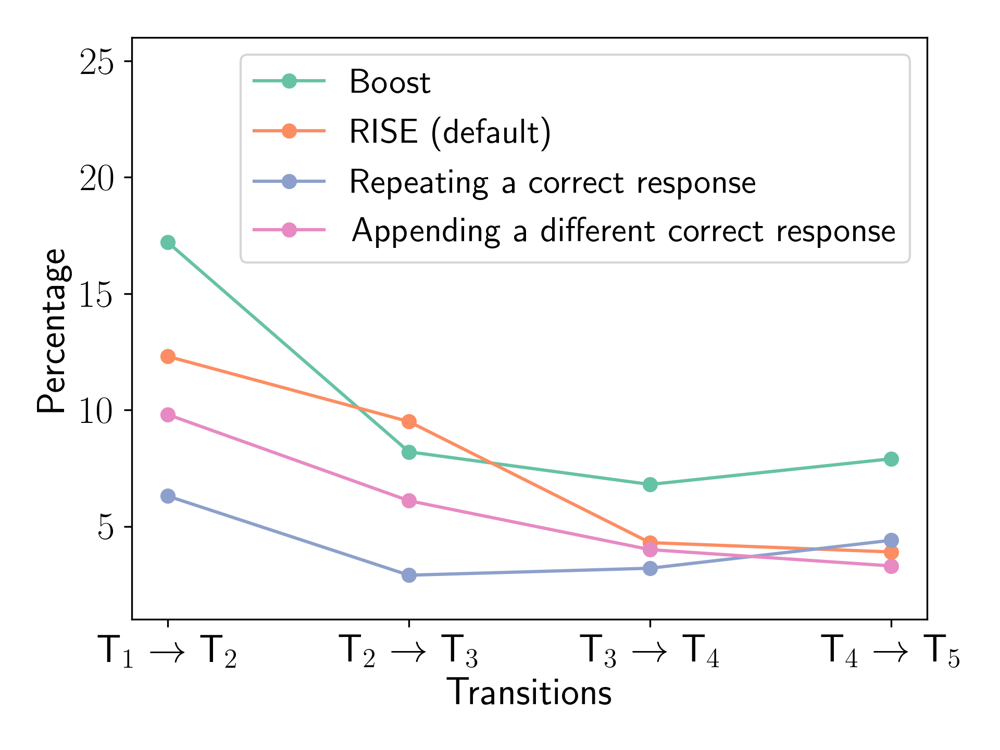

[Arxiv](https://arxiv.org/abs/2407.18219)