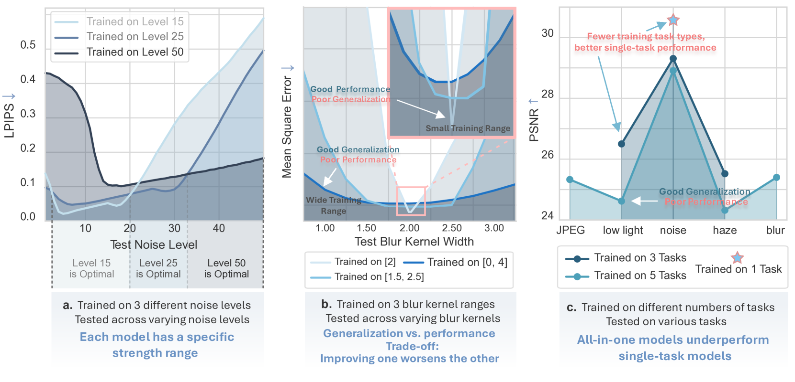
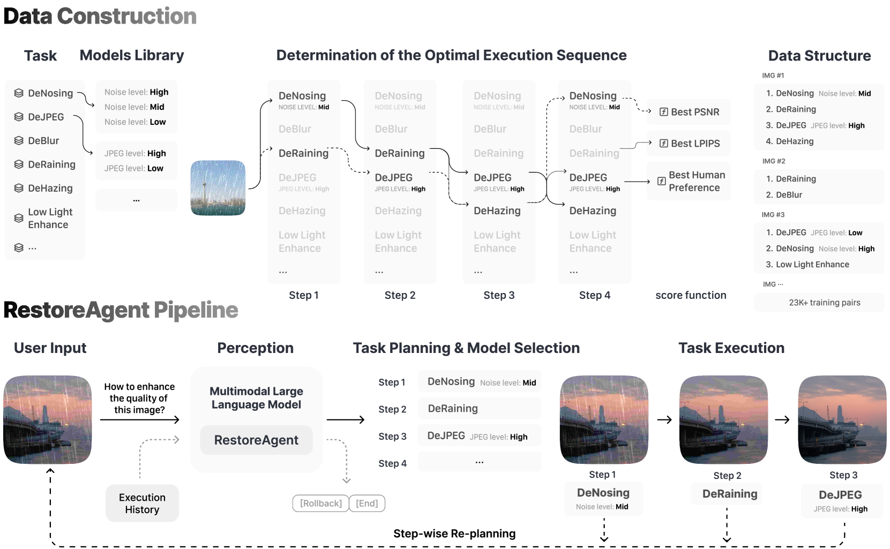
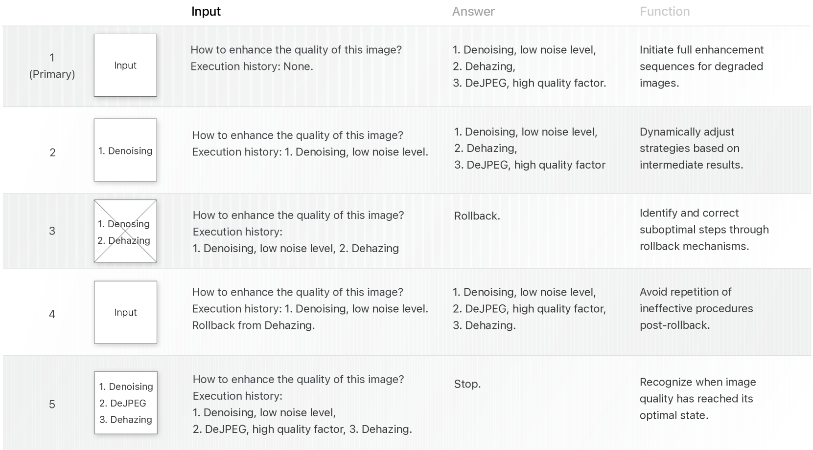
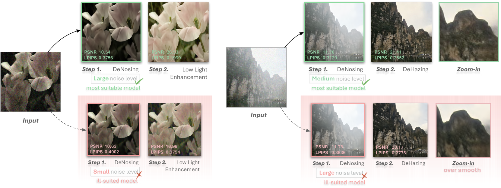
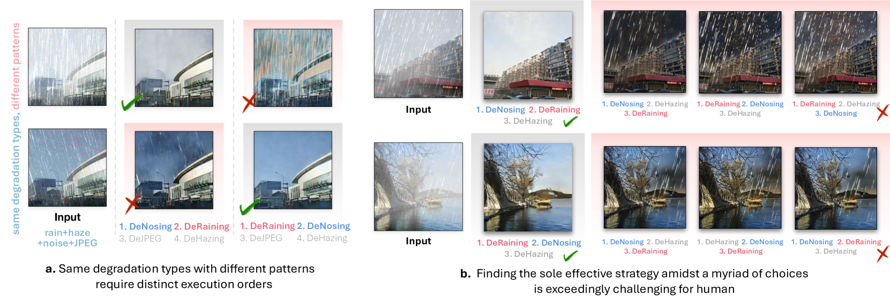

# RestoreAgent：借助多模态大型语言模型，实现图像恢复的自主代理

发布时间：2024年07月25日

`Agent` `图像处理` `移动设备`

> RestoreAgent: Autonomous Image Restoration Agent via Multimodal Large Language Models

# 摘要

> 移动设备拍摄的图像常因噪声、模糊和低光等因素受损。传统恢复方法需手动挑选任务和算法，耗时且效果不佳。全能模型虽能应对多任务，但支持范围有限，常导致图像过度平滑。为此，我们设计了新的恢复流程，并推出了RestoreAgent系统，该系统利用多模态大型语言模型，自动识别图像退化并进行修复。实验证明，RestoreAgent在处理复杂图像退化方面超越了人类专家，其模块化设计也便于快速集成新功能，提升了系统的灵活性和适应性。

> Natural images captured by mobile devices often suffer from multiple types of degradation, such as noise, blur, and low light. Traditional image restoration methods require manual selection of specific tasks, algorithms, and execution sequences, which is time-consuming and may yield suboptimal results. All-in-one models, though capable of handling multiple tasks, typically support only a limited range and often produce overly smooth, low-fidelity outcomes due to their broad data distribution fitting. To address these challenges, we first define a new pipeline for restoring images with multiple degradations, and then introduce RestoreAgent, an intelligent image restoration system leveraging multimodal large language models. RestoreAgent autonomously assesses the type and extent of degradation in input images and performs restoration through (1) determining the appropriate restoration tasks, (2) optimizing the task sequence, (3) selecting the most suitable models, and (4) executing the restoration. Experimental results demonstrate the superior performance of RestoreAgent in handling complex degradation, surpassing human experts. Furthermore, the system modular design facilitates the fast integration of new tasks and models, enhancing its flexibility and scalability for various applications.

[Arxiv](https://arxiv.org/abs/2407.18035)