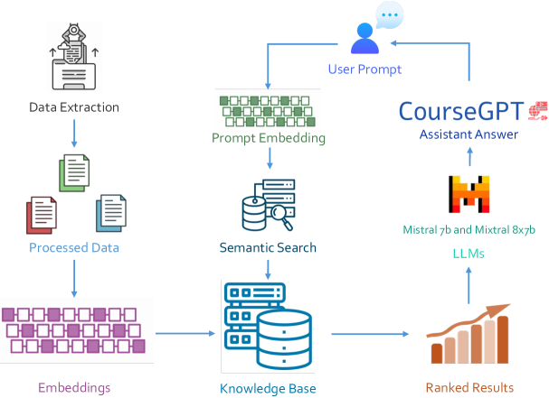
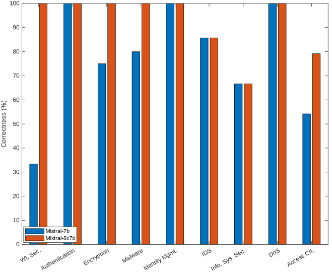
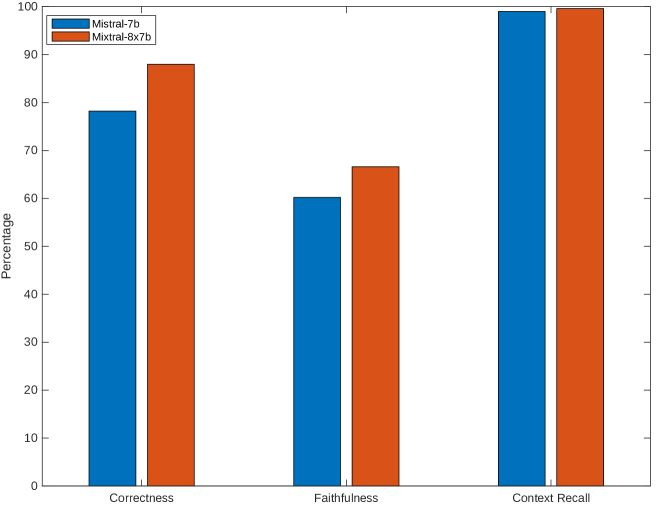
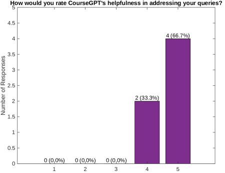
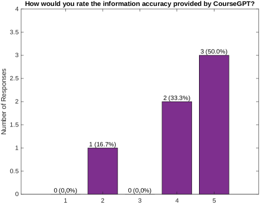
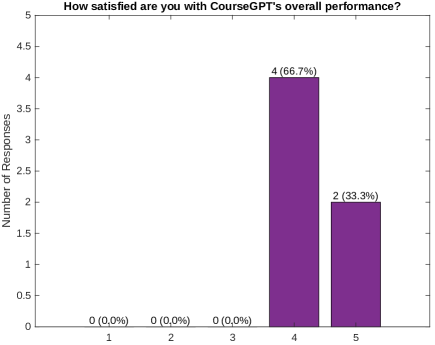

# CourseGPT 正革新本科教育，通过其生成式 AI 技术的进步，为学习体验带来革命性的变化。

发布时间：2024年07月25日

`LLM应用` `人工智能`

> Revolutionizing Undergraduate Learning: CourseGPT and Its Generative AI Advancements

# 摘要

> 将生成式AI融入教育领域，为提升学习体验带来了革命性的可能。本文介绍的CourseGPT，是一款基于开源大型语言模型的生成式AI工具，旨在为教师提供持续支持，并丰富本科生的学习经历。CourseGPT通过整合课程特定资源，如幻灯片和补充材料，为学生提供精准且动态的答案。与传统AI不同，CourseGPT赋予教师管理响应的权力，确保课程内容的扩展既全面又不失细节。本文以信息系统安全基础课程为例，展示了CourseGPT的实际应用及其在提升学习效率、加速反馈循环和简化管理流程方面的潜力。研究结果表明，参数更多的Mixtral-8x7b模型在正确性和忠实度上均优于小模型，且多数用户反馈CourseGPT在解答问题时表现出色，提供了及时且有价值的信息。

> Integrating Generative AI (GenAI) into educational contexts presents a transformative potential for enhancing learning experiences. This paper introduces CourseGPT, a generative AI tool designed to support instructors and enhance the educational experiences of undergraduate students. Built on open-source Large Language Models (LLMs) from Mistral AI, CourseGPT offers continuous instructor support and regular updates to course materials, enriching the learning environment. By utilizing course-specific content, such as slide decks and supplementary readings and references, CourseGPT provides precise, dynamically generated responses to student inquiries. Unlike generic AI models, CourseGPT allows instructors to manage and control the responses, thus extending the course scope without overwhelming details. The paper demonstrates the application of CourseGPT using the CPR E 431 - Basics of Information System Security course as a pilot. This course, with its large enrollments and diverse curriculum, serves as an ideal testbed for CourseGPT. The tool aims to enhance the learning experience, accelerate feedback processes, and streamline administrative tasks. The study evaluates CourseGPT's impact on student outcomes, focusing on correctness scores, context recall, and faithfulness of responses. Results indicate that the Mixtral-8x7b model, with a higher parameter count, outperforms smaller models, achieving an 88.0% correctness score and a 66.6% faithfulness score. Additionally, feedback from former students and teaching assistants on CourseGPT's accuracy, helpfulness, and overall performance was collected. The outcomes revealed that a significant majority found CourseGPT to be highly accurate and beneficial in addressing their queries, with many praising its ability to provide timely and relevant information.

[Arxiv](https://arxiv.org/abs/2407.18310)