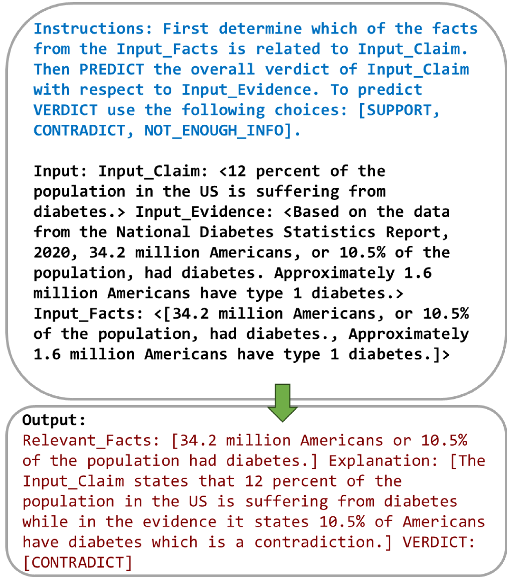

# 通过事实检测，我们能够稳健地验证主张。

发布时间：2024年07月25日

`LLM应用`

> Robust Claim Verification Through Fact Detection

# 摘要

> 声明验证任务颇具挑战性。本文介绍了一种通过从证据中提炼简短事实来强化自动声明验证的方法——FactDetect。该方法借助大型语言模型（LLMs），从证据中提炼出精炼的事实陈述，并依据其与声明及证据的语义关联进行标记。这些事实随后与原始声明和证据结合，以训练一个轻量级监督模型。通过将事实检测任务融入声明验证流程，我们不仅提升了性能，还增强了可解释性。实验表明，在声明验证提示中应用FactDetect，能显著提升LLMs在零-shot声明验证中的表现。在监督模型中，我们的方法在科学声明验证数据集上F1分数提升了15%，显示出强劲的竞争力。此外，通过声明和证据的零-shot提示（AugFactDetect），我们的方法在裁决预测上也超越了基线，平均性能提升达17.3%。

> Claim verification can be a challenging task. In this paper, we present a method to enhance the robustness and reasoning capabilities of automated claim verification through the extraction of short facts from evidence. Our novel approach, FactDetect, leverages Large Language Models (LLMs) to generate concise factual statements from evidence and label these facts based on their semantic relevance to the claim and evidence. The generated facts are then combined with the claim and evidence. To train a lightweight supervised model, we incorporate a fact-detection task into the claim verification process as a multitasking approach to improve both performance and explainability. We also show that augmenting FactDetect in the claim verification prompt enhances performance in zero-shot claim verification using LLMs. Our method demonstrates competitive results in the supervised claim verification model by 15% on the F1 score when evaluated for challenging scientific claim verification datasets. We also demonstrate that FactDetect can be augmented with claim and evidence for zero-shot prompting (AugFactDetect) in LLMs for verdict prediction. We show that AugFactDetect outperforms the baseline with statistical significance on three challenging scientific claim verification datasets with an average of 17.3% performance gain compared to the best performing baselines.

[Arxiv](https://arxiv.org/abs/2407.18367)