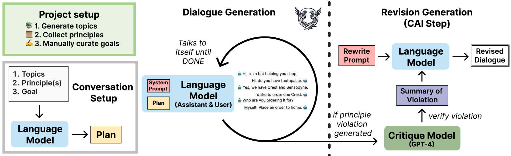
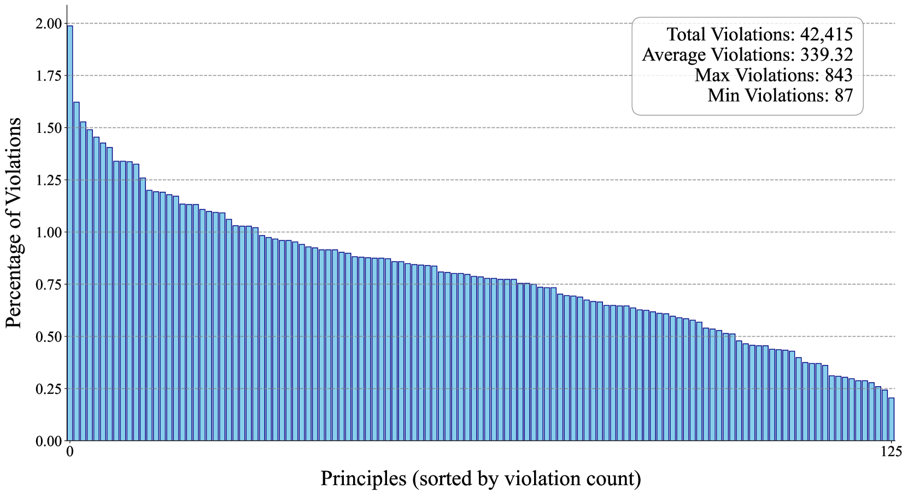
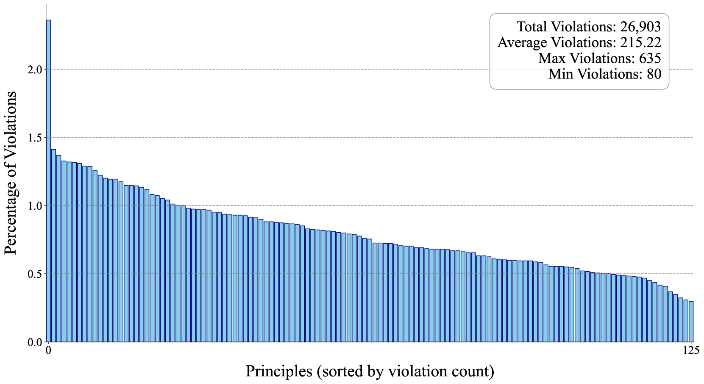

# 自主合成对话与修订技术报告

发布时间：2024年07月25日

`LLM应用` `人工智能` `数据科学`

> Self-Directed Synthetic Dialogues and Revisions Technical Report

# 摘要

> 合成数据在微调语言模型以应对复杂任务中扮演关键角色。但当前开放数据多缺乏多轮对话，且依赖封闭模型，阻碍了开放微调技术的发展。为此，我们推出了自我导向合成对话（SDSD）数据集，内含语言模型间的多轮对话，这些对话均遵循预设的对话计划。此外，我们还尝试融入宪法AI等原则，通过调整对话末轮来生成合成偏好数据。期待这项工作能激发对多轮数据及开放模型应用的深入研究，以更广泛地利用合成数据。

> Synthetic data has become an important tool in the fine-tuning of language models to follow instructions and solve complex problems. Nevertheless, the majority of open data to date is often lacking multi-turn data and collected on closed models, limiting progress on advancing open fine-tuning methods. We introduce Self Directed Synthetic Dialogues (SDSD), an experimental dataset consisting of guided conversations of language models talking to themselves. The dataset consists of multi-turn conversations generated with DBRX, Llama 2 70B, and Mistral Large, all instructed to follow a conversation plan generated prior to the conversation. We also explore including principles from Constitutional AI and other related works to create synthetic preference data via revisions to the final conversation turn. We hope this work encourages further exploration in multi-turn data and the use of open models for expanding the impact of synthetic data.

[Arxiv](https://arxiv.org/abs/2407.18421)