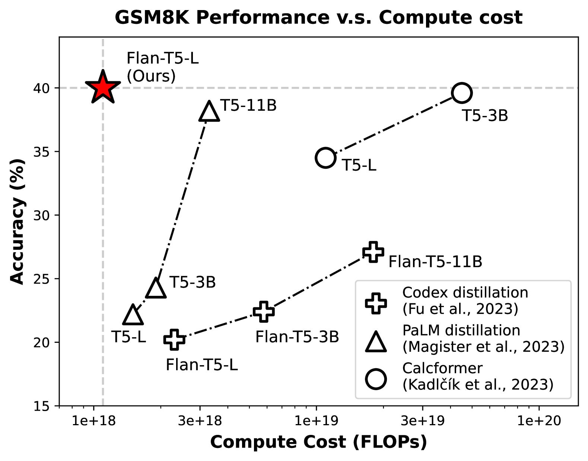
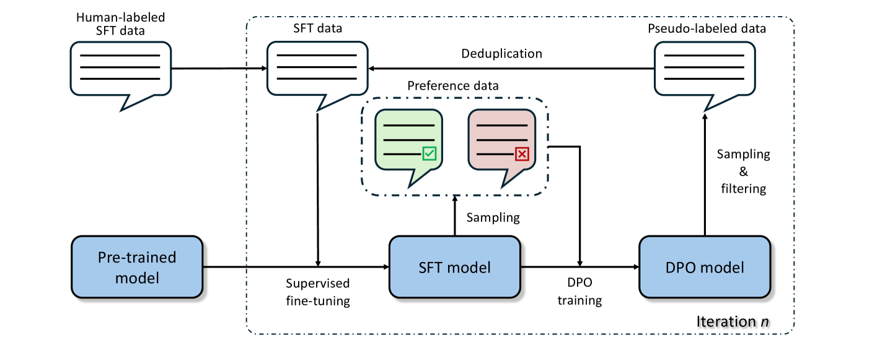
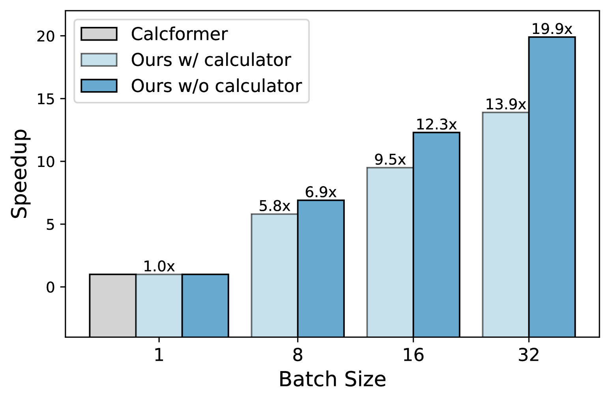
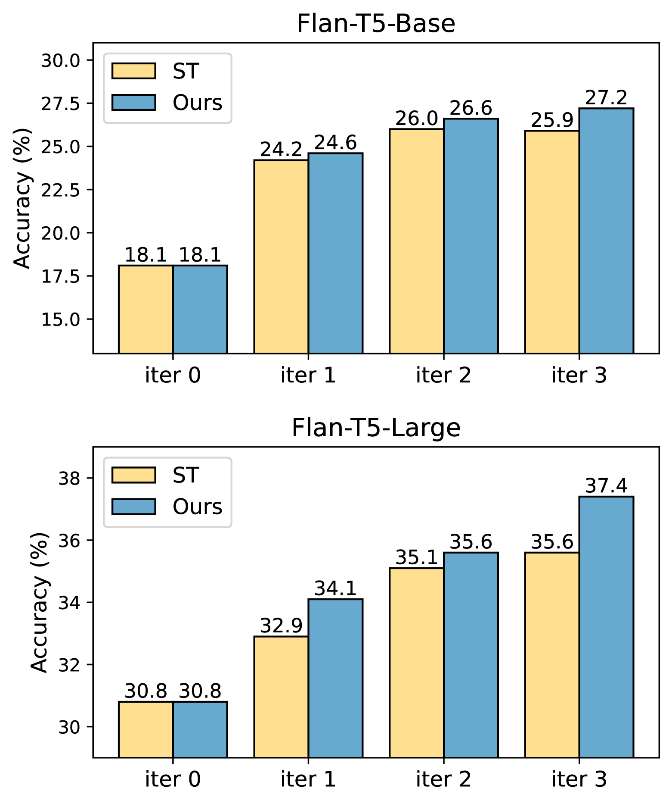
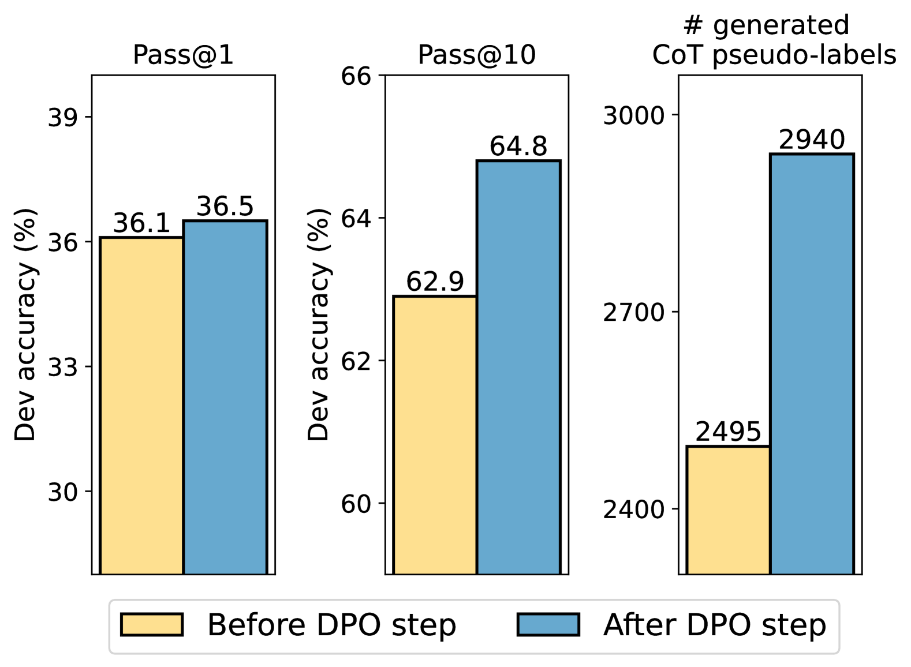
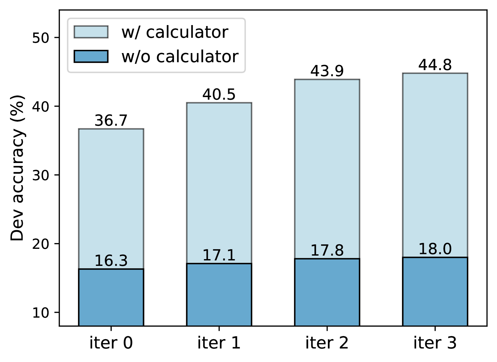

# 借助直接偏好优化进行自我训练，有效提升了思维链推理能力。

发布时间：2024年07月25日

`LLM应用` `人工智能`

> Self-Training with Direct Preference Optimization Improves Chain-of-Thought Reasoning

# 摘要

> 训练语言模型进行数学推理，需高质量监督数据。传统方法依赖专家标注或从强大模型中采样，但成本高且不稳定，尤其是使用GPT-4等闭源模型时。我们发现，通过自训练，小规模模型能从自身输出中学习，提升推理能力。结合直接偏好优化（DPO）算法，我们进一步强化了这一过程，使模型在思维链推理上更准确多样。实验显示，这种方法不仅提升性能，还比依赖大型专有模型更经济高效。

> Effective training of language models (LMs) for mathematical reasoning tasks demands high-quality supervised fine-tuning data. Besides obtaining annotations from human experts, a common alternative is sampling from larger and more powerful LMs. However, this knowledge distillation approach can be costly and unstable, particularly when relying on closed-source, proprietary LMs like GPT-4, whose behaviors are often unpredictable. In this work, we demonstrate that the reasoning abilities of small-scale LMs can be enhanced through self-training, a process where models learn from their own outputs. We also show that the conventional self-training can be further augmented by a preference learning algorithm called Direct Preference Optimization (DPO). By integrating DPO into self-training, we leverage preference data to guide LMs towards more accurate and diverse chain-of-thought reasoning. We evaluate our method across various mathematical reasoning tasks using different base models. Our experiments show that this approach not only improves LMs' reasoning performance but also offers a more cost-effective and scalable solution compared to relying on large proprietary LMs.

[Arxiv](https://arxiv.org/abs/2407.18248)