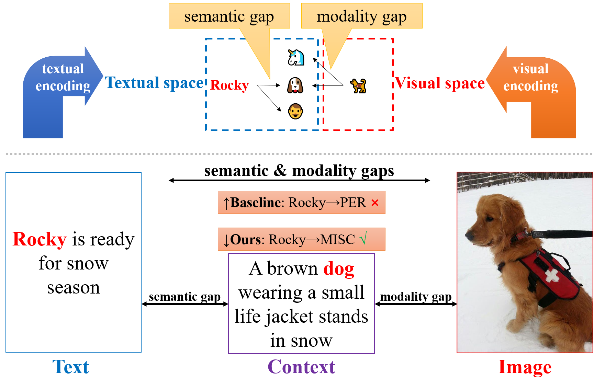
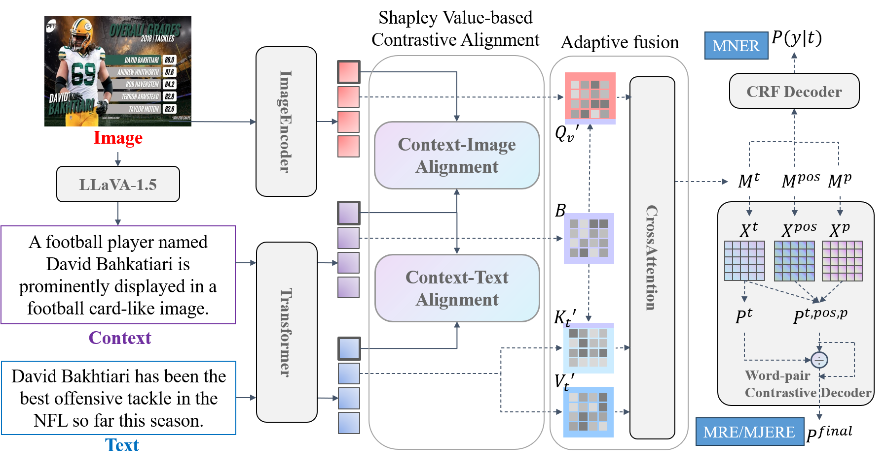
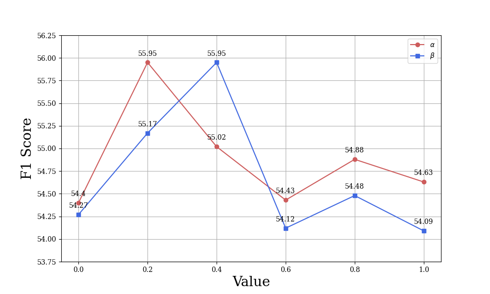
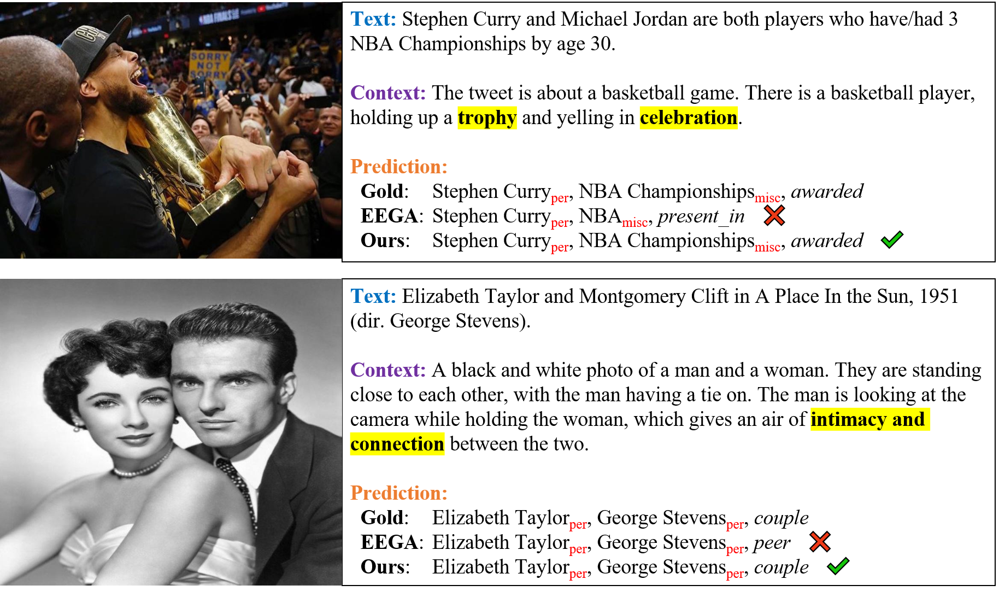

# 基于Shapley值的对比对齐技术，应用于多模态信息提取领域。

发布时间：2024年07月25日

`LLM应用` `社交媒体` `多模态通信`

> Shapley Value-based Contrastive Alignment for Multimodal Information Extraction

# 摘要

> 随着社交媒体的兴起和多模态通信的迅猛发展，多模态信息提取（MIE）技术亟需创新。传统方法依赖于直接的图像-文本交互，但常因语义和模态差异而受阻。本文提出一种新颖的图像-上下文-文本交互模式，利用大型多模态模型（LMMs）生成描述性文本上下文，以弥合差距。我们创新的Shapley值对比对齐（Shap-CA）方法，通过评估各元素对语义和模态重叠的贡献，强化对内交互，弱化对外影响。自适应融合模块则优化跨模态融合。实验证明，我们的方法在多个数据集上超越了现有顶尖技术。

> The rise of social media and the exponential growth of multimodal communication necessitates advanced techniques for Multimodal Information Extraction (MIE). However, existing methodologies primarily rely on direct Image-Text interactions, a paradigm that often faces significant challenges due to semantic and modality gaps between images and text. In this paper, we introduce a new paradigm of Image-Context-Text interaction, where large multimodal models (LMMs) are utilized to generate descriptive textual context to bridge these gaps. In line with this paradigm, we propose a novel Shapley Value-based Contrastive Alignment (Shap-CA) method, which aligns both context-text and context-image pairs. Shap-CA initially applies the Shapley value concept from cooperative game theory to assess the individual contribution of each element in the set of contexts, texts and images towards total semantic and modality overlaps. Following this quantitative evaluation, a contrastive learning strategy is employed to enhance the interactive contribution within context-text/image pairs, while minimizing the influence across these pairs. Furthermore, we design an adaptive fusion module for selective cross-modal fusion. Extensive experiments across four MIE datasets demonstrate that our method significantly outperforms existing state-of-the-art methods.

[Arxiv](https://arxiv.org/abs/2407.17854)