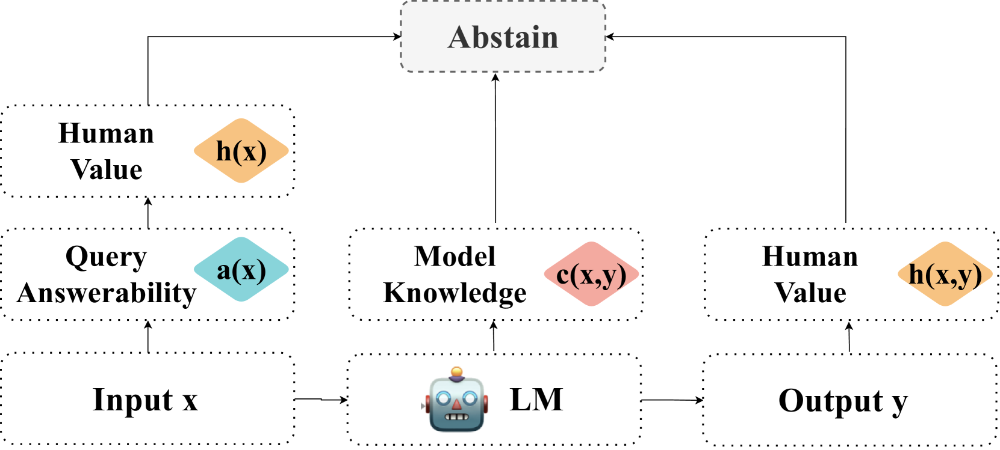

# 大型语言模型中的弃权艺术：一项调查研究

发布时间：2024年07月25日

`LLM理论` `人工智能` `信息安全`

> The Art of Refusal: A Survey of Abstention in Large Language Models

# 摘要

> 大型语言模型（LLM）的拒绝回答行为，正逐渐被视为减轻幻觉、提升系统安全性的关键。本调查从查询、模型和人类价值观三个维度，构建了分析拒绝回答行为的框架。我们梳理了相关文献，涵盖了基于 LLM 发展阶段的拒绝回答方法、基准及评估指标，并探讨了现有研究的优劣。此外，我们强调了未来研究方向，如将拒绝回答视为一种跨任务的元能力，并根据具体情境定制其应用。我们的目标是通过这些努力，深化拒绝回答方法在人工智能系统中的应用与影响。

> Abstention, the refusal of large language models (LLMs) to provide an answer, is increasingly recognized for its potential to mitigate hallucinations and enhance safety in building LLM systems. In this survey, we introduce a framework to examine abstention behavior from three perspectives: the query, the model, and human values. We review the literature on abstention methods (categorized based on the development stages of LLMs), benchmarks, and evaluation metrics, and discuss the merits and limitations of prior work. We further identify and motivate areas for future research, such as encouraging the study of abstention as a meta-capability across tasks and customizing abstention abilities based on context. In doing so, we aim to broaden the scope and impact of abstention methodologies in AI systems.

[Arxiv](https://arxiv.org/abs/2407.18418)