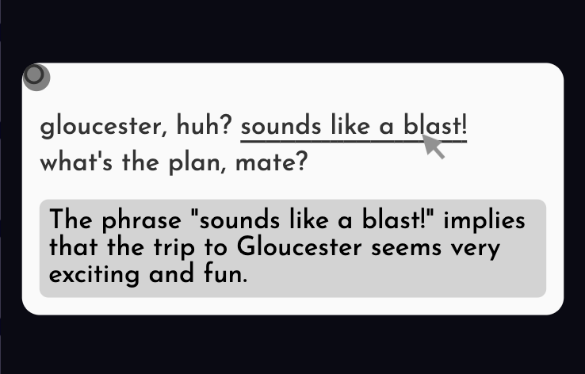
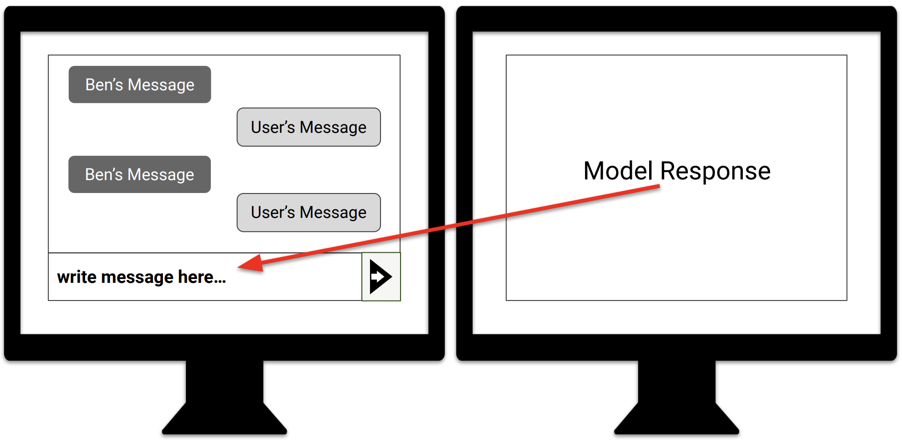
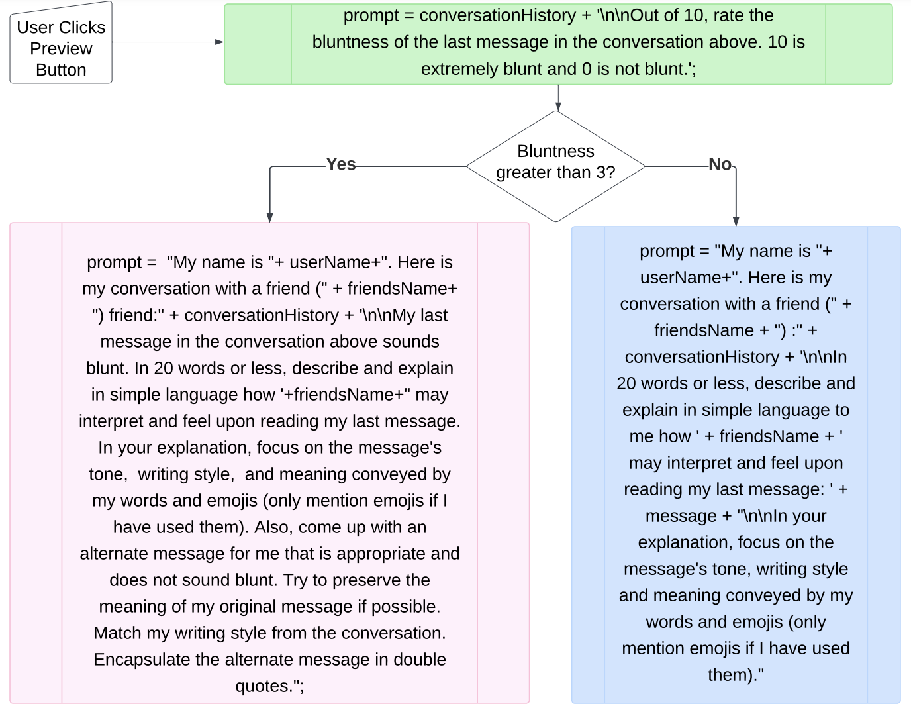
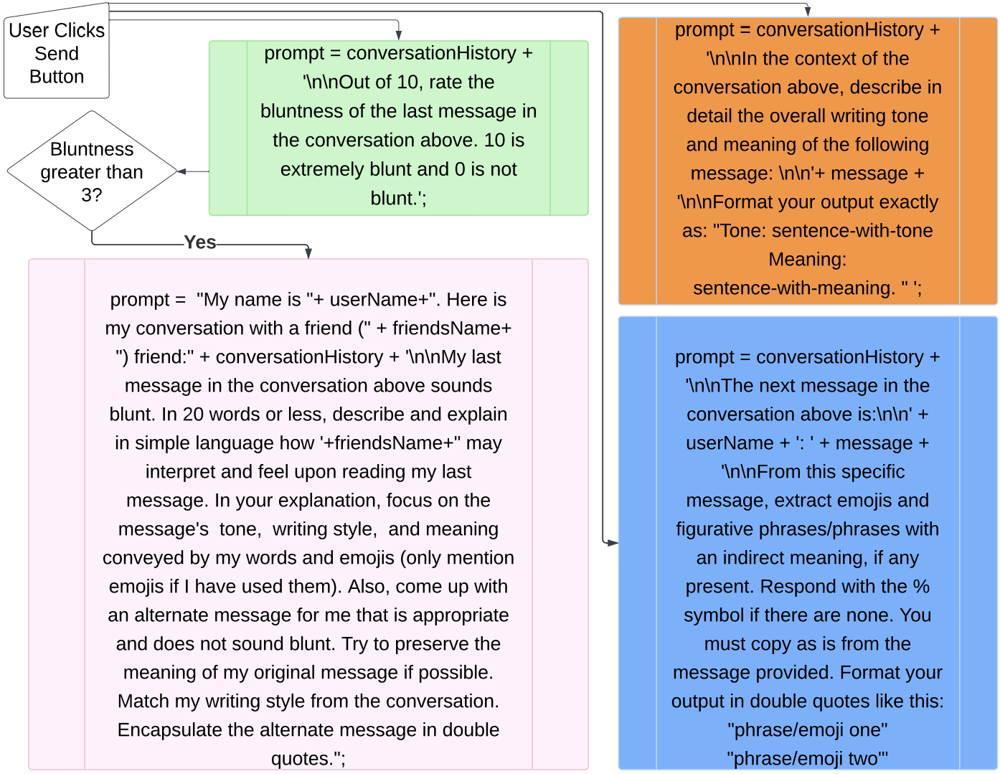
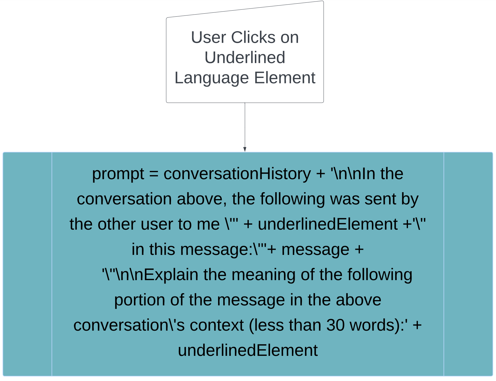

# TwIPS：一款借助大型语言模型，简化自闭症用户对话细节的短信应用

发布时间：2024年07月25日

`LLM应用`

> TwIPS: A Large Language Model Powered Texting Application to Simplify Conversational Nuances for Autistic Users

# 摘要

> 自闭症患者在情感交流和理解非字面含义上常感困难，许多人甚至会调整沟通方式以避免误解，耗费大量心力。为此，我们开发了TwIPS，一款基于大型语言模型的短信应用原型，旨在帮助用户：a) 准确解读消息的情感色彩和真实意图，b) 确保发出的消息情感与初衷相符，c) 提供可能被误解消息的替代表达。通过AI模拟和对话脚本，我们在实验室中对8名自闭症参与者进行了TwIPS测试。结果表明，TwIPS不仅简化了澄清过程，还优化了语调指示，促进了写作技巧的提升。同时，我们深入研究了自闭症用户在即时通讯中的语言运用，并根据反馈优化原型。最后，我们探讨了如何在AI辅助沟通中平衡用户自主权与AI介入，确立AI系统的信任度，以及满足自闭症用户的个性化需求。

> Autistic individuals often experience difficulties in conveying and interpreting emotional tone and non-literal nuances. Many also mask their communication style to avoid being misconstrued by others, spending considerable time and mental effort in the process. To address these challenges in text-based communication, we present TwIPS, a prototype texting application powered by a large language model (LLM), which can assist users with: a) deciphering tone and meaning of incoming messages, b) ensuring the emotional tone of their message is in line with their intent, and c) coming up with alternate phrasing for messages that could be misconstrued and received negatively by others. We leverage an AI-based simulation and a conversational script to evaluate TwIPS with 8 autistic participants in an in-lab setting. Our findings show TwIPS enables a convenient way for participants to seek clarifications, provides a better alternative to tone indicators, and facilitates constructive reflection on writing technique and style. We also examine how autistic users utilize language for self-expression and interpretation in instant messaging, and gather feedback for enhancing our prototype. We conclude with a discussion around balancing user-autonomy with AI-mediation, establishing appropriate trust levels in AI systems, and customization needs if autistic users in the context of AI-assisted communication

[Arxiv](https://arxiv.org/abs/2407.17760)