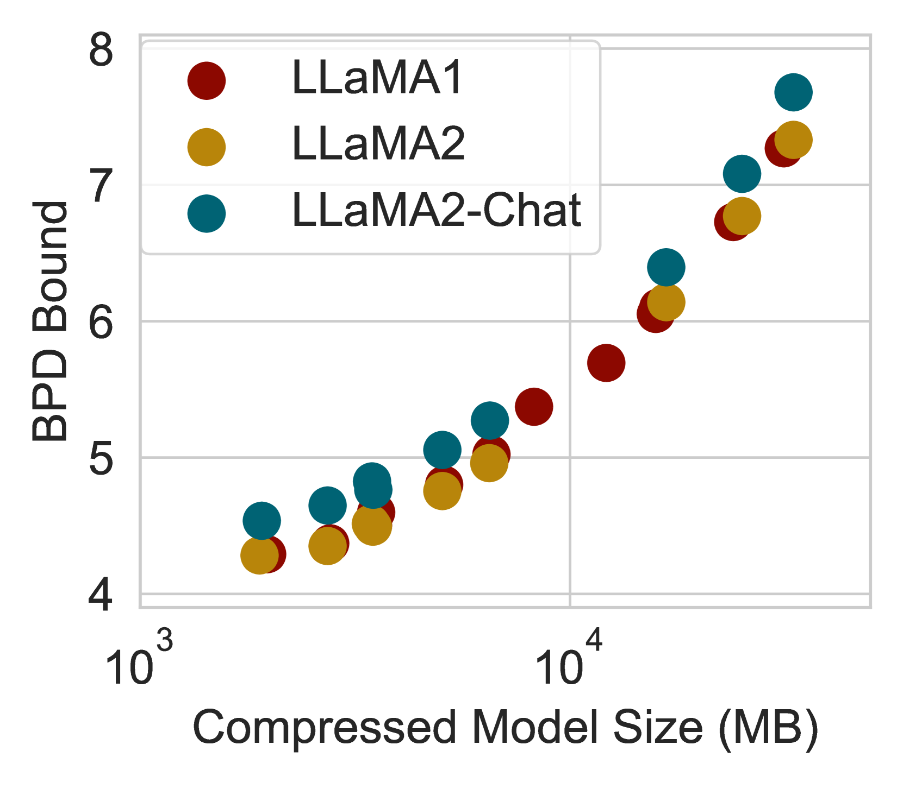
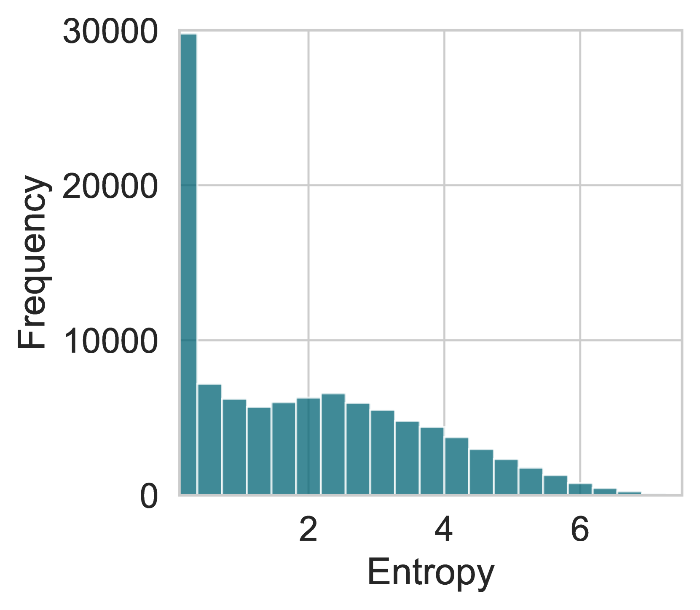

# 通过解锁令牌作为数据点，探索更大语言模型的泛化界限

发布时间：2024年07月25日

`LLM理论` `人工智能`

> Unlocking Tokens as Data Points for Generalization Bounds on Larger Language Models

# 摘要

> 大型语言模型（LLM）以其数十亿参数的优势，在预测序列中的下一个词元方面表现卓越。尽管近期研究为LLM提供了基于压缩的泛化边界，但这些边界对于拥有数十亿参数的模型而言，仍显空泛。这些边界依赖于限制性压缩技术，且其紧密性取决于训练集中独立同分布文档的数量，而非数量庞大的非独立同分布词元，这限制了更紧密边界的潜力。本研究另辟蹊径，利用鞅的特性，从LLM训练集中大量词元中获益，推导出更宽松的泛化边界。通过Monarch矩阵、Kronecker分解及训练后量化技术，我们成功为LLaMA2-70B等大型模型设定了非空泛泛化边界。这一突破性进展，首次为实际应用中生成高质量文本的模型提供了切实可行的泛化边界。

> Large language models (LLMs) with billions of parameters excel at predicting the next token in a sequence. Recent work computes non-vacuous compression-based generalization bounds for LLMs, but these bounds are vacuous for large models at the billion-parameter scale. Moreover, these bounds are obtained through restrictive compression techniques, bounding compressed models that generate low-quality text. Additionally, the tightness of these existing bounds depends on the number of IID documents in a training set rather than the much larger number of non-IID constituent tokens, leaving untapped potential for tighter bounds. In this work, we instead use properties of martingales to derive generalization bounds that benefit from the vast number of tokens in LLM training sets. Since a dataset contains far more tokens than documents, our generalization bounds not only tolerate but actually benefit from far less restrictive compression schemes. With Monarch matrices, Kronecker factorizations, and post-training quantization, we achieve non-vacuous generalization bounds for LLMs as large as LLaMA2-70B. Unlike previous approaches, our work achieves the first non-vacuous bounds for models that are deployed in practice and generate high-quality text.

[Arxiv](https://arxiv.org/abs/2407.18158)