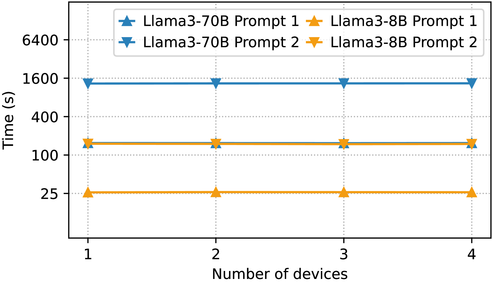
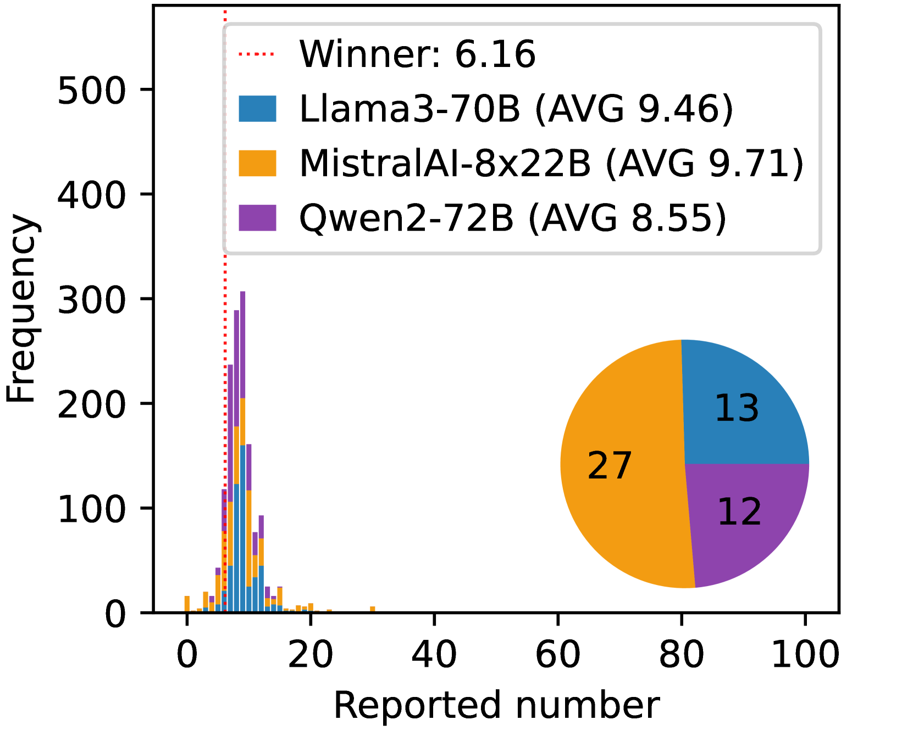
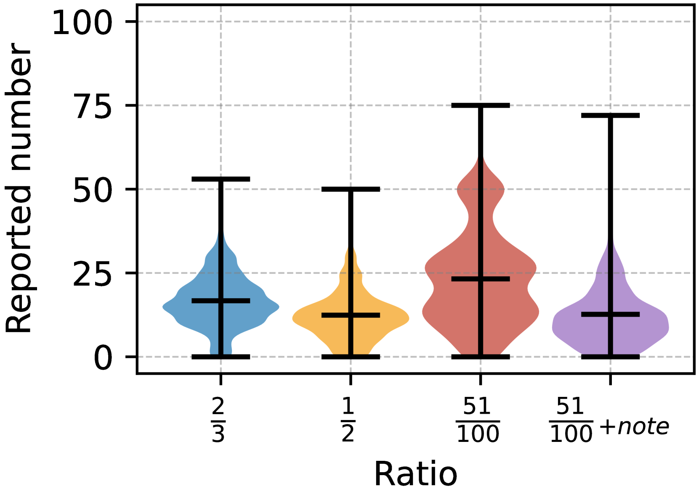
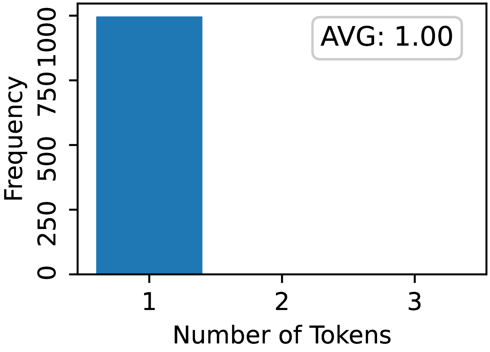
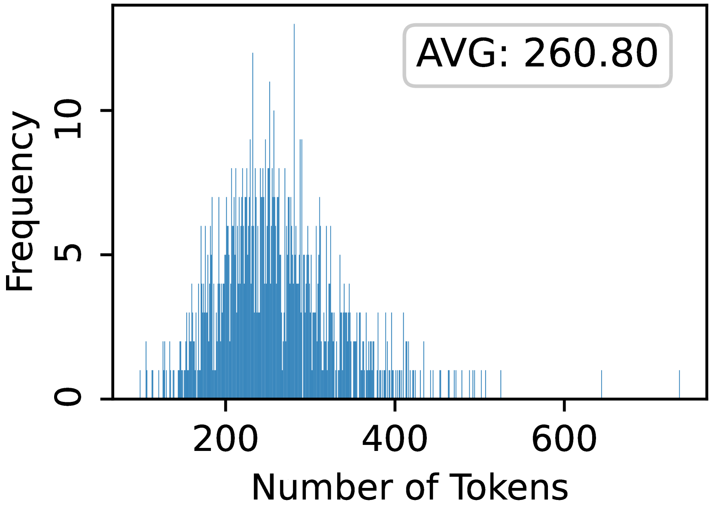
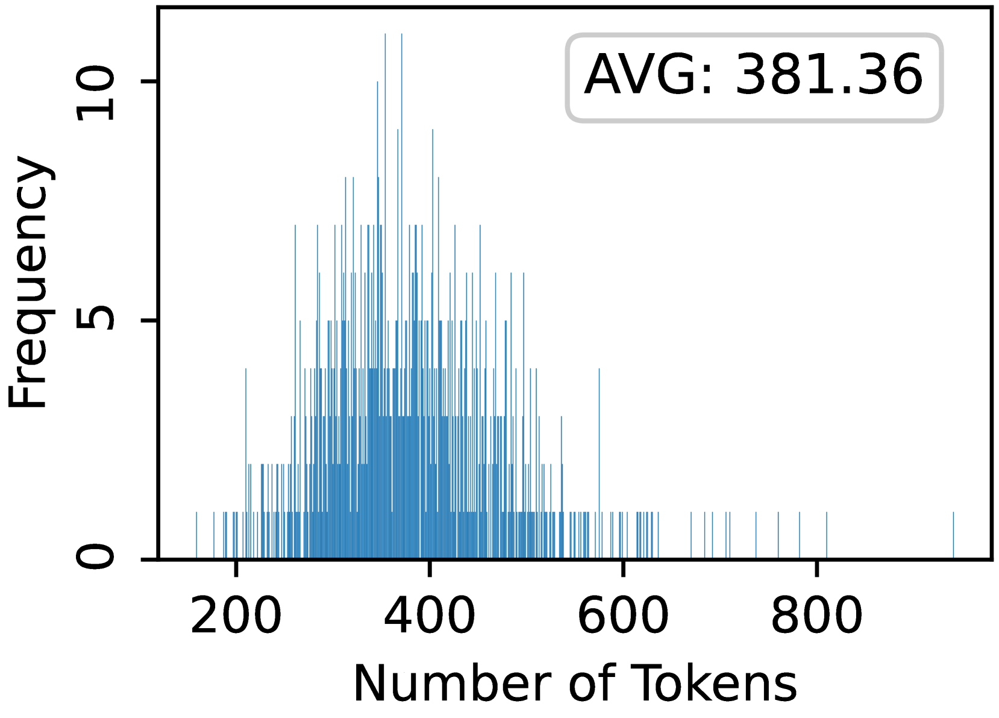

# AgentScope 中的超大规模多智能体模拟

发布时间：2024年07月25日

`Agent` `多智能体系统`

> Very Large-Scale Multi-Agent Simulation in AgentScope

# 摘要

> 大型语言模型的进步为超大规模模拟中的多智能体系统应用开辟了新途径。然而，现有平台在多智能体模拟中仍面临扩展性、效率、智能体多样性和管理过程的挑战。为此，我们为 AgentScope 平台增添了新功能，提升了其支持超大规模模拟的便利性和灵活性。我们设计了基于角色的分布式机制，增强了扩展性和效率，并提供了灵活的环境支持，以模拟多样化的现实场景。此外，我们简化了智能体的创建过程，并提供了基于 Web 的界面，便于监控和管理跨设备部署的智能体。通过全面模拟，我们展示了这些增强功能的效果，并讨论了多智能体系统在大型模拟中的应用潜力。源代码已在 GitHub 发布，以促进该领域的进一步研究。

> Recent advances in large language models (LLMs) have opened new avenues for applying multi-agent systems in very large-scale simulations. However, there remain several challenges when conducting multi-agent simulations with existing platforms, such as limited scalability and low efficiency, unsatisfied agent diversity, and effort-intensive management processes. To address these challenges, we develop several new features and components for AgentScope, a user-friendly multi-agent platform, enhancing its convenience and flexibility for supporting very large-scale multi-agent simulations. Specifically, we propose an actor-based distributed mechanism as the underlying technological infrastructure towards great scalability and high efficiency, and provide flexible environment support for simulating various real-world scenarios, which enables parallel execution of multiple agents, centralized workflow orchestration, and both inter-agent and agent-environment interactions among agents. Moreover, we integrate an easy-to-use configurable tool and an automatic background generation pipeline in AgentScope, simplifying the process of creating agents with diverse yet detailed background settings. Last but not least, we provide a web-based interface for conveniently monitoring and managing a large number of agents that might deploy across multiple devices. We conduct a comprehensive simulation to demonstrate the effectiveness of the proposed enhancements in AgentScope, and provide detailed observations and discussions to highlight the great potential of applying multi-agent systems in large-scale simulations. The source code is released on GitHub at https://github.com/modelscope/agentscope to inspire further research and development in large-scale multi-agent simulations.

[Arxiv](https://arxiv.org/abs/2407.17789)