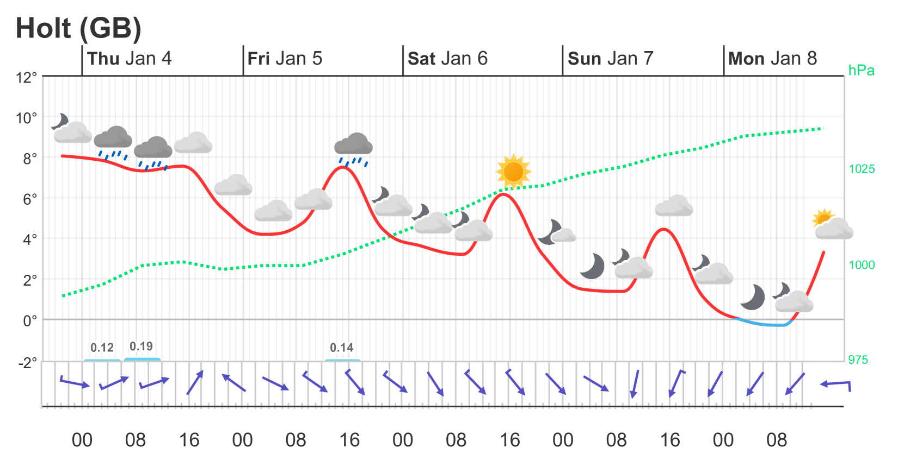
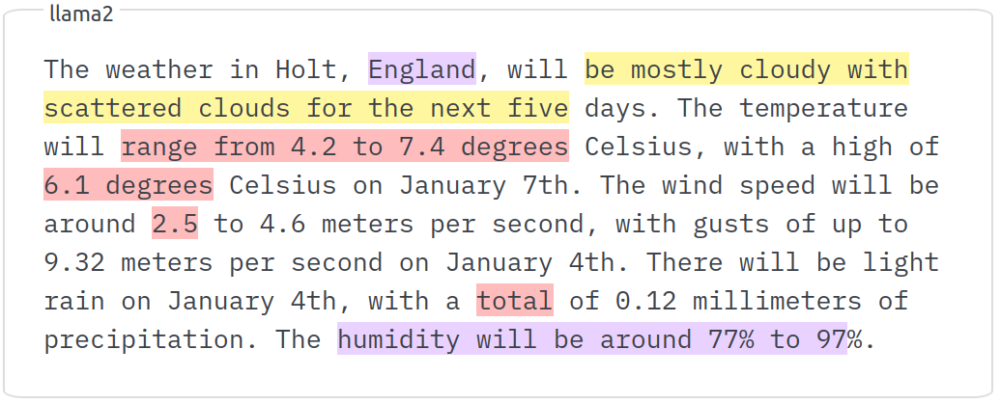
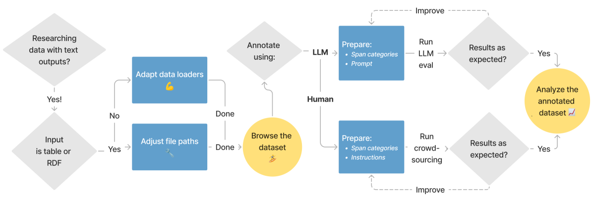

# factgenie：一款专为生成文本设计的跨度评估框架

发布时间：2024年07月25日

`LLM应用` `文本分析` `数据可视化`

> factgenie: A Framework for Span-based Evaluation of Generated Texts

# 摘要

> 我们推出了 factgenie 框架，专为注释和展示文本模型输出中的词跨度而设计。该框架能捕捉语义错误或无关内容等跨度现象。factgenie 支持从人类工作者和大型语言模型中收集注释，并配备了一个直观易用的网页界面和可扩展的代码库，便于数据可视化和注释收集。

> We present factgenie: a framework for annotating and visualizing word spans in textual model outputs. Annotations can capture various span-based phenomena such as semantic inaccuracies or irrelevant text. With factgenie, the annotations can be collected both from human crowdworkers and large language models. Our framework consists of a web interface for data visualization and gathering text annotations, powered by an easily extensible codebase.

[Arxiv](https://arxiv.org/abs/2407.17863)