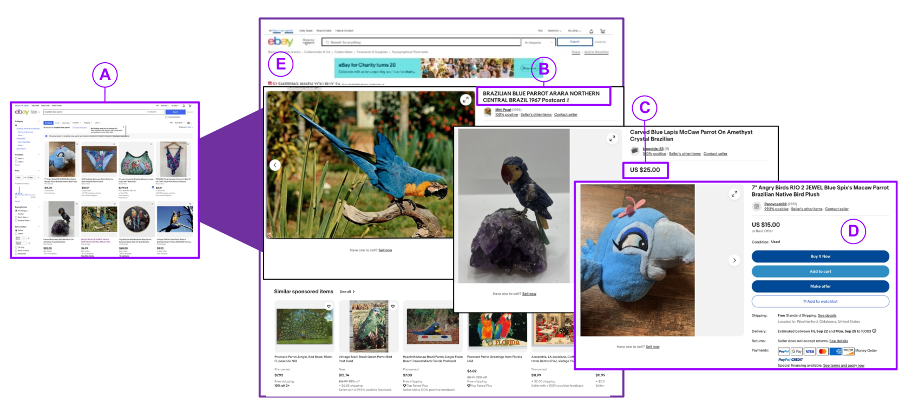
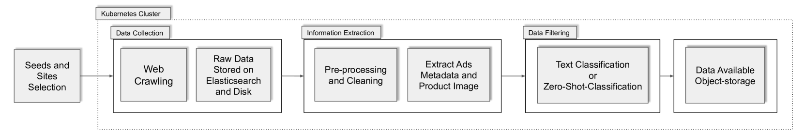
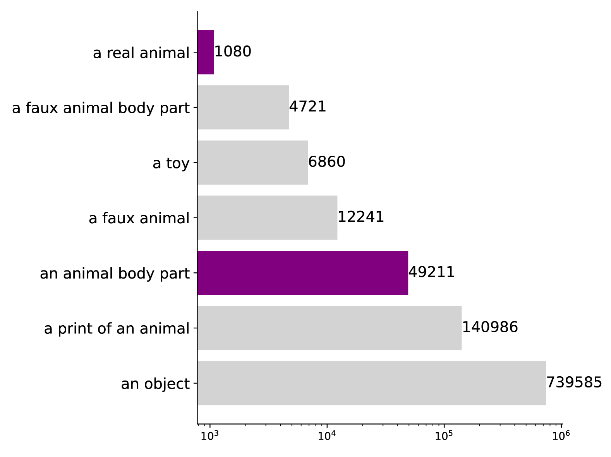
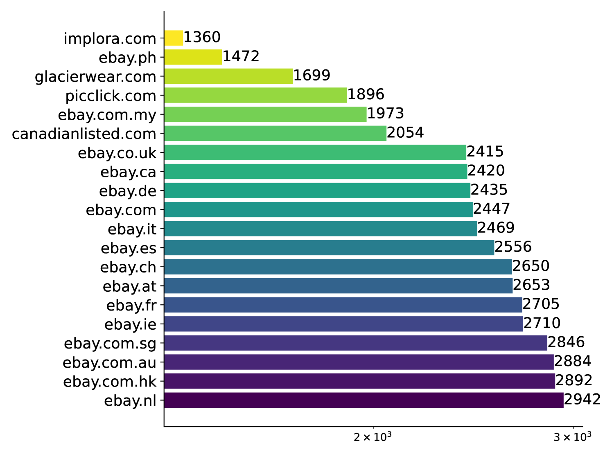

# 灵活扩展，网罗野生动物广告新策略

发布时间：2024年07月26日

`Agent` `野生动物保护` `网络安全`

> A Flexible and Scalable Approach for Collecting Wildlife Advertisements on the Web

# 摘要

> 野生动物贩子正越来越多地将活动转移到网络空间，他们在在线市场上宣传和销售野生动物产品，留下了数字痕迹。这为我们提供了新的机会：通过分析这些痕迹，我们不仅能洞察贩运网络的运作方式，还能找到破坏它们的方法。然而，收集这些信息颇具挑战。在线市场上的产品数量庞大，识别涉及野生动物的广告是一项复杂且难以自动化的任务。此外，面对海量数据，我们需要可扩展的机制来处理、过滤、存储这些广告，并使其可供分析。本文中，我们提出了一种新的大规模收集野生动物贩运数据的方法。我们设计了一个数据收集管道，结合了范围爬虫进行数据发现和获取，以及基础模型和机器学习分类器来识别相关广告。我们创建的数据集，据我们所知，是同类中最大的：包含近百万个广告，来自41个市场，涵盖235个物种和20种语言。源代码已在\url{https://github.com/VIDA-NYU/wildlife_pipeline}公开。

> Wildlife traffickers are increasingly carrying out their activities in cyberspace. As they advertise and sell wildlife products in online marketplaces, they leave digital traces of their activity. This creates a new opportunity: by analyzing these traces, we can obtain insights into how trafficking networks work as well as how they can be disrupted. However, collecting such information is difficult. Online marketplaces sell a very large number of products and identifying ads that actually involve wildlife is a complex task that is hard to automate. Furthermore, given that the volume of data is staggering, we need scalable mechanisms to acquire, filter, and store the ads, as well as to make them available for analysis. In this paper, we present a new approach to collect wildlife trafficking data at scale. We propose a data collection pipeline that combines scoped crawlers for data discovery and acquisition with foundational models and machine learning classifiers to identify relevant ads. We describe a dataset we created using this pipeline which is, to the best of our knowledge, the largest of its kind: it contains almost a million ads obtained from 41 marketplaces, covering 235 species and 20 languages. The source code is publicly available at \url{https://github.com/VIDA-NYU/wildlife_pipeline}.

[Arxiv](https://arxiv.org/abs/2407.18898)