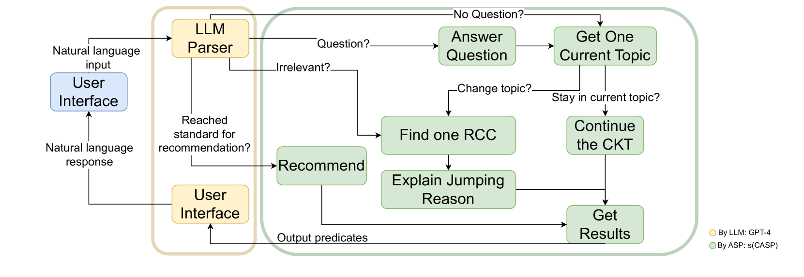

# 基于 LLM 与目标导向 ASP 技术，打造了一款具备可靠常识推理能力的社交机器人。

发布时间：2024年07月26日

`Agent` `社交机器人`

> A Reliable Common-Sense Reasoning Socialbot Built Using LLMs and Goal-Directed ASP

# 摘要

> 随着GPT等大型语言模型（LLM）的兴起，ChatGPT等社交机器人因其模拟人类对话的能力而备受瞩目。然而，这些对话缺乏目标导向且难以掌控，加之LLM更侧重模式识别而非逻辑推理，导致答案可能含糊不清，且难以将多话题融合成连贯回应。为此，我们推出了AutoCompanion，一款利用LLM将自然语言与谓词相互转换，并结合Answer Set Programming（ASP）进行常识推理的社交机器人，旨在与人类进行更自然的社交互动。我们特别采用了以目标为导向的s(CASP)作为后端支持。本文详细阐述了其框架设计，以及如何运用LLM解析用户信息并基于s(CASP)输出生成回应。通过实际对话案例，我们展示了AutoCompanion如何通过讨论电影和书籍来娱乐用户，同时确保答案准确、对话连贯且始终聚焦主题。

> The development of large language models (LLMs), such as GPT, has enabled the construction of several socialbots, like ChatGPT, that are receiving a lot of attention for their ability to simulate a human conversation. However, the conversation is not guided by a goal and is hard to control. In addition, because LLMs rely more on pattern recognition than deductive reasoning, they can give confusing answers and have difficulty integrating multiple topics into a cohesive response. These limitations often lead the LLM to deviate from the main topic to keep the conversation interesting. We propose AutoCompanion, a socialbot that uses an LLM model to translate natural language into predicates (and vice versa) and employs commonsense reasoning based on Answer Set Programming (ASP) to hold a social conversation with a human. In particular, we rely on s(CASP), a goal-directed implementation of ASP as the backend. This paper presents the framework design and how an LLM is used to parse user messages and generate a response from the s(CASP) engine output. To validate our proposal, we describe (real) conversations in which the chatbot's goal is to keep the user entertained by talking about movies and books, and s(CASP) ensures (i) correctness of answers, (ii) coherence (and precision) during the conversation, which it dynamically regulates to achieve its specific purpose, and (iii) no deviation from the main topic.

[Arxiv](https://arxiv.org/abs/2407.18498)