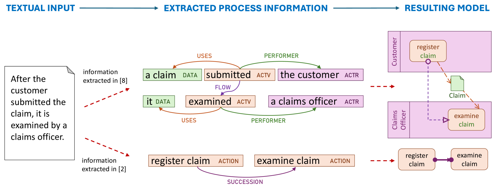
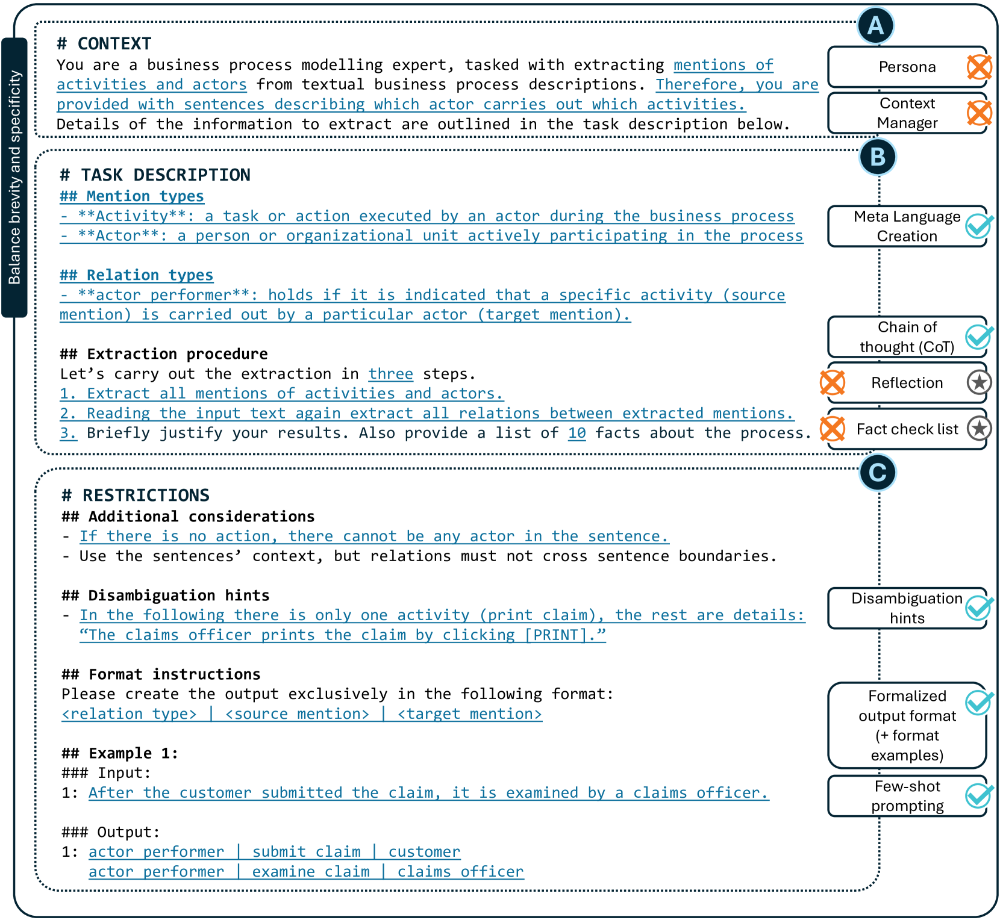
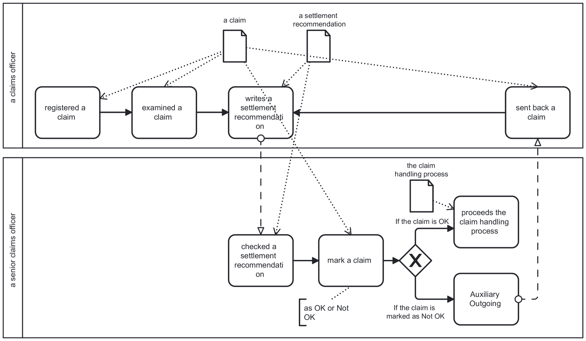
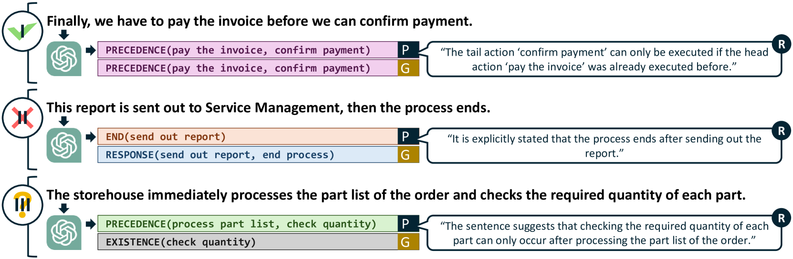

# 利用大型语言模型，我们提出了一种从自然语言文本中提取过程模型信息的通用提示策略。

发布时间：2024年07月26日

`LLM应用` `业务流程`

> A Universal Prompting Strategy for Extracting Process Model Information from Natural Language Text using Large Language Models

# 摘要

> 过去十年，研究者们致力于从文本中提取业务流程信息，但这一领域仍主要依赖规则和机器学习。数据稀缺限制了深度学习的应用，直到生成式大型语言模型的飞速发展，使得高质量NLP任务的解决成为可能。我们探索了LLMs在提取流程元素及其关系方面的潜力，并通过启发式算法验证了其信息对流程模型生成的适用性。采用新颖的提示策略，LLMs在三个数据集上的表现超越了现有机器学习方法，$F_1$分数提升高达8%。我们在八个LLMs上验证了这一策略的普遍性，并分析了提示细节对提取质量的影响。示例数量、定义特异性和格式指令的严谨性是提升准确性的关键。我们的研究资源已公开，供进一步探索和应用。

> Over the past decade, extensive research efforts have been dedicated to the extraction of information from textual process descriptions. Despite the remarkable progress witnessed in natural language processing (NLP), information extraction within the Business Process Management domain remains predominantly reliant on rule-based systems and machine learning methodologies. Data scarcity has so far prevented the successful application of deep learning techniques. However, the rapid progress in generative large language models (LLMs) makes it possible to solve many NLP tasks with very high quality without the need for extensive data. Therefore, we systematically investigate the potential of LLMs for extracting information from textual process descriptions, targeting the detection of process elements such as activities and actors, and relations between them. Using a heuristic algorithm, we demonstrate the suitability of the extracted information for process model generation. Based on a novel prompting strategy, we show that LLMs are able to outperform state-of-the-art machine learning approaches with absolute performance improvements of up to 8\% $F_1$ score across three different datasets. We evaluate our prompting strategy on eight different LLMs, showing it is universally applicable, while also analyzing the impact of certain prompt parts on extraction quality. The number of example texts, the specificity of definitions, and the rigour of format instructions are identified as key for improving the accuracy of extracted information. Our code, prompts, and data are publicly available.

[Arxiv](https://arxiv.org/abs/2407.18540)