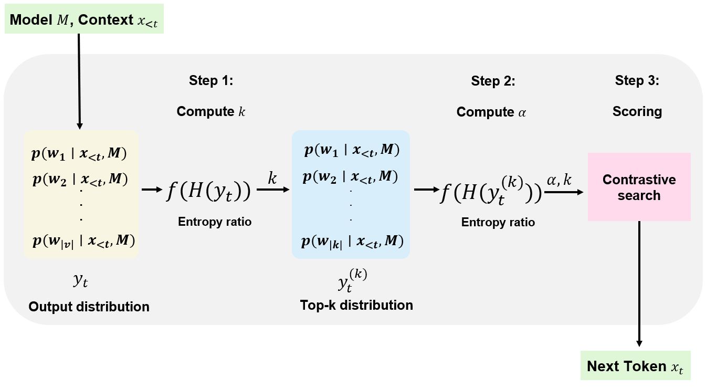
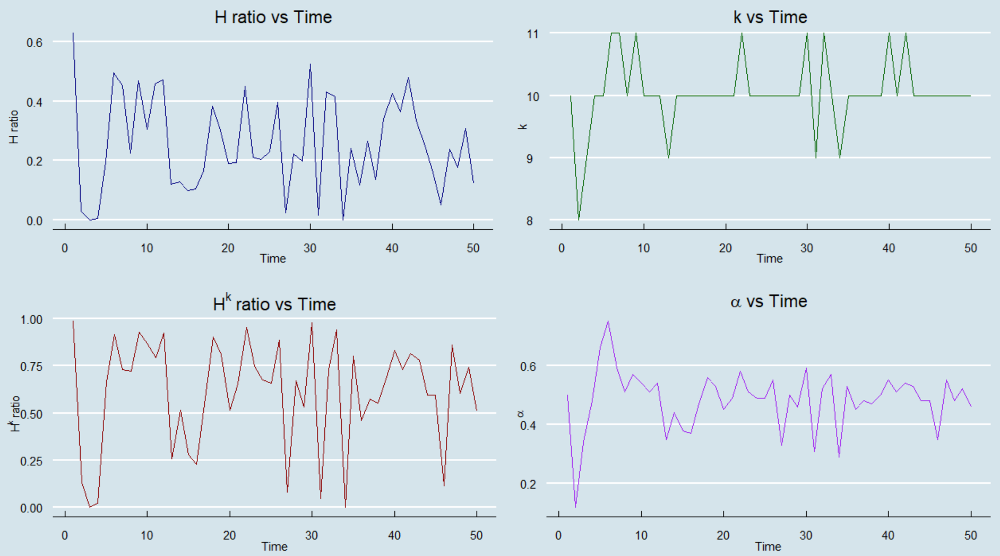
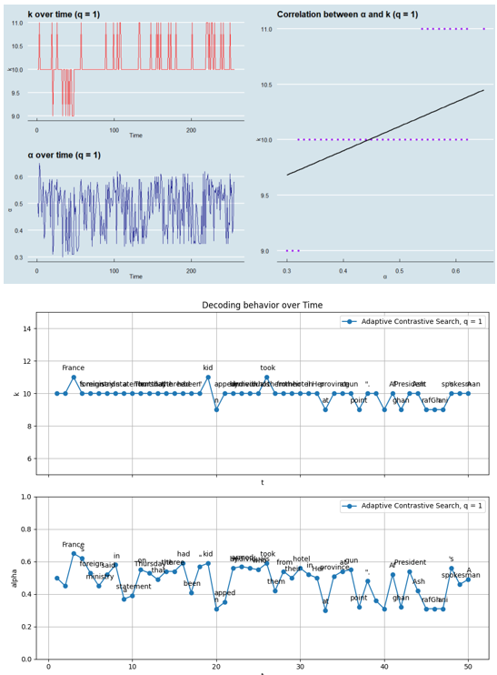
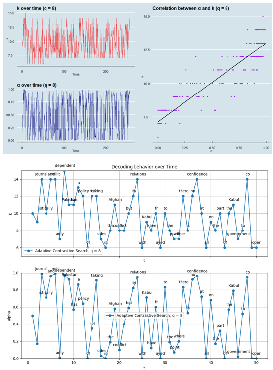
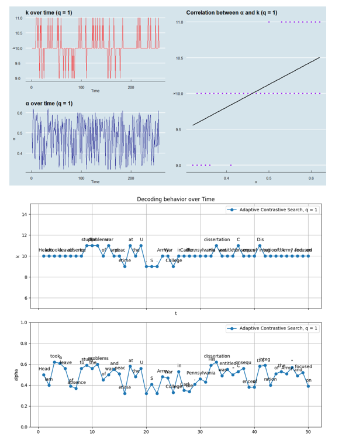
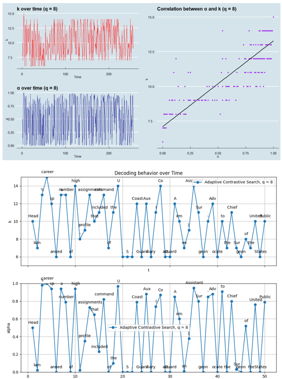
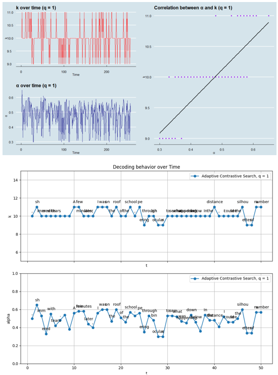
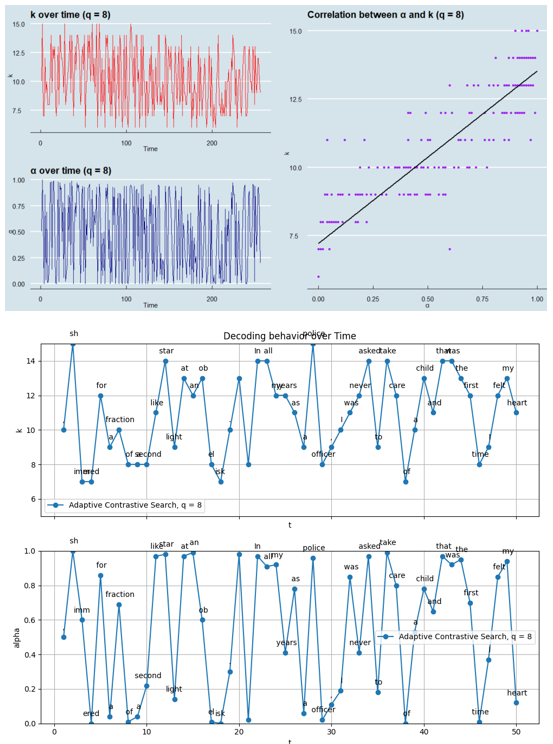
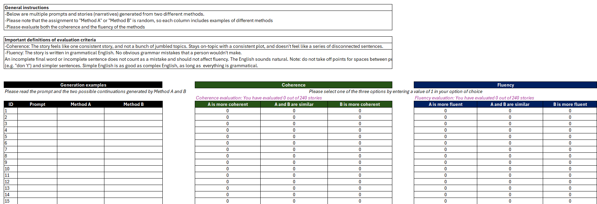

# 自适应对比搜索：为开放式文本生成提供不确定性引导的解码策略

发布时间：2024年07月26日

`LLM应用` `人工智能`

> Adaptive Contrastive Search: Uncertainty-Guided Decoding for Open-Ended Text Generation

# 摘要

> 在语言建模领域，从大型语言模型的输出中解码高质量文本是一项挑战。为此，研究者们提出了多种方法，如束搜索、温度采样等，以提升文本的连贯性、多样性和人类文本的相似度。本研究中，我们创新性地提出了自适应对比搜索策略，该策略通过引入一个由模型不确定性引导的自适应退化惩罚，扩展了对比搜索，旨在同时提升文本的创造性、多样性和质量。实验结果显示，该策略在不同模型和数据集上均有效提升了性能。相关代码、数据集和模型已公开。

> Decoding from the output distributions of large language models to produce high-quality text is a complex challenge in language modeling. Various approaches, such as beam search, sampling with temperature, $k-$sampling, nucleus $p-$sampling, typical decoding, contrastive decoding, and contrastive search, have been proposed to address this problem, aiming to improve coherence, diversity, as well as resemblance to human-generated text. In this study, we introduce adaptive contrastive search, a novel decoding strategy extending contrastive search by incorporating an adaptive degeneration penalty, guided by the estimated uncertainty of the model at each generation step. This strategy is designed to enhance both the creativity and diversity of the language modeling process while at the same time producing coherent and high-quality generated text output. Our findings indicate performance enhancement in both aspects, across different model architectures and datasets, underscoring the effectiveness of our method in text generation tasks. Our code base, datasets, and models are publicly available.

[Arxiv](https://arxiv.org/abs/2407.18698)