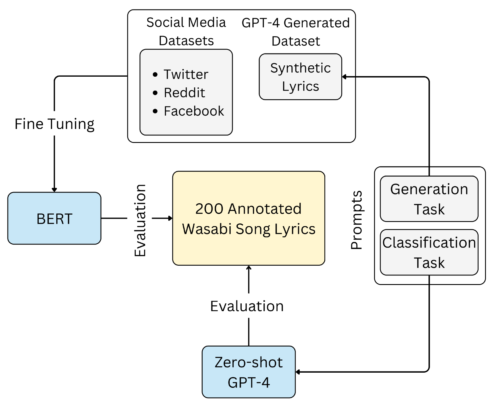
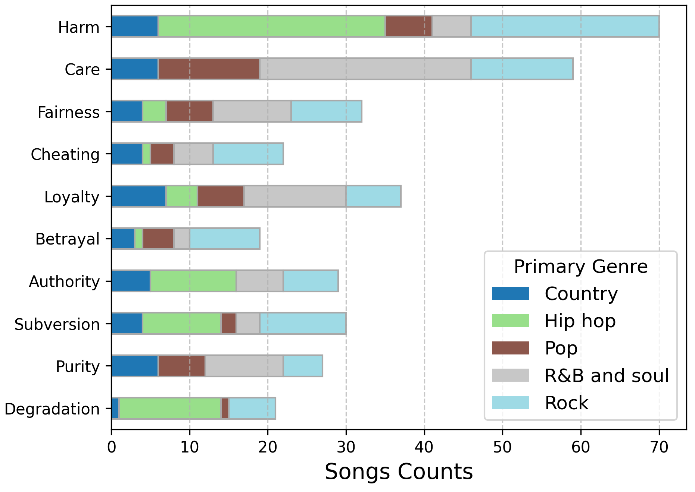
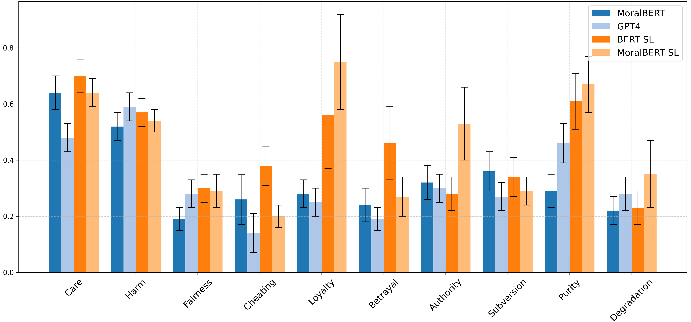

# 自动识别音乐歌词中的道德价值观

发布时间：2024年07月26日

`LLM应用` `创意产业`

> Automatic Detection of Moral Values in Music Lyrics

# 摘要

> 道德价值观深刻影响着我们处理信息、决策和评判社会问题的方式。通过快速从歌词中提取道德观念，我们能更深入地洞察音乐聆听行为。借助道德基础理论（MFT），我们训练了一组基于transformer的语言模型（BERT），在GPT-4生成的合成歌词上微调后，用于识别真实音乐歌词中的道德元素。与多种基准模型相比，包括在社交媒体文本上微调的BERT和零-shot的GPT-4，我们的模型展现了最高的准确性，平均加权F1分数达0.8，较其他模型高出5%。在二元分类的精确度上，我们的模型也领先基准12%。这一方法不仅推动了无需标注的歌词道德学习，还为LLMs在音乐道德表达方面的知识提炼及这些技术对创意产业和音乐文化的潜在影响提供了深刻见解。

> Moral values play a fundamental role in how we evaluate information, make decisions, and form judgements around important social issues. The possibility to extract morality rapidly from lyrics enables a deeper understanding of our music-listening behaviours. Building on the Moral Foundations Theory (MFT), we tasked a set of transformer-based language models (BERT) fine-tuned on 2,721 synthetic lyrics generated by a large language model (GPT-4) to detect moral values in 200 real music lyrics annotated by two experts.We evaluate their predictive capabilities against a series of baselines including out-of-domain (BERT fine-tuned on MFT-annotated social media texts) and zero-shot (GPT-4) classification. The proposed models yielded the best accuracy across experiments, with an average F1 weighted score of 0.8. This performance is, on average, 5% higher than out-of-domain and zero-shot models. When examining precision in binary classification, the proposed models perform on average 12% higher than the baselines.Our approach contributes to annotation-free and effective lyrics morality learning, and provides useful insights into the knowledge distillation of LLMs regarding moral expression in music, and the potential impact of these technologies on the creative industries and musical culture.

[Arxiv](https://arxiv.org/abs/2407.18787)