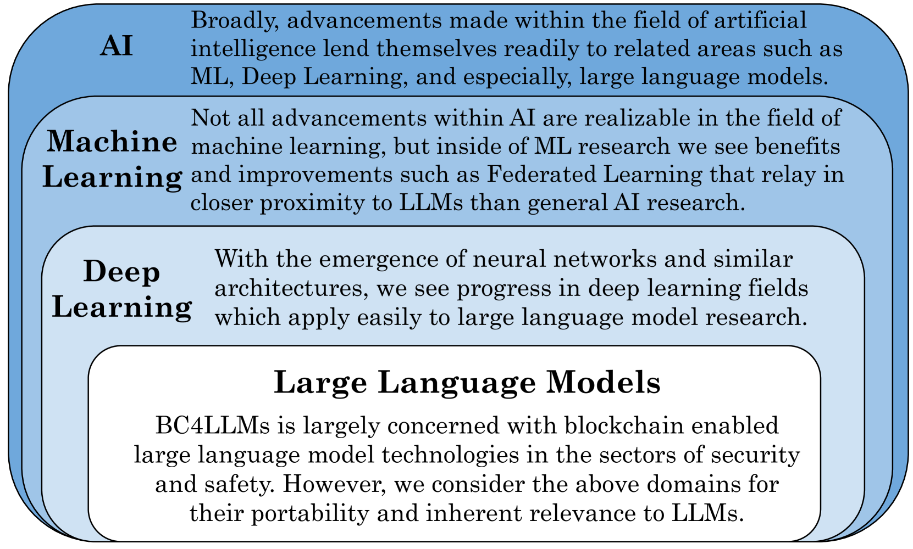
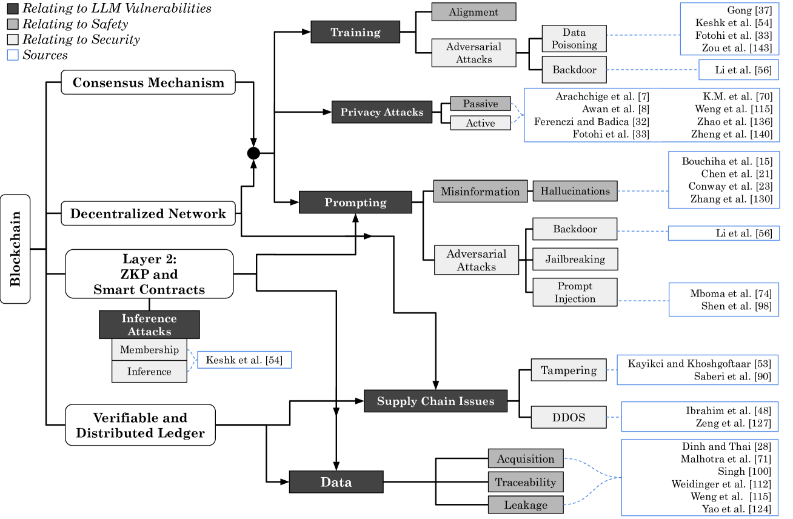
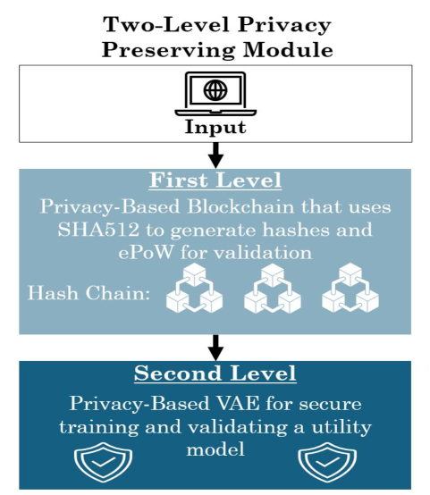
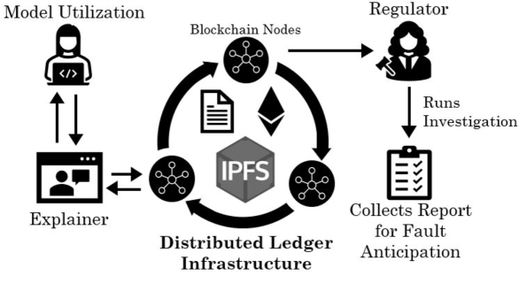

# 区块链在大型语言模型安全和安全领域的应用：一项全面调查

发布时间：2024年07月26日

`LLM应用` `区块链` `网络安全`

> Blockchain for Large Language Model Security and Safety: A Holistic Survey

# 摘要

> 随着大型语言模型交互接口的普及，其在商业和学术领域的关注度激增。然而，这也催生了针对这些模型的新型攻击，严重威胁用户数据安全。区块链技术，以其对数据不可变性和来源的强大保障，近年来崭露头角，被视为重塑数据处理方式的潜力技术。本文全面探讨了区块链在保护大型语言模型免受攻击中的应用，并展望其在创新应用中的潜力。我们提出了大型语言模型区块链分类法（BC4LLM），并制定了相关定义，以精准把握各研究领域的特性。全文贯穿研究框架，旨在为更广泛的研究提供情境，同时明确指出大型语言模型区块链领域未来的研究方向与挑战。

> With the advent of accessible interfaces for interacting with large language models, there has been an associated explosion in both their commercial and academic interest. Consequently, there has also been an sudden burst of novel attacks associated with large language models, jeopardizing user data on a massive scale. Situated at a comparable crossroads in its development, and equally prolific to LLMs in its rampant growth, blockchain has emerged in recent years as a disruptive technology with the potential to redefine how we approach data handling. In particular, and due to its strong guarantees about data immutability and irrefutability as well as inherent data provenance assurances, blockchain has attracted significant attention as a means to better defend against the array of attacks affecting LLMs and further improve the quality of their responses. In this survey, we holistically evaluate current research on how blockchains are being used to help protect against LLM vulnerabilities, as well as analyze how they may further be used in novel applications. To better serve these ends, we introduce a taxonomy of blockchain for large language models (BC4LLM) and also develop various definitions to precisely capture the nature of different bodies of research in these areas. Moreover, throughout the paper, we present frameworks to contextualize broader research efforts, and in order to motivate the field further, we identify future research goals as well as challenges present in the blockchain for large language model (BC4LLM) space.

[Arxiv](https://arxiv.org/abs/2407.20181)