# ChatSchema：基于模式，利用大型多模态模型提取结构化信息的流程

发布时间：2024年07月26日

`LLM应用` `数据分析`

> ChatSchema: A pipeline of extracting structured information with Large Multimodal Models based on schema

# 摘要

> 本研究引入了ChatSchema方法，通过结合大型多模态模型（LMMs）和基于模式的OCR技术，有效提取并结构化医学论文报告中的非结构化数据。我们通过预定义模式，使LMMs能直接按规范提取和标准化信息，简化数据录入。研究采用分类和提取两阶段流程，对报告场景分类并结构化信息。我们建立并标注数据集验证ChatSchema，评估关键提取的精确度、召回率、F1分数和准确性，并进一步评估值提取。消融研究显示，ChatSchema在键值提取的整体准确性和F1分数上显著优于基线，分别提升26.9%和27.4%。我们分析了北京大学第一医院的100份报告，建立包含2,945个键值对的基础真值数据集，使用GPT-4o和Gemini 1.5 Pro评估，发现GPT-4o性能更佳，关键提取精确度、召回率和F1分数均达98.6%，值提取整体准确性、精确度、召回率和F1分数均为95.8%。

> Objective: This study introduces ChatSchema, an effective method for extracting and structuring information from unstructured data in medical paper reports using a combination of Large Multimodal Models (LMMs) and Optical Character Recognition (OCR) based on the schema. By integrating predefined schema, we intend to enable LMMs to directly extract and standardize information according to the schema specifications, facilitating further data entry. Method: Our approach involves a two-stage process, including classification and extraction for categorizing report scenarios and structuring information. We established and annotated a dataset to verify the effectiveness of ChatSchema, and evaluated key extraction using precision, recall, F1-score, and accuracy metrics. Based on key extraction, we further assessed value extraction. We conducted ablation studies on two LMMs to illustrate the improvement of structured information extraction with different input modals and methods. Result: We analyzed 100 medical reports from Peking University First Hospital and established a ground truth dataset with 2,945 key-value pairs. We evaluated ChatSchema using GPT-4o and Gemini 1.5 Pro and found a higher overall performance of GPT-4o. The results are as follows: For the result of key extraction, key-precision was 98.6%, key-recall was 98.5%, key-F1-score was 98.6%. For the result of value extraction based on correct key extraction, the overall accuracy was 97.2%, precision was 95.8%, recall was 95.8%, and F1-score was 95.8%. An ablation study demonstrated that ChatSchema achieved significantly higher overall accuracy and overall F1-score of key-value extraction, compared to the Baseline, with increases of 26.9% overall accuracy and 27.4% overall F1-score, respectively.

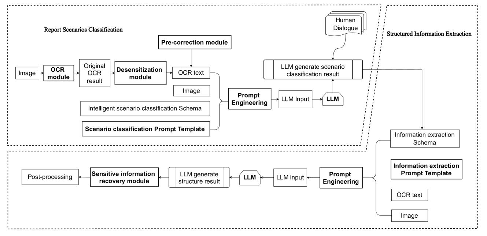

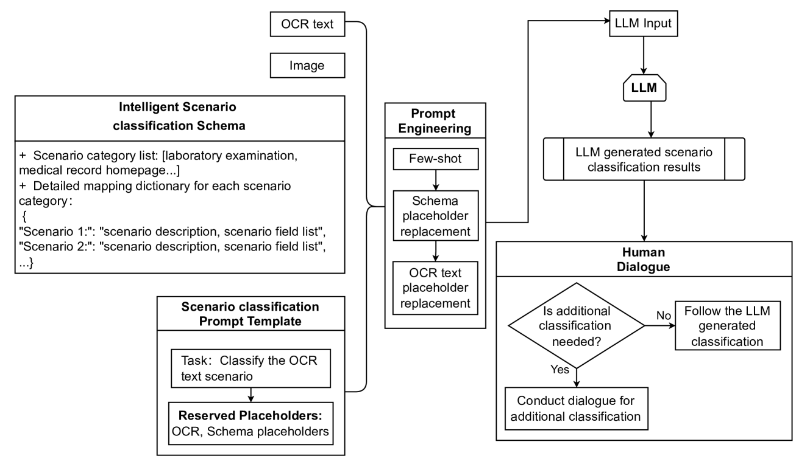

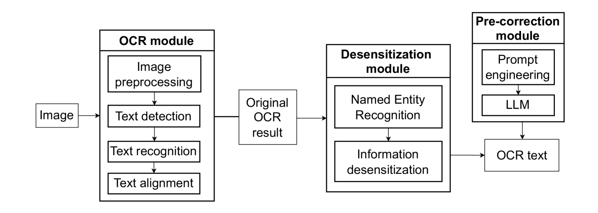

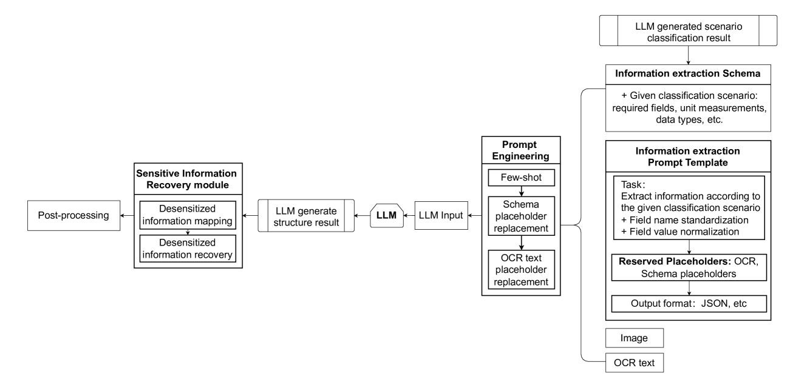

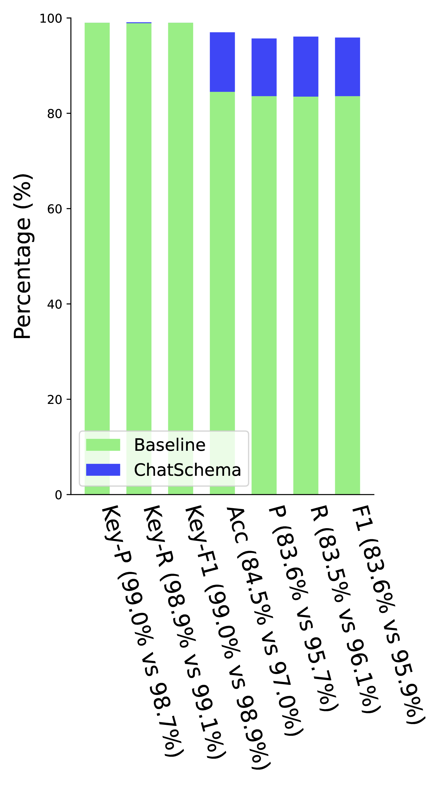

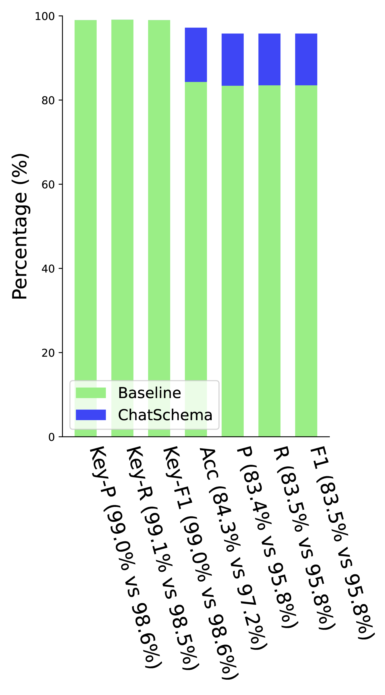

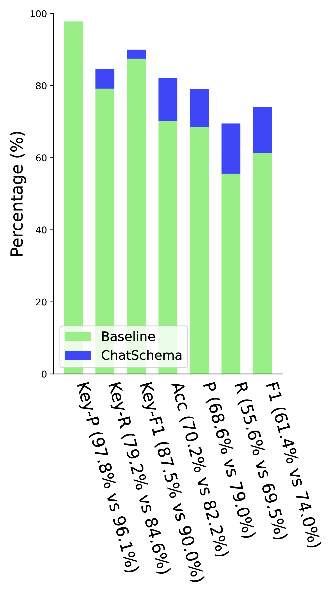

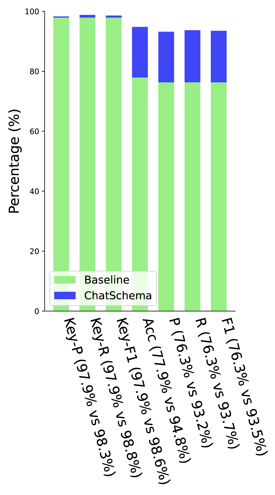

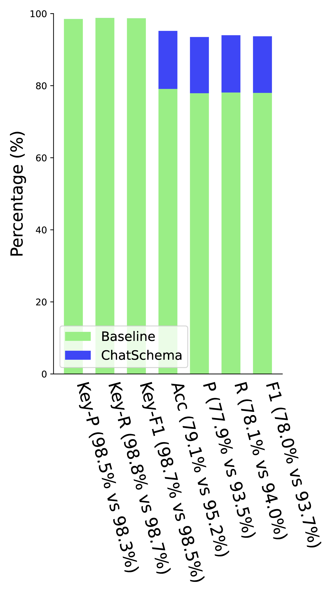

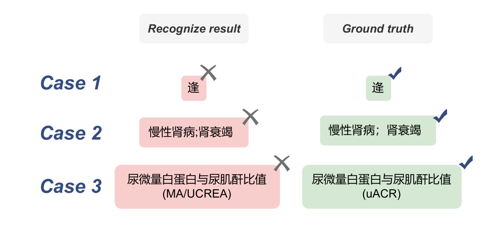

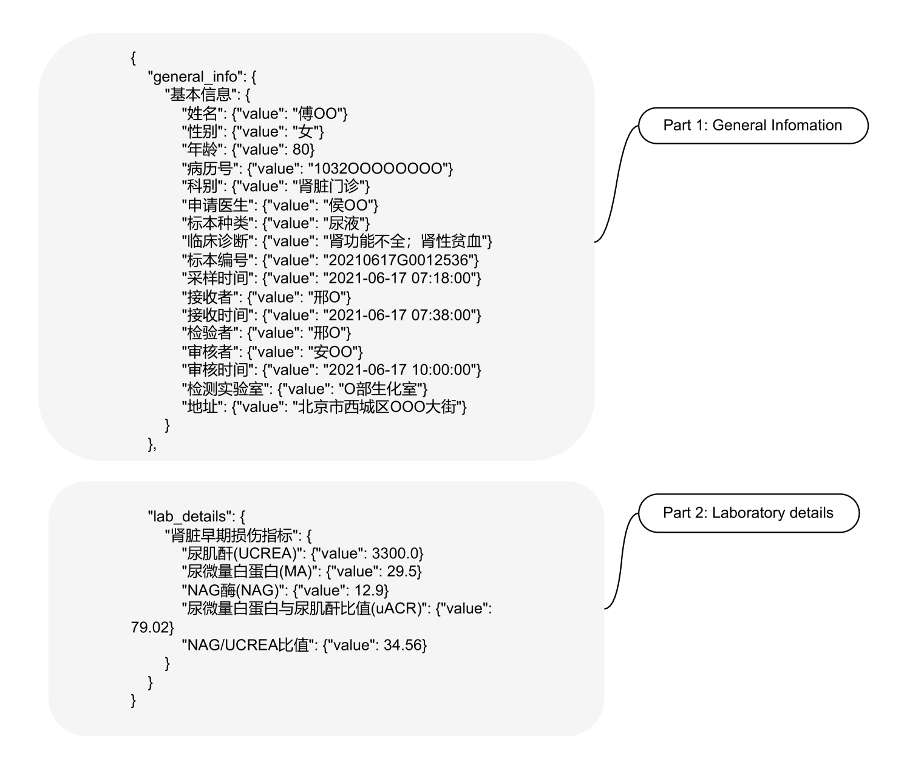

[Arxiv](https://arxiv.org/abs/2407.18716)